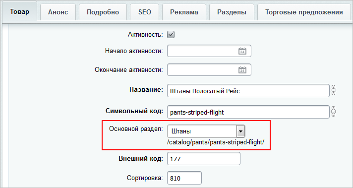
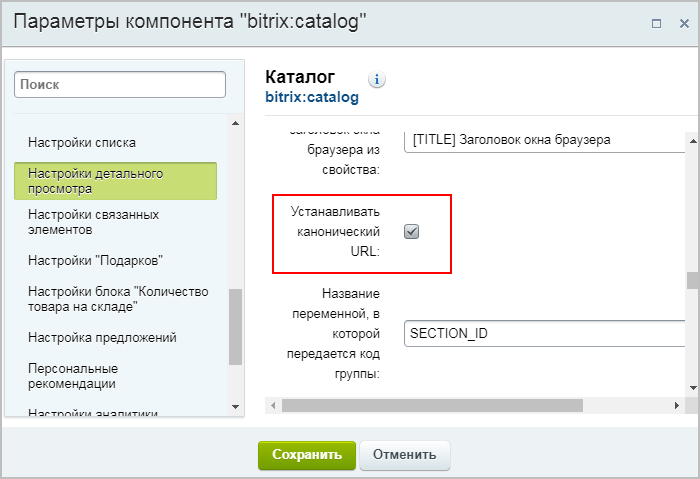
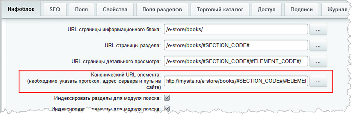
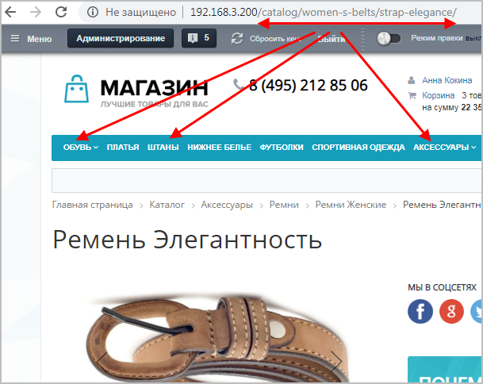

# Основная страница элемента среди дублей

**Навигация**
- [← Оглавление курса](index.md)
- [← Предыдущий: 5319 — Вложенные ЧПУ: формируем полные адреса](lesson_5319.md)
- [Следующий: 7180 — Красивые адреса для фильтра товаров →](lesson_7180.md)

Официальная страница урока: https://dev.1c-bitrix.ru/learning/course/index.php?COURSE_ID=34&LESSON_ID=7199

### Видеоурок

Элемент инфоблока может быть привязан к нескольким разделам. Но при этом могут быть

			претензии


Привязка к нескольким разделам приводит к тому, что страница сайта может существовать в сети под двумя и более различными адресами. Поисковые системы негативно относятся к дублированному контенту и понижают его в выдаче.

Избежать таких ситуаций помогут **канонические**ссылки.

**Канонические** (основные) ссылки указывают поисковому роботу основную страницу. Если робот найдёт на сайте копии канонической страницы, то он пометит их, как малозначительные.

		 по дублям страниц от SEO. Избежать этого помогает такое понятие как «основной раздел» элемента. Раньше основным разделом считался раздел с минимальным идентификатором, что было не совсем удобно. С версии 15.5.0 все изменилось, теперь вы можете самостоятельно задать основной раздел и, следовательно, пометить нужную страницу элемента как

			каноническую.


**Каноническая страница** — это оригинальная страница или первоисточник.

### Как назначить основной раздел?

**Шаг 1**. Включите настройку выбора раздела в форме редактирования инфоблока на закладке **Поля**:


**Шаг 2.** В форме создания/редактирования элемента укажите основной раздел в одноимённом поле:



**Важно!** Если в форме поле **Основной раздел** отсутствует, то

			перенастройте внешний вид.


При работе с товарами, материалами статей, каталогами справочников вы зачастую

обращаете внимание на следующий момент: в форме присутствуют поля, которые не

используются на сайте. Лишние поля увеличивают размеры формы редактирования и

затрудняют внесение данных.

Облегчите свой труд, используйте инструмент настройки форм инфоблоков. Инструмент

учитывает индивидуальные потребности,  позволяет настроить формы редактирования

разделов и элементов инфоблока под себя:

- удаляйте лишние поля или целые вкладки;
- перемещайте поля между вкладками;
- создавайте свои вкладки.

 Для каждого конкретного инфоблока формируйте свои уникальные формы и

работайте с удовольствием.

[Подробнее](lesson_1883.md)...

**Примечание.** Основной раздел выбирается только среди тех разделов, к которым привязан элемент.

### Как установить каноническую ссылку для элемента?

Пометьте страницу элемента в основном разделе как каноническую (т.е. выделите её как основную среди дублей). Для этого:

1. в компоненте, с помощью которого создан публичный интерфейс детальной страницы элемента, отметьте опцию
  			Устанавливать канонический URL
                      
  		.
  **Примечание.** Данная опция добавлена в компоненты
  			Новости
                      Комплексный компонент позволяет создать новостной раздел на сайте. Доступен просмотр детальной информации, списка элементов, настройка экспорта в rss, организация голосования за новости (или другие элементы инфоблоков), настройка отзывов, вывода материалов по темам, настройки ЧПУ и многое другое.
  						[Описание компонента «Новости (комплексный компонент)» в пользовательской документации.](http://dev.1c-bitrix.ru/user_help/detail.php?ID=62967)
  		,
  			Каталог
                       Комплексный компонент осуществляет вывод полного каталога товаров из определенного инфоблока.
  						[Описание компонента «Каталог (комплексный компонент)» в пользовательской документации.](http://dev.1c-bitrix.ru/user_help/detail.php?ID=62978)
  		,
  			Новость  детально
                      Одностраничный компонент, осуществляющий вывод детального описание новости. Компонент стандартный и входит в дистрибутив модуля.
  						[Описание компонента «Новость детально» в пользовательской документации.](http://dev.1c-bitrix.ru/user_help/detail.php?ID=62969)
  		 и
  			Элемент каталога детально
                      Компонент выводит детальную информацию по элементу каталога.
  						[Описание компонента «Элемент каталога детально» в пользовательской документации.](http://dev.1c-bitrix.ru/user_help/detail.php?ID=62981)
  		.
2. кроме того, проверьте корректность заполнения поля
  			Канонический URL элемента
                      
  		 в форме редактирования инфоблока.

### Дополнительные моменты

**Примечание.** В вышеперечисленные компоненты, а также в компоненты

			Разделы с top'ом элементов

						[Описание компонента «Разделы с top'ом элементов» в пользовательской документации.](http://dev.1c-bitrix.ru/user_help/detail.php?ID=62987)

		 и

			Элементы раздела

                     Компонент выводит список элементов раздела с указанным набором свойств.


						[Описание компонента «Элементы раздела» в пользовательской документации.](http://dev.1c-bitrix.ru/user_help/detail.php?ID=62980)

		 добавлена опция **Использовать основной раздел для показа элемента**. Она позволяет просматривать элемент только в основном разделе, несмотря на то, что переход к просмотру был осуществлён из другого раздела, к которому привязан элемент.

При настройке компонента обратите внимание на ещё две полезные опции в **Дополнительных настройках**:


- **Использовать основной раздел для показа элемента** – генерация единого адреса. При переходе на элемент из любого из разделов, к которым он привязан, всегда будет отображаться
  			URL основного раздела.
  В данном примере ремень «Элегантность» находится в трех разделах: Аксессуары
  (**основной раздел**), Обувь и Штаны. Однако при переходе
  на этот элемент из всех трёх разделов URL будет одинаковым:
  
  Однако этот элемент будет доступен и по ссылкам, содержащим названия всех остальных привязанных разделов.
- **Строгая проверка раздела для детального показа элемента** – запрет перехода по второстепенным ссылкам (элемент будет доступен **только** по ссылке, содержащей основной раздел).

## Канонические ссылки в кастомизированных шаблонах

Если всё сделано по описанию выше, но каноническая ссылка так и не появилась в шаблоне детальной страницы товара, то в случае использования кастомизированного шаблона компонента проблема может быть в неправильной кастомизации.

**Решение** на примере **bitrix.catalog**:

1. Откройте на редактирование файл **element.php** из папки: `/bitrix/templates/имя_шаблона_сайта/components/bitrix/catalog/.ваше_имя_шаблона`.
2. Добавьте в массив строку `"SET_CANONICAL_URL" => $arParams["DETAIL_SET_CANONICAL_URL"]`. Должно получиться так:
  ```
  <?$ElementID = $APPLICATION->IncludeComponent(
  "bitrix:catalog.element",
  "",
  array(
  "IBLOCK_TYPE" => $arParams["IBLOCK_TYPE"],
  "IBLOCK_ID" => $arParams["IBLOCK_ID"],
  "PROPERTY_CODE" => $arParams["DETAIL_PROPERTY_CODE"],
  "META_KEYWORDS" => $arParams["DETAIL_META_KEYWORDS"],
  "META_DESCRIPTION" => $arParams["DETAIL_META_DESCRIPTION"],
  "BROWSER_TITLE" => $arParams["DETAIL_BROWSER_TITLE"],
  "SET_CANONICAL_URL" => $arParams["DETAIL_SET_CANONICAL_URL"],
  "BASKET_URL" => $arParams["BASKET_URL"],
  ...
  ```

### Заключение

Избегайте дублей страниц и улучшайте ваш сайт с точки зрения SEO. Используйте механизм выбора основного раздела, чтобы более гибко формировать для элемента каноническую ссылку:

1. в форме редактирования инфоблока отметьте флаг **Разрешить выбор основного раздела для привязки**;
2. в форме создания/редактирования элемента укажите, какой раздел считать основным;
3. в настройках компонента отметьте флаг **Устанавливать канонический URL**.
