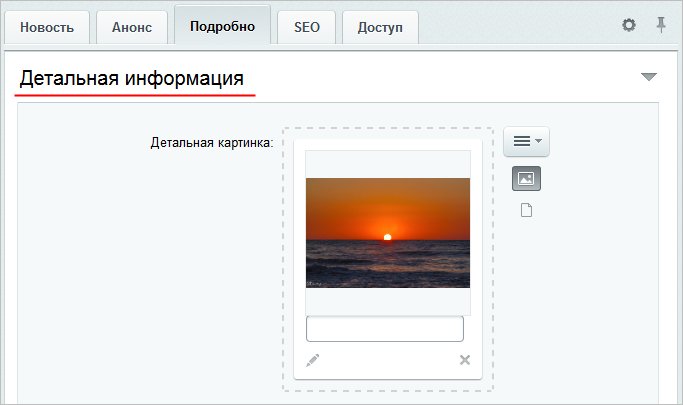
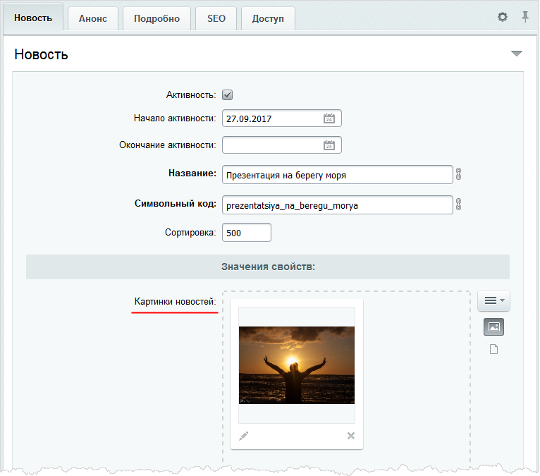
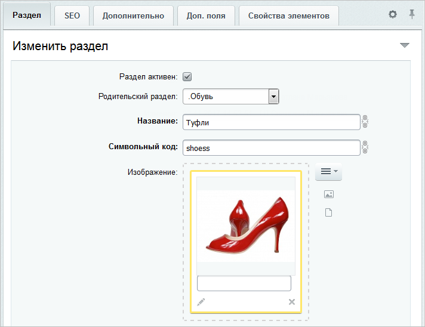
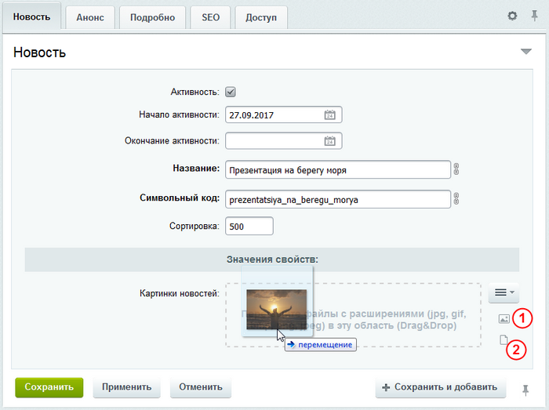
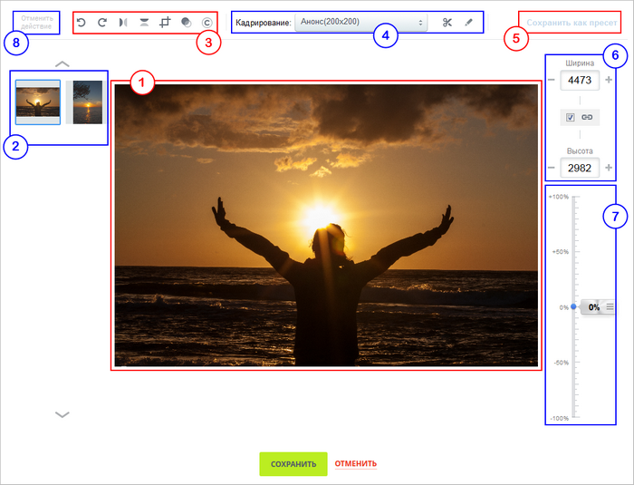
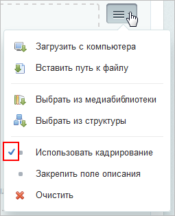

# Редактор изображений в элементах инфоблока

**Навигация**
- [← Оглавление курса](index.md)
- [← Предыдущий: 10131 — Элементы: создание, изменение, удаление](lesson_10131.md)
- [Следующий: 6305 — Настройка SEO информации →](lesson_6305.md)

Официальная страница урока: https://dev.1c-bitrix.ru/learning/course/index.php?COURSE_ID=34&LESSON_ID=7243

Делайте информацию в инфоблоках привлекательной, загружайте большое количество фотографий. При этом не нужно устанавливать специальное программное обеспечение, в инфоблоки встроен собственный редактор изображений.

### Видеоурок

**Примечание:** инструмент загрузки и обработки изображений доступен с версии 15.5.1. Его можно использовать для

			картинок анонса

                    

		,

			детальных картинок

                    

		 элемента, для фотографий,

			загружаемых в свойство

                    

		 типа **Файл** и для

			изображений

                    

		 раздела.

### Как пользоваться редактором?

1. Откройте форму редактирования элемента (раздела).
2. Перетащите в область картинок
                      В области картинок показываются либо эскизы изображений, либо иконки с названием файлов.
  Это определяется нажатием кнопок 1 и 2 соответственно.
  
  		 изображения с локального компьютера.
  Хотите загрузить из других источников? Используйте кнопку .
3. Дважды кликните по добавленному изображению либо нажмите на "карандашик" под изображением. Откроется окно редактора:
  
  **Примечание:** для добавляемых изображений редактор откроется автоматически, если предварительно в меню кнопки  отметить пункт
  			Использовать кадрирование
                      
  		.
  Придайте подходящий вид изображению, отображаемому в рабочей области 1. При этом:
  - Инструменты панели 3 используйте для поворота, отражения,
    			обрезки изображения
                        При выполнении обрезки отображается специальная панель управления. Так, кнопка  позволяет очистить выделенную область, предназначенную для обрезки. Кнопка  служит непосредственно для обрезки изображения согласно выбранной области, а кнопка  определяет сохранять ли соотношение сторон при выборе обрезаемой области.
    		, а также при переводе изображения в черно-белый вид и добавлении подписи.
  - Сохраняйте настройки выполняемой вами обрезки по кнопке 5, чтобы применять их в дальнейшем.
  - Обрезайте изображение по вашим настройкам: в панели 4 выберите пресет и нажмите кнопку . В рабочей области 1 сразу отобразится рамка обрезки нужного размера.
    Старые пресеты редактируйте по кнопке  панели 4.
  - Изменяйте размеры изображения в абсолютном 6 или процентом соотношении 7.
  - Не бойтесь ошибиться. Любое действие отменяется по кнопке 8.
  Если вы загрузили несколько изображений в область, то не закрывайте редактор. Переключайтесь между обрабатываемыми изображениями с помощью панели 2.
  Сохраните выполненные настройки.

### Заключение

Вы узнали, как пользоваться встроенным инструментом загрузки и обработки изображений. Попробуйте инструмент в работе, добавьте изображения в элементы инфоблока на вашем сайте.
