# Каталог товаров на простых компонентах

**Навигация**
- [← Оглавление курса](index.md)
- [← Предыдущий: 7180 — Красивые адреса для фильтра товаров](lesson_7180.md)
- [Следующий: 13596 — Как массово поменять картинки в товарах каталога →](lesson_13596.md)

Официальная страница урока: https://dev.1c-bitrix.ru/learning/course/index.php?COURSE_ID=34&LESSON_ID=7250

Прежде чем приступать к изучению этого примера, освежите свои знания об отличиях простых компонентов от комплексных компонентов. Мы рассказывали об этом в уроке курса Контент-менеджер [Что такое компоненты](lesson_1992.md).

### Введение

Пример, приведенный в этом уроке, не обязателен для повторения, опубликован для самых пытливых и любознательных.

Простые компоненты применяются редко, т.к. требуют более длительной и сложной настройки, а также ручного создания страниц. Работать с комплексными компонентами проще и быстрее, они уже включают в себя все необходимые простые компоненты и самостоятельно выполняют работу по созданию разделов и страниц. Поэтому мы настоятельно рекомендуем публиковать ваш [каталог товаров](https://dev.1c-bitrix.ru/learning/course/index.php?COURSE_ID=42&LESSON_ID=13600) с помощью **комплексного компонента**.

В каких же случаях могут понадобиться простые компоненты вместо комплексных? Примеры таких задач:

- Необходим вывод элементов только определенного раздела инфоблока (напр., только раздела Штаны из инфоблока Одежда);
- Требуется отображение информации из разных компонентов на одной странице сайта (напр.,
  			показ случайного фото
                      Одностраничный компонент cлужит для показа одной произвольной фотографии.
  						[Описание компонента «Случайное фото» в пользовательской документации.](http://dev.1c-bitrix.ru/user_help/detail.php?ID=62977)
  		 и
  			списка новостей
                      Одностраничный компонент выводит список новостей из одного информационного блока.
  						[Описание компонента «Список новостей» в пользовательской документации.](http://dev.1c-bitrix.ru/user_help/detail.php?ID=62968)
  		).

> **Основная сложность**, которая возникает при настройке компонентов, это настройка адресов. Наиболее частая причина - недостаточное понимание как формируются ссылки (стандартные и ЧПУ) для динамической информации.
>
> Пожалуйста, изучите внимательнее такие непростые темы, как [Как формируются ссылки](lesson_12838.md#dynamic), [Человеко-понятные URL](lesson_3579.md) и [ЧПУ: делаем адреса понятными](lesson_10233.md), прежде чем приступать к примеру этого урока. Пример является обобщением разных тем, знания о которых вы должны были получить при последовательном изучении курса.

#### Практический пример

В уроке рассмотрим работу с простыми компонентами на примере. Организуем с их помощью небольшой каталог товаров на сайте. Нам понадобится создать три страницы:

- Главная страница каталога (**index.php**). На ней отобразим для посетителей структуру разделов каталога и TOP элементов;
- Страница содержимого раздела (**section.php**). На этой странице будет показано содержимое выбранного раздела и умный фильтр для фильтрации товаров;
- Страница с детальной карточкой товара (**element.php**). Такая страница отобразит подробную информацию о выбранном товаре.

**Внимание**! В примере показаны общие минимальные действия, необходимые для создания каталога на простых компонентах. Как выполнить более детальную настройку смотрите в соответствующих

			уроках

                    Ссылки указаны в текстовом описании и в конце урока.

		.

**Примечание**: При изменении настроек компонентов, результаты изменений не всегда отображаются сразу из-за кеширования информации. Чтобы исключить влияние кеша после изменения настроек, включите режим правки и сбросьте

			кеш компонентов

                    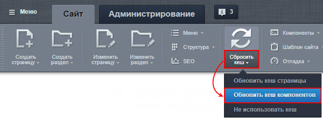

		, размещенных на открытой странице.

### Создание каталога на простых компонентах

В видео показан процесс создания каталога товаров на простых компонентах. После видео есть текстовое описание, в котором вы найдете дополнительные пояснения.

#### Текстовое описание процесса

#### 1 Первый этап. Создание структуры

Создадим новый раздел и три страницы через Публичный раздел:

1. Нажмем кнопку
  			Создать раздел
                      
  		 на
  			Панели управления
                      На Панели управления собраны все команды, которые доступны контент-менеджеру при работе с сайтом. [Подробнее](lesson_1831.md)...
  
  		. Введем название. Снимем галочку с редактирования страницы, а добавление пункта в меню оставим. При создании нового раздела автоматически создастся страница **index.php**.
2. В новом разделе создадим две страницы: **section.php** и **element.php**. Для них пункты в меню не добавляем, страницы пока оставляем пустыми.

#### 2 Второй этап. Настройка инфоблока товаров

Создайте

1. Откройте страницу  Контент &gt; Инфоблоки &gt; Типы инфоблоков &gt; название_типа, где вместо название_типа у вас отображается реальное название нужного типа инфоблоков (учтите, что после создания инфоблока его тип уже нельзя будет поменять).

2. Нажмите кнопку **Добавить инфоблок**.

3. Заполните поля формы редактирования инфоблока.

[Подробнее](lesson_4534.md)...

		 и настройте инфоблок товаров:

1. Заполните все обязательные поля и задайте
  			адреса страниц
                      В адресах, которые заданы по умолчанию при создании инфоблока, замените раздел и названия страниц:
  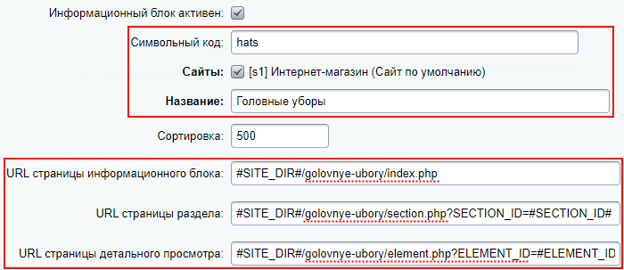
  		 (с учетом созданных нами страниц на первом этапе):

  - URL страницы информационного блока: `#SITE_DIR#/golovnye-ubory/index.php`
  - URL страницы раздела: `#SITE_DIR#/golovnye-ubory/section.php?SECTION_ID=#SECTION_ID#`
  - URL страницы детального просмотра: `#SITE_DIR#/golovnye-ubory/element.php?ELEMENT_ID=#ELEMENT_ID#`
2. Настройте поля и свойства инфоблока;
3. Обязательно настройте инфоблок на работу в
  			режиме торгового каталога;
  Чтобы нужный информационный блок работал в режиме торговых каталогов, необходимо
  отметить его флажком в поле **Является торговым каталогом** на странице настроек модуля
  **Торговый каталог** (Настройки &gt; Настройки продукта &gt; Настройки модулей &gt; Торговый каталог).
  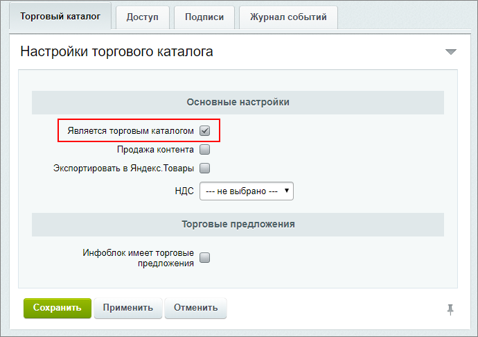
  [Подробнее](/learning/course/index.php?COURSE_ID=42&LESSON_ID=3456)...
4. Чтобы посетители имели доступ к инфоблоку на закладке **Доступ** установите **Чтение** (по умолчанию стоит **Запрещен**);
5. Выполните настройку
  			отображения свойств в умном фильтре
                      В умном фильтре могут быть отображены свойства товаров и торговых предложений. Кроме того, начиная с версии 15.0.1 модуля Информационные блоки, для свойств доступна настройка их визуального представления.
  [Подробнее](/learning/course/index.php?COURSE_ID=42&LESSON_ID=5371)...
  Также для разделов может быть настроен различный набор свойств, в одном инфоблоке возможно держать разнотипные товары с различными свойствами.
  [Подробнее](/learning/course/index.php?COURSE_ID=42&LESSON_ID=5124)...
  		;
6. Наполните инфоблок
  			товарами
  Товары в каталог добавляются либо вручную, либо "оптом", через импорт. При первичном заполнении каталога предпочтительнее импорт, а вот добавлять новые товары в уже существующий каталог приходится вручную, через административный или публичный раздел, как удобнее.
  [Подробнее](https://dev.1c-bitrix.ru/learning/course/index.php?COURSE_ID=34&CHAPTER_ID=06462&LESSON_PATH=3905.4478.6462)...
  		.

### Настройка ЧПУ для каталога на простых компонентах

В видео показан процесс настройки ЧПУ для существующего каталога товаров на простых компонентах (который мы создали ранее в этом же уроке). После видео есть текстовое описание, в котором вы найдете дополнительные пояснения.

#### Текстовое описание процесса

Сделаем для нашего каталога на простых компонентах красивые адреса. Для этого нам понадобится:

- Настроить
  			символьные коды
                      **Символьный код** - это заданный латиницей осмысленный код.
  		;
- Внести изменения в **шаблоны адресов** инфоблока и компонентов;
- Включить
  			ЧПУ
                      Средства «1С-Битрикс: Управление сайтом» позволяют сделать ссылки более понятными с помощью специальной функции. Функция встроена во все комплексные компоненты (и отдельные простые) и преобразует стандартный веб-адрес в так называемый человеко-понятный URL (сокращенно ЧПУ).
  [Подробнее](lesson_3579.md)...
  		 в компонентах и
  			настроить
                       Согласитесь, что ссылка на некий элемент инфоблока http://mysite.ru/catalog/pants/pants-striped-flight/ гораздо понятнее посетителям, чем http://mysite.ru/catalog/?SECTION_ID=8&ELEMENT_ID=4. Весомым аргументом в пользу человеко-понятных адресов является и то, что такие адреса лучше воспринимаются поисковыми машинами. Сделайте красивые адреса для элементов инфоблока вместе с поддержкой ЧПУ в компонентах.
  [Подробнее](lesson_10233.md)...
  		 правила его применения.

#### 1 Первый этап. Настройка символьных кодов

Для того, чтобы в адресах использовались понятные пользователю слова вместо числовых идентификаторов **ID**, настроим символьные коды **CODE**:

- В настройках инфоблока в разделах **Поля** и **Поля разделов** включим **символьные коды**, а также отметим для них проверку на уникальность и автоматическую транслитеризацию из названия;
- Для существующих разделов инфоблока и его элементов
  			создадим символьные коды
                      Может возникнуть ситуация, когда инфоблок с элементами уже давно создан и вы не использовали символьные коды. А сейчас они вам понадобились (например, для настройки ЧПУ). В этом случае пригодится инструмент групповой генерации символьных кодов.
  [Подробнее](lesson_12876.md)...
  		. Для новых элементов они создадутся автоматически.

#### 2 Второй и 3 третий этапы. Настройка шаблонов адресов и ЧПУ в компонентах

**Важно**! Настройки ЧПУ выполняются в зависимости от версии модуля **Информационные блоки** следующим образом:

- если версия 15.5.0 или выше, то настройка ЧПУ выполняется в секции компонентов
  			Управление адресами страниц
                      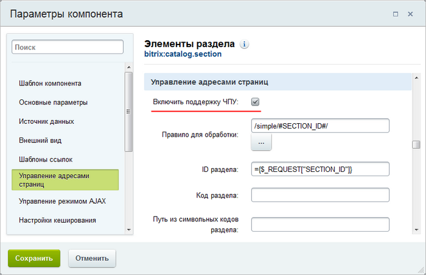
  		;
  если версия ниже, чем 15.5.0, то следует вручную составить
  			правило
                      Подробнее в примере [Настройка ЧПУ в простых компонентах](https://dev.1c-bitrix.ru/learning/course/index.php?COURSE_ID=35&LESSON_ID=4901&LESSON_PATH=3906.4493.4818.4901#simple).
  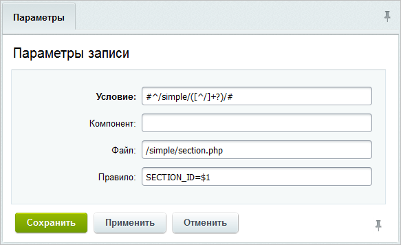
  		 на странице Настройки &gt; Настройки продукта &gt; Обработка адресов &gt; Правила обработки.

1. В настройках **инфоблока** изменим адреса
  			таким образом
                      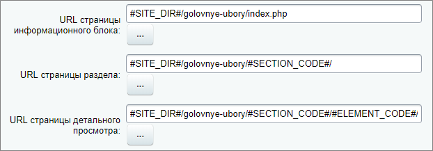
  		:
  **Примечание**: Далее в настройках компонентов все адреса указываются такими же, как и в настройках инфоблока (только опущен макрос `#SITE_DIR#`).

  - URL страницы информационного блока: `#SITE_DIR#/golovnye-ubory/index.php`
  - URL страницы раздела: `#SITE_DIR#/golovnye-ubory/#SECTION_CODE#/`
  - URL страницы детального просмотра: `#SITE_DIR#/golovnye-ubory/#SECTION_CODE#/#ELEMENT_CODE#/`
2. Компонент **Элемент каталога детально**:

  - Настроим новые
    			шаблоны адресов
                        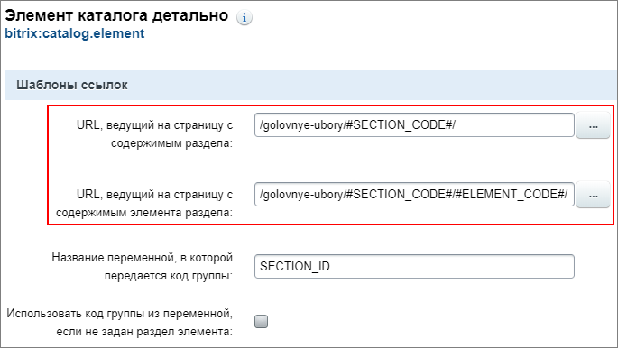
    		;
  - Включим ЧПУ и укажем
    			правило
                        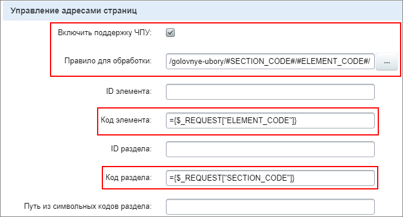
    		: `/golovnye-ubory/#SECTION_CODE#/#ELEMENT_CODE#/`. Также проверим код раздела `={$_REQUEST["SECTION_CODE"]}` и код элемента `={$_REQUEST["ELEMENT_CODE"]}`.
3. Компонент **Умный фильтр**:

  - Включим ЧПУ и укажем
    			правило
                        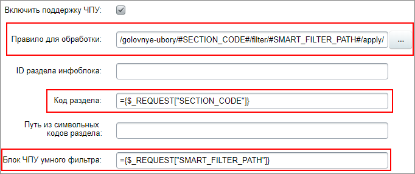
    		: `/golovnye-ubory/#SECTION_CODE#/filter/#SMART_FILTER_PATH#/apply/`. Также проверим код раздела `={$_REQUEST["SECTION_CODE"]}` и блок ЧПУ умного фильтра `={$_REQUEST["SMART_FILTER_PATH"]}`.
4. Компонент **Элементы раздела**:

  - Настроим новые
    			шаблоны адресов
                        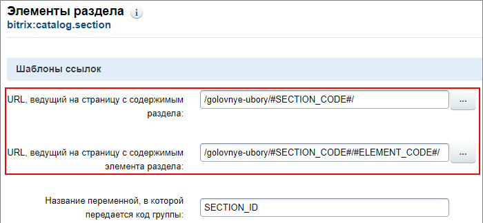
    		;
  - Включим ЧПУ и укажем
    			правило
                        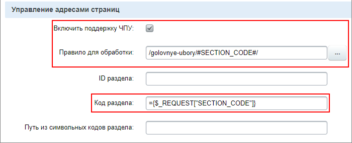
    		: `/golovnye-ubory/#SECTION_CODE#/`. Также проверим код раздела `={$_REQUEST["SECTION_CODE"]}`.
5. Для компонента **Структура разделов** изменим только шаблон адреса на: `/golovnye-ubory/#SECTION_CODE#/`;
6. Для компонента **Top элементов каталога**
  			меняем шаблоны
                      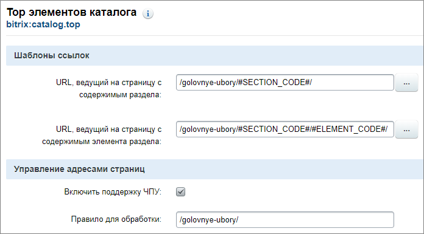
  		. Включаем ЧПУ, но в нашем случае страница всегда неизменна, поэтому правило: `/golovnye-ubory/`.

### Результат

Каталог товаров на простых компонентах настроен. Рассмотрены два способа: с применением ЧПУ и без.

#### Результат создания каталога товаров на простых компонентах

- Главная (index.php):
  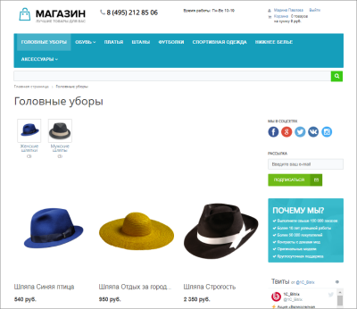
- Страница элементов раздела (section.php):
  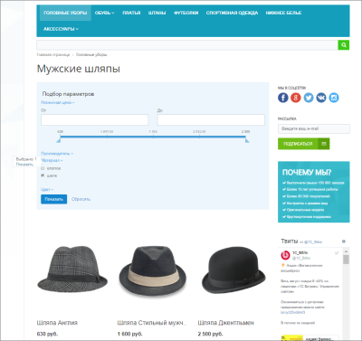
- Страница детального просмотра (element.php):
  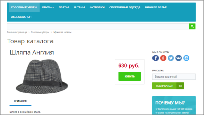

### Список материалов

- [Создание и настройка инфоблока](https://dev.1c-bitrix.ru/learning/course/index.php?COURSE_ID=34&CHAPTER_ID=02011);
- [Разделы и элементы инфоблока](https://dev.1c-bitrix.ru/learning/course/index.php?COURSE_ID=34&CHAPTER_ID=09921);
- [Настройки инфоблока для корректного поиска элементов](lesson_3579.md);
- [Наполнение каталога товарами](https://dev.1c-bitrix.ru/learning/course/index.php?COURSE_ID=34&CHAPTER_ID=06462);
- [Подготовка файла CSV для импорта каталога](https://dev.1c-bitrix.ru/learning/course/index.php?COURSE_ID=42&LESSON_ID=5223);
- [Компоненты: выставляем информацию напоказ](lesson_1884.md);
- [Как формируются ссылки](lesson_12838.md)
- [Человеко-понятные URL](lesson_3579.md);
- [ЧПУ: делаем адреса понятными](lesson_10233.md) - настройка ЧПУ в компонентах;
- [Настройка ЧПУ в Умном фильтре](lesson_7180.md);
- [Групповая генерация символьных кодов](lesson_12876.md).
