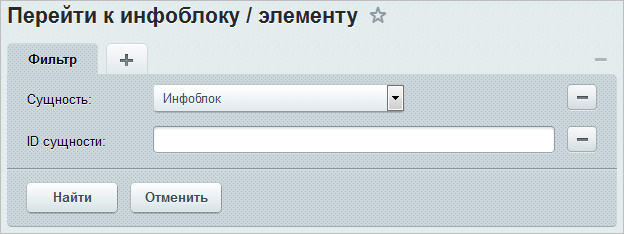
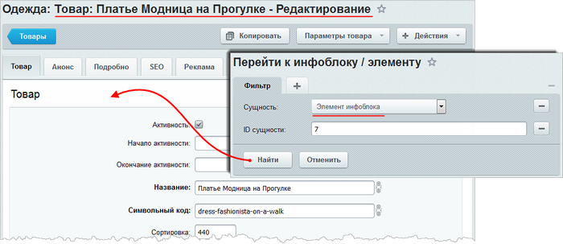

# Как быстро открыть форму элемента или инфоблока

**Навигация**
- [← Оглавление курса](index.md)
- [← Предыдущий: 13038 — Практические задания](lesson_13038.md)
- [Следующий: 5364 — Фасетный поиск: улучшаем работу каталога товаров →](lesson_5364.md)

Официальная страница урока: https://dev.1c-bitrix.ru/learning/course/index.php?COURSE_ID=34&LESSON_ID=7341

### Как быстро открыть форму элемента или инфоблока

Представьте, что вы знаете идентификатор элемента и вам требуется его отредактировать. Не тратьте время на поиски, используйте

			специальный инструмент

                    <!-- &lt;iframe title="Как быстро открыть форму элемента или инфоблока" src="//www.youtube.com/embed/2bGGSMFfI08?feature=oembed&rel=0" allowfullscreen="" frameborder="0" width="720" height="720"&gt;&lt;/iframe&gt; -->

		 быстрого перехода к инфоблоку/элементу:

1. Откройте страницу  Контент &gt; Инфоблоки &gt; Инструменты &gt; Перейти к инфоблоку / элементу:
  
2. Укажите  вид сущности (инфоблок или элемент) и ее идентификатор.

Так, если был введен идентификатор для инфоблока, то по кнопке **Найти** будет открыта страница инфоблока, содержащая список его разделов и элементов:

**Примечание:** при поиске учитываются права доступа к инфоблоку. Если у пользователя право доступа будет ниже, чем **Просмотр в панели**, то ему будет выведено сообщение о том, что инфоблок не найден.

Если же выполняется поиск элемента, то по нажатию кнопки **Найти** открывается форма его редактирования:

**Примечание:** при поиске элементов также учитываются права доступа. Если у пользователя право доступа к элементу инфоблока будет ниже, чем **Просмотр в панели**, то ему будет выведено сообщение о том, что элемент не найден.

### Заключение

Открывайте формы редактирования элементов и инфоблоков в два клика, когда знаете их идентификаторы. В следующем [уроке](lesson_5364.md) вы познакомьтесь с технологией фасетного поиска.
