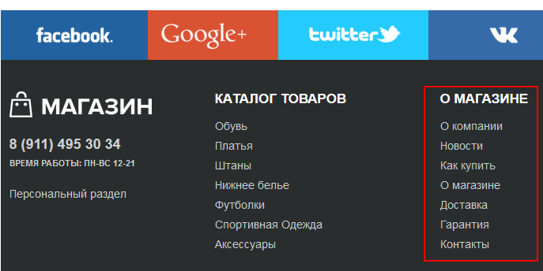
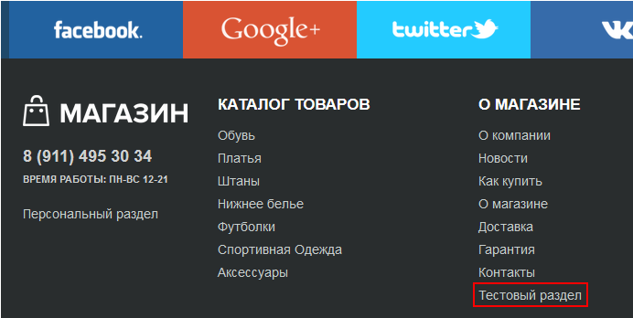
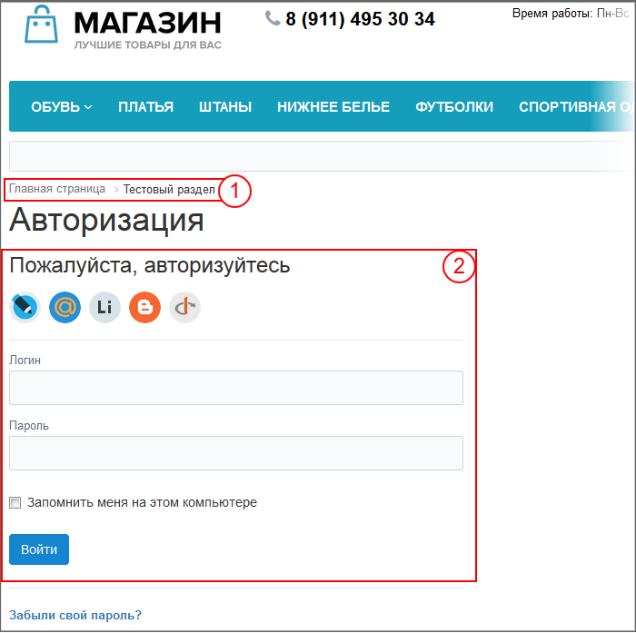
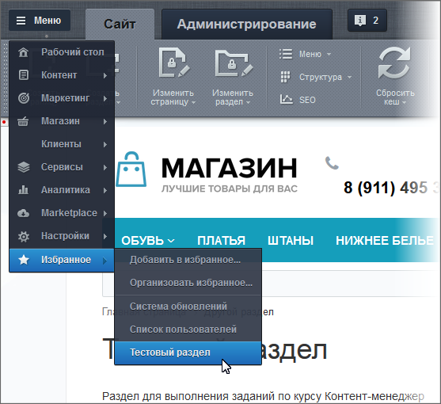

# Права доступа на статические страницы

**Навигация**
- [← Оглавление курса](index.md)
- [← Предыдущий: 2581 — Структура сайта](lesson_2581.md)
- [Следующий: 2738 — Загрузка файлов и Медиабиблиотека →](lesson_2738.md)

Официальная страница урока: https://dev.1c-bitrix.ru/learning/course/index.php?COURSE_ID=34&LESSON_ID=7719

|  | **По материалам уроков:** 
 [Управление правами доступа](https://dev.1c-bitrix.ru/learning/course/index.php?COURSE_ID=34&CHAPTER_ID=06675&LESSON_PATH=3905.4461.6675) 
 [Создание новых страниц и разделов](lesson_1911.md)  
 [Навигация, Избранное и поиск](lesson_1990.md) 
 [Настройка компонентов на работу с информационными блоками](lesson_1884.md) 
 [Расширенный режим настройки меню](/learning/course/index.php?COURSE_ID=35&LESSON_ID=2018) |
| --- | --- |

В этом задании "поиграемся" с правами доступа и посмотрим что на что влияет.

#### Первое задание: задание прав доступа на пункт меню

**Примечание**: Для выполнения этого задания ознакомьтесь с уроком [Расширенный режим настройки меню](/learning/course/index.php?COURSE_ID=35&LESSON_ID=2018) из курса Администратор. Базовый. Выполняемая задача в теории выполняется администратором сайта, но на практике её часто поручают Контент-менеджерам.

Скройте Тестовый раздел из Нижнего меню для неавторизованных пользователей. Пояснение: сама страница доступна по прямому адресу.

Подсказка: воспользуйтесь командой **Редактировать меню в Панели управления** в форме редактирования меню.

## Результат выполнения задания

Пункт Нижнего меню **Тестовый раздел** не отображается для неавторизованого пользователя:

Сама страница открывается, если в адресной строке ввести вручную её прямой адрес:

1 -  если в адресной строке браузера набрать прямой путь, то страница откроется.

2 - пользователь не авторизованный

#### Второе задание: задание прав доступа на страницу

Отмените все ограничения прав доступа из первого задания.

Выполните задачу обратную первому заданию: закройте доступ к Тестовому разделу для неавторизованных пользователей при сохранении пункта меню.

## Результат выполнения задания

Для неавторизованного пользователя пункт меню **Тестовый радел** отображается в Нижнем меню:

Но если неавторизованный пользователь попробует перейти по этому пункту меню - сама страница не открывается:

1 - неавторизованный пользователь находится в Тестовом разделе,

2 - но вместо содержания раздела видит форму авторизации.

#### Дополнительно

Добавьте Тестовый раздел в **Избранное** для быстрого доступа.

## Результат выполнения задания

Добавленная страница в Избранное:

