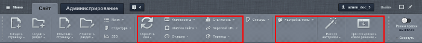

# Нельзя делать!

**Навигация**
- [← Оглавление курса](index.md)
- [← Предыдущий: 2149 — Ошибки при работе со структурой](lesson_2149.md)
- [Следующий: 2528 — С чего начать →](lesson_2528.md)

Официальная страница урока: https://dev.1c-bitrix.ru/learning/course/index.php?COURSE_ID=34&LESSON_ID=7959

|  | ### Что можно сломать ненароком в системе |
| --- | --- |

"1С-Битрикс: Управление сайтом" реализована развитая и сложная система прав. Но даже она не всегда позволяет полностью разграничить пользователей по правам доступа. Поэтому возникают ситуации, когда Контент-менеджеру доступны действия, предназначенные для администраторов.

1. В
  			Панели управления
                      Панель управления - простой и понятный инструмент для выполнения повседневных задач контент-менеджера. От простого редактирования информации до распределения прав доступа - всё это можно выполнить в одном месте.
  [Подробнее ...](lesson_3557.md)
  		 на закладке **Сайт** кнопки для разработчиков не видны Контент-менеджеру при правильной настройке. Если видны, то помните значение кнопок и не используйте непредназначенные для Контент-менеджера. Внимательно изучите этот список!
  
2. При работе в Визуальном редакторе, либо при включённом режиме
  			Правка
  
  		 вам может быть доступно
  			управление компонентами
                      Мы разместили на странице компонент , теперь приступим к настройке. Настройка выполняется двумя способами:...
  [Подробнее ...](lesson_9165.md)
  		. Производя настройки параметров компонента, вы должны точно понимать какие настройки должны быть изменены.
  Кроме этого возможно случайное удаление или отключение компонента, смена используемого шаблона на другой.
3. В ряде случаев Контент-менеджеру даются права на настройку Информационного блока, например, для
  			настроек SEO
                      В данном уроке научимся работать с SEO данными для элементов и разделов инфоблока. Допустим, что у нас на сайте опубликован инфоблок Продукция, в котором уже заданы некоторые настройки SEO.
  [Подробнее ...](lesson_6305.md)
  		 или
  			ЧПУ
                      Чтобы изменить вид адресов на более приятный и понятный, выполните следующие действия:
  [Подробнее ...](lesson_3579.md)
  		. Помните, что изменение иных настроек в информационном блоке может привести к неприятным последствиям.
4. Иногда предоставляется доступ к изменению
  			шаблонов дизайна
                      Контент-менеджер может управлять внешним видом сайта, который определяется шаблоном сайта. Создать этот шаблон может только разработчик: слишком много надо знать о HTML, PHP и многом другом. Но после того как шаблон создан и размещён на сайте, управление им доступно контент-менеджеру.
  [Подробнее ...](lesson_1994.md)
  		сайта. Изменение иных параметров сайта на странице настроек сайта приводит к искажению вывода информации, либо к полной недоступности сайта.
5. Если в Визуальном редакторе доступно изменение кода в режиме работы
  			с исходным кодом
                      Визуальный редактор может работать в двух режимах. Визуальный режим - более простой и интиутивно понятный вариант. Мы сразу видим как будут выглядеть элементы на странице. Второй вариант - режим исходного кода. Он предназначен для опытных пользователей и позволяет произвести дополнительную настройку (например, задать значения параметров).
  [Подробнее ...](lesson_6301.md#code)
  		, то в этом режиме возможно случайное изменение, например, кода компонента. Это приведёт к неправильному отображению информации.
