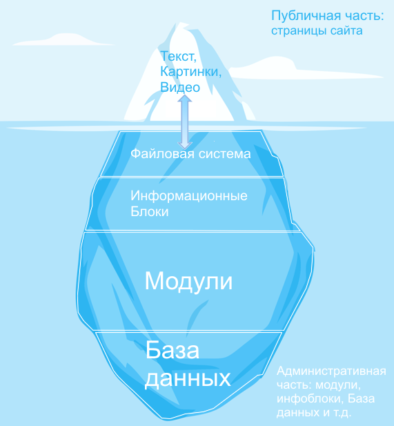

# Создание физических страниц

**Навигация**
- [← Оглавление курса](index.md)
- [← Предыдущий: 3742 — Как формируется страница сайта?](lesson_3742.md)
- [Следующий: 1973 — Работа с инфоблоками →](lesson_1973.md)

Официальная страница урока: https://dev.1c-bitrix.ru/learning/course/index.php?COURSE_ID=34&LESSON_ID=7981

|  | Это ознакомительный материал. Детальнее смотрите в главе [Изменение структуры сайта](https://dev.1c-bitrix.ru/learning/course/index.php?COURSE_ID=34&CHAPTER_ID=08437&LESSON_PATH=3905.4460.8437) |
| --- | --- |

|  | ### Создание физических страниц: самый простой сценарий взаимодействия |
| --- | --- |

Создание, изменение, удаление

Изменять структуру сайта контент менеджер должен с публичного раздела . Это самый простой и удобный способ работы, который предоставлен разработчиками "1С-Битрикс: Управление сайтом".

[Подробнее](https://dev.1c-bitrix.ru/learning/course/index.php?COURSE_ID=34&CHAPTER_ID=08437&LESSON_PATH=3905.4460.8437)...

		 физической страницы с текстом и картинками - простейший сценарий взаимодействия элементов структуры вашего сайта.

При создании страницы сайта создаётся файл в файловой системе сайта в выбранной папке. Этот файл и показывается при открытии страницы посетителем. Этот процесс показан на иллюстрации стрелочками.

При редактировании содержания физической страницы не происходит обращения к программному коду системы: модулям, компонентам, Базе данных, если на этой странице не размещены компоненты. Всё просто и однозначно, как в случае работы с обычными файлами на компьютере.

|  | #### Важно запомнить! |
| --- | --- |

- Создали страницу - создали файл.
- Наполнили страницу содержанием - наполнили файл содержанием.
- Показ страницы в браузере пользователя происходит без работы программного кода вашего сайта.
