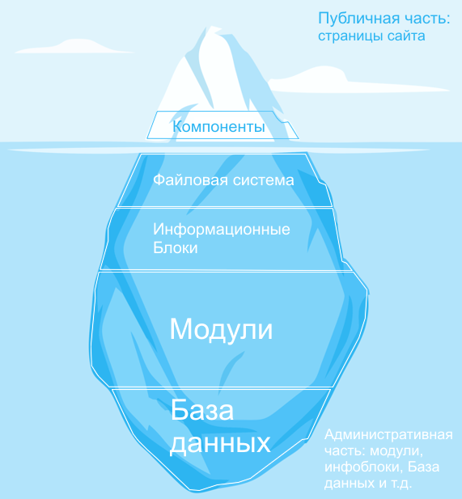
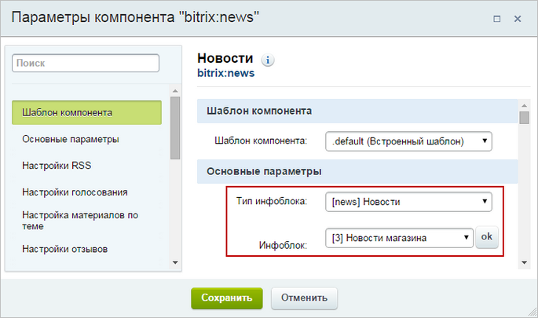
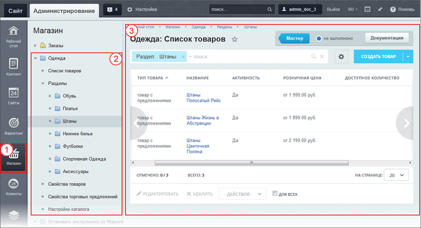
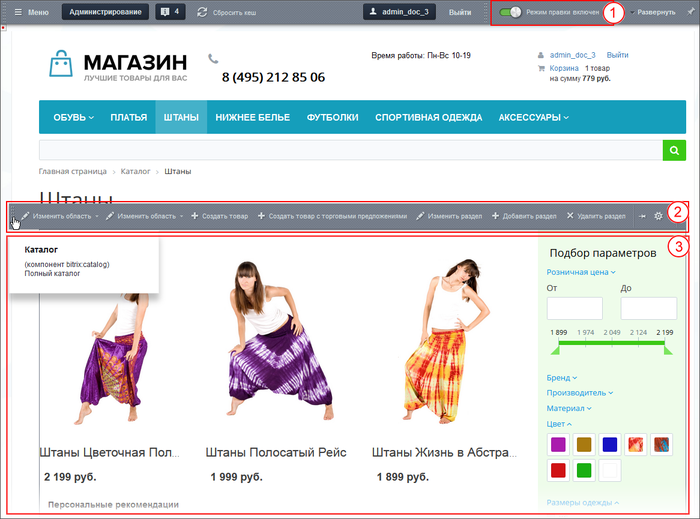

# Модули и компоненты

**Навигация**
- [← Оглавление курса](index.md)
- [← Предыдущий: 8627 — Информационные блоки](lesson_8627.md)
- [Следующий: 3070 — Зачем всё это нужно →](lesson_3070.md)

Официальная страница урока: https://dev.1c-bitrix.ru/learning/course/index.php?COURSE_ID=34&LESSON_ID=7987

Это ознакомительный материал. Детальнее смотрите в главе [Компоненты: что это и как их использовать](https://dev.1c-bitrix.ru/learning/course/index.php?COURSE_ID=34&CHAPTER_ID=04457&LESSON_PATH=3905.4457)

### Модули и компоненты

#### Модули

Модуль - объёмная часть программного кода, отвечающая за определённый функционал на сайте. Например, модуль Интернет-магазин отвечает за продажи, а модуль Поиск - за поиск информации на сайте.

Внутри модуля проводится большая работа для правильного отображения информации на сайте. Простой пример: установлена скидка на часть товаров в процентах. Но посетителям интернет-магазина цена отображается в рублях. Вот модуль и рассчитает, и покажет эту новую цену.

Единого места хранения модулей в Административной части нет. Они более-менее равномерно распределены по всему административному разделу.

Модули работают с Базой данных как опосредованно, через информационные блоки, так и напрямую.

Менять поведение модуля можно в определённых пределах с помощью настроек.

#### Компоненты

Компонент - "представитель" модуля в Публичной части системы. С его помощью модуль выводит информацию для просмотра. У каждого модуля - свой набор компонентов. Каждый компонент решает только одну конкретную задачу в Публичной части сайта: проведение опроса, показ новостей, оформить заказ в магазине, вывод форума или блога и так далее.

Компонент - связующее звено между Модулем и Инфоблоками. Без него Инфоблоки ничего не стоят, они не умеют сами выводить информацию на сайт. Без компонента Модуль не знает, данные какого Информационного блока ему обрабатывать. Эта взаимосвязь устанавливается в

			настройках компонента

                    Большинство компонентов не работают если не задан информационный блок.

		. Кроме настроек на информационный блок, компоненту задаются и другие условия отображения информации.

У

			Компонента

Предположим, вы хотите расположить на странице сайта список новостей. Новости хранятся в базе данных . Но вы - не программист и не умеете обращаться к базе данных для получения информации. Компоненты облегчат вашу жизнь.

Представьте, что сайт - это дом. Дом состоит из этажей и комнат. Каждая комната выполняет определенную функцию - в спальне мы спим, на кухне готовим еду, а в ванной принимаем душ. Компонент - это готовая комната нашего дома. Мы просто "выстраиваем" внешний вид сайта из набора разных компонентов. Один компонент показывает новости, другой - сообщение в блоге. Это и есть функции компонентов.

[Подробнее](https://dev.1c-bitrix.ru/learning/course/index.php?COURSE_ID=34&CHAPTER_ID=04457&LESSON_PATH=3905.4457)...

		 есть несколько шаблонов, которые могут выводить информацию на странице сайта тем или иным способом. Меняя шаблоны, контент-менеджер меняет внешний вид страницы сайта.

### Небольшой пример

Модуль **Торговый каталог** представляет товары для покупки в интернет-магазине. В Административном разделе сайта он расположен в разделе **Магазин** Административного меню (1). В Меню функций Административного раздела (2) выводится структура каталога. А уж в Рабочей области (3) Контент-менеджер работает над самим каталогом. На иллюстрации отображены товары каталога из раздела "Штаны". Каждый товар можно открыть и отредактировать. Также можно добавить новый товар.

В Публичной части представители модуля - это компоненты. Их у каждого модуля несколько. Увидеть компонент, точнее панель его управления, можно включив режим Правки 1. Если навести указатель мыши на список товаров 3, то появится панель управления компонентом 2, позволяющая добавлять новый товар, редактировать старый.

### Важно запомнить!

Модули:

- отвечают за большую часть функционала сайта определённой направленности,
- можно настраивать.

Компонент:

- связывает Модуль и Информационный блок,
- работает на странице сайта и выполняет только одну конкретную задачу,
- требует настройки на нужный информационный блок, на нужный способ отображения информации (шаблон) и на другие условия отображения информации.
