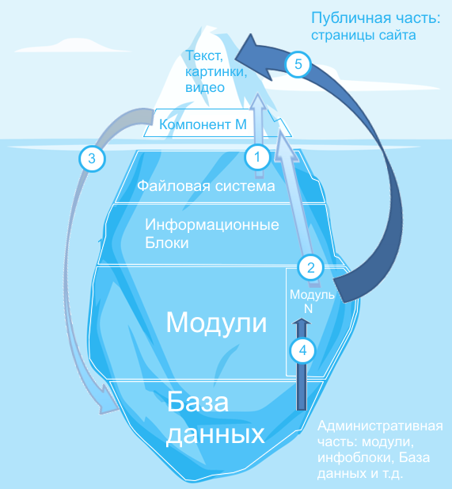
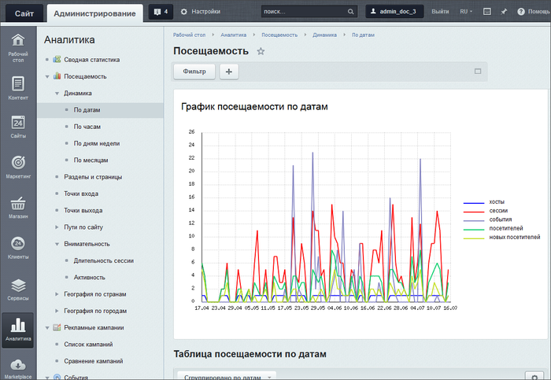
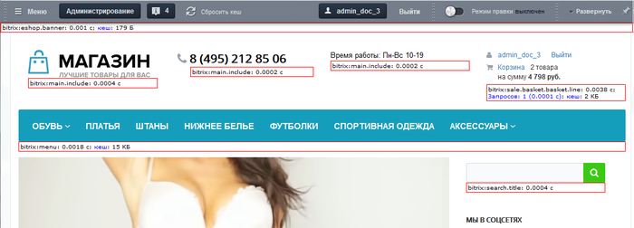

# Работа без инфоблоков

**Навигация**
- [← Оглавление курса](index.md)
- [← Предыдущий: 1973 — Работа с инфоблоками](lesson_1973.md)
- [Следующий: 2302 — Проверьте себя →](lesson_2302.md)

Официальная страница урока: https://dev.1c-bitrix.ru/learning/course/index.php?COURSE_ID=34&LESSON_ID=8589

### Работа без инфоблоков

Без использования инфоблоков работают, в основном, служебные модули, с которыми Контент-менеджеру практически не придётся сталкиваться. Это модули, где информация публикуется посетителями сайта (блоги, форумы, опросы и др.) или формируется самостоятельно на основе служебной информации о работе сайта (например, модули Веб-аналитика или Баннерная реклама). В этом случае схема работы упрощается.

#### Создание страницы для динамической информации

1. В файловой структуре в нужном разделе создаём страницу.
2. На странице размещаем нужный нам компонент M из модуля N.

#### Посетитель открыл страницу, что происходит

1. Посетитель заполняет форму с данными (форма обратной связи, пишет сообщение на форуме или блоге и так далее.) Компонент передаёт данные в Базу данных для хранения.
2. При следующем открытии страницы другим пользователем База данных передаёт модулю N информацию.
3. Модуль производит необходимые изменения этой информации и выдаёт её компоненту М для показа.

В результате посетитель на странице видит текст, картинки, видео и так далее.

#### Если модуль сам формирует данные

Если модуль предназначен для обработки служебной информации о сайте, то тут ещё проще:

- Модуль сам передаёт информацию в Базу данных для хранения.
- При необходимости вызывает её из Базы, обрабатывает и показывает на странице в Административном разделе или на страницах сайта.

### Примеры

Первый пример модуля, работающего без инфоблоков - модуль

			**Веб-аналитика**

                    Модуль Веб-аналитика - это эффективная обратная связь с посетителями. Он помогает проанализировать готовность структуры и материалов для достижения целей рекламных кампаний.

**Обратите внимание!** Модуль Веб-аналитика недоступен в редакциях Старт, Стандарт, Малый бизнес. Текущую редакцию Вашего *1С-Битрикс* можно просмотреть на [странице](lesson_23444.md) **Обновление платформы** (Marketplace &gt;Обновление платформы).

		. Он собирает и обрабатывает данные о посещениях страниц и выводит их в Административном разделе:

Второй пример - модуль

			**Монитор производительности**

                    Это модуль для администраторов и разработчиков. Он показывает скорость работы сайта на хостинге, выявляет узкие места (скрипты на сайте, которые потребляют наибольшее число системных ресурсов) и основные ошибки настройки сервера.

		. Он, кроме Административного раздела, может выводить информацию и в Публичной части:

### Важно запомнить!

- Часть модулей работает без привлечения информационных блоков.
- Если данные модуля выводятся на страницах сайта, то создаётся страница и на ней размещается компонент этого модуля.
- Если данные модуля не выводятся на страницах сайта, то эти данные видны в Административном разделе.
