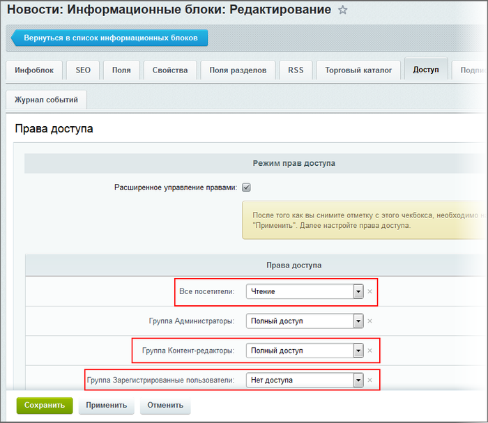
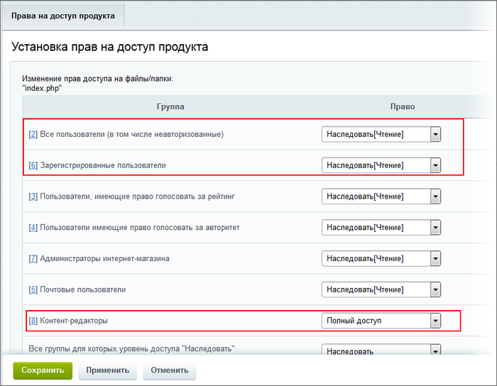
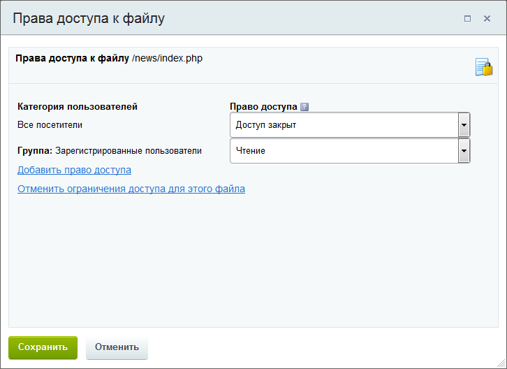
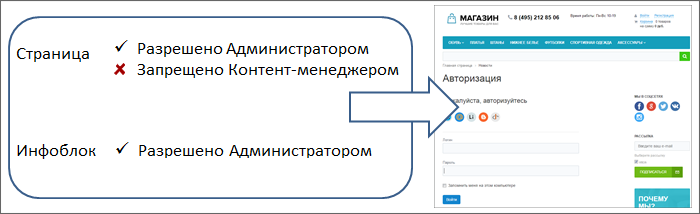
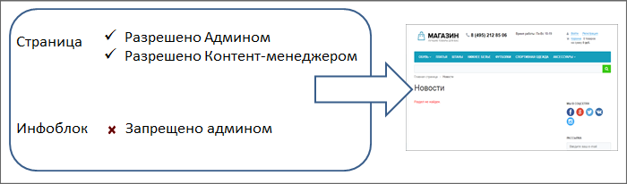
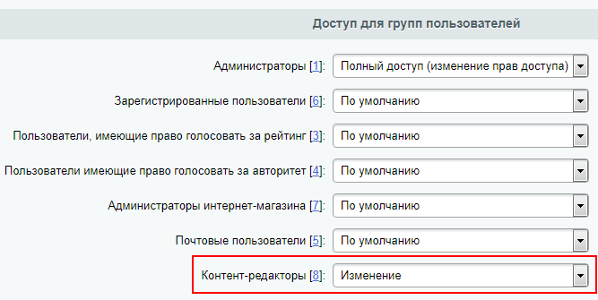
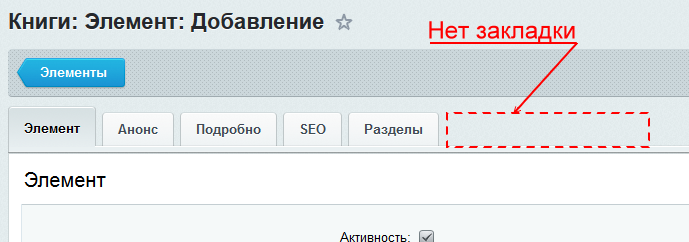
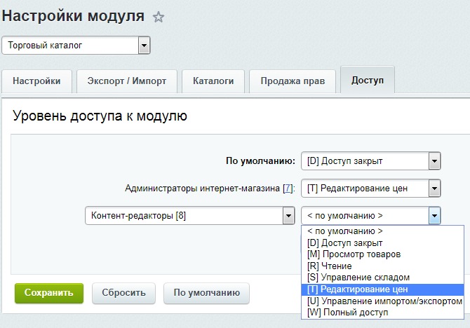

# Примеры работы прав доступа

**Навигация**
- [← Оглавление курса](index.md)
- [← Предыдущий: 6909 — Определение прав доступа динамических страниц](lesson_6909.md)
- [Следующий: 3270 — Кеш, документооборот и информация →](lesson_3270.md)

Официальная страница урока: https://dev.1c-bitrix.ru/learning/course/index.php?COURSE_ID=34&LESSON_ID=8595

### Пример 1

- Администратор выставил права на конкретный Инфоблок **Новости**
  			права доступа
                      
  		:

  - для зарегистрированных - нет доступа,
  - для всех посетителей (в т.ч. неавторизованных) - чтение,
  - для группы Контент-менеджеров - полный доступ.
- На страницу, где будет размещён компонент Новости, Администратор дал
  			доступ
                      
  		:

  - для всех пользователей (в т.ч. неавторизованных) - чтение,
  - для зарегистрированных - чтение,
  - для группы Контент-менеджеров - полный доступ.
- Контент-менеджер разместил компонент Новости, настроил его на нужный инфоблок и поправил
  			права на страницу
                      
  		:

  - для всех посетителей (в т.ч. неавторизованных) - нет доступа,
  - для зарегистрированных - чтение.

При таком сочетании:

- Незарегистрированный посетитель не увидит страницу (разрешено администратором и запрещено контент-менеджером). И, соответственно, не увидит информацию из инфоблока (хоть и разрешено Администратором).
  
- Зарегистрированный пользователь увидит страницу (разрешено и Администратором и Контент-менеджером) но не информацию на ней (Администратор запретил доступ к информации из инфоблока.)
  

### Пример 2

Рассмотрим пример, когда Администратору нужно настроить два разных права доступа, чтобы Контент-менеджер смог наполнять каталог товарами:

При настройке может возникнуть, например, такая ситуация:

- Администратор создал каталог товаров, дал для Контент-менеджера права доступа к каталогу товаров (т.е. инфоблоку) -
  			Изменение
                      
  		 и поручил наполнить его товарами;
- Контент-менеджер начал наполнение каталога, создал товар и не может добавить цены: нет вкладки
  			Торговый каталог
                      
  		 в форме создания товара;
- Причина такой ситуации в том, что Администратор забыл дать Контент-менеджеру
  			права на редактирование цен
                      
  		 в настройках модуля Торговый каталог;
- После добавления этих прав Контент-менеджеру нужно заново авторизоваться на сайте и вкладка **Торговый каталог** станет доступна. Можно приступать к созданию товаров!
