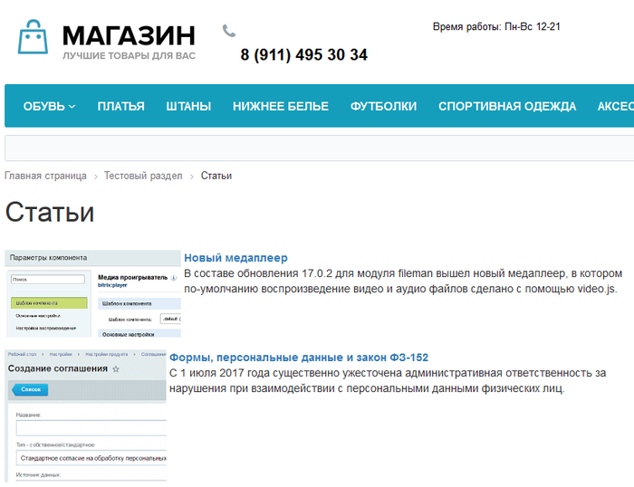
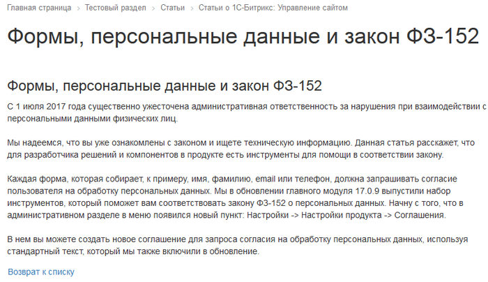
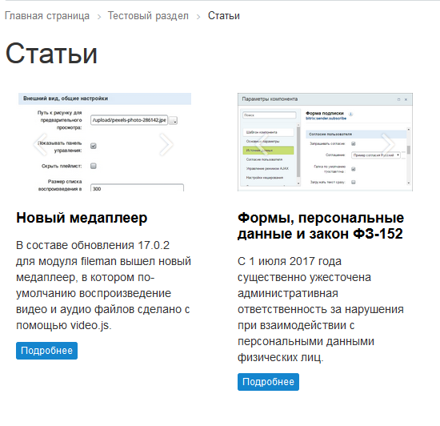
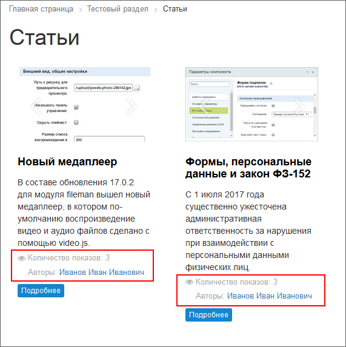
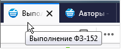
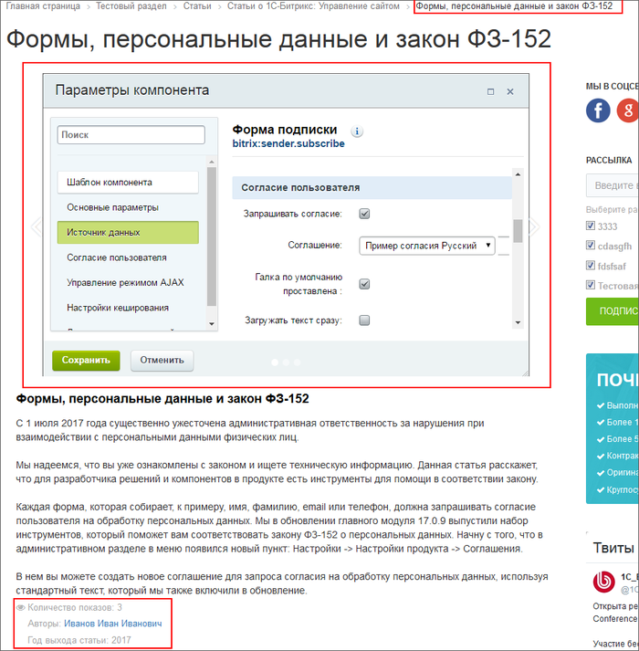
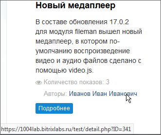
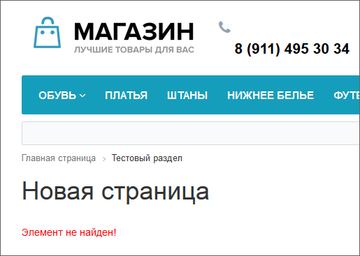
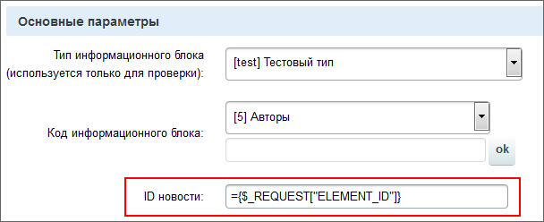
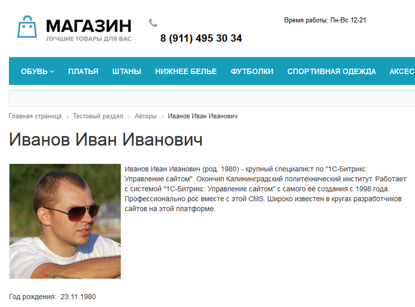

# Вывод данных в публичной части

**Навигация**
- [← Оглавление курса](index.md)
- [← Предыдущий: 8603 — Добавление статей и справочных данных](lesson_8603.md)
- [Следующий: 2701 — Работа с компонентами →](lesson_2701.md)

Официальная страница урока: https://dev.1c-bitrix.ru/learning/course/index.php?COURSE_ID=34&LESSON_ID=8597

|  | **По материалам уроков:** 
 [Компоненты: что это и как их использовать](https://dev.1c-bitrix.ru/learning/course/index.php?COURSE_ID=34&CHAPTER_ID=04457&LESSON_PATH=3905.4457) 
 [Публикация на сайте информации из инфоблоков](https://dev.1c-bitrix.ru/learning/course/index.php?COURSE_ID=34&CHAPTER_ID=09909&LESSON_PATH=3905.4477.9909) 
 [Новости (комплексный компонент)](https://dev.1c-bitrix.ru/user_help/components/content/articles_and_news/news.php) 
 [Новость детально (простой компонент)](https://dev.1c-bitrix.ru/user_help/components/content/articles_and_news/news_detail.php) |
| --- | --- |

Созданные данные выводятся в публичной части. Выполните несложные задания для решения этой задачи.

#### Задание первое. Размещение комплексного компонента

Статьи или новости, как правило, выводят комплексным компонентом **Новости**. Возможен вариант создания каталога из простых, не комплексных компонентов, но этот путь для опытных разработчиков.

Разместите в **Тестовом разделе** комплексный компонент **Новости**, настройте его на инфоблок Статьи.

## Результат выполнения первого задания

Список статей:

Страница статьи:

#### Задание второе: настройка вывода данных

Выполнение первого задания обеспечило вывод данных по умолчанию. Такой вывод данных не учитывает потребностей проекта и всех добавленных свойств. Для вывода в нужном нам формате измените настройки компонента:

1. Примените шаблон компонента **flat**, это изменит вывод списка, внешний вид и позволит впоследствии использовать слайдер для показа картинок.
  ## Результат выполнения пункта 1
  
2. В списке статей выводите автора статьи с ссылкой на его страницу и число показов статьи. (Ссылка с автором статьи пока не будет открываться.)
  ## Результат выполнения пункта 2
  Выделенная красным зона - добавленные для показа свойства.
  
3. На странице просмотра статьи выведите название статьи в цепочке навигации, слайдер для изображений, количество показов, автора, год выхода статьи, укажите системе откуда брать заголовок браузера и ключевые слова для страницы.
  ## Результат выполнения пункта 3
  Вывод заголовка браузера:
  
  Страница детального просмотра новости. Красные зоны - добавленные
  			свойства
                      Свойство MORE_PHOTO для слайдера указывается в разделе настроек компонента **Дополнительные настройки** в поле **Свойство с изображениями для слайдера**
  		.
  

#### Задание третье: вывод связанного элемента другого инфоблока

Вывести страницу с автором статьи. У нас есть ссылка на автора в тексте статьи. Компонент **Новости** формирует эту

			ссылку в виде

                    

		: https://*******.ru/test/detail.php?ID=341. Следовательно, для решения задачи вывода автора требуется создать в тестовом разделе страницу **detail.php**. Разместите на странице простой компонент **Новость детально** и настройте его на инфоблок Авторы. (Создавая страницу не выводите её в меню, она там не нужна.)

			Результат действий

                    

		.

Для получения нужного результата донастройте компонент, а точнее - запрос ID элемента инфоблока **Авторы**. Этот запрос по умолчанию: `={$_REQUEST["ELEMENT_ID"]}`. Поле **ID новости** в

			настройках компонента

                    

		 Новость детально. Но, как показано в предыдущем абзаце, адрес задаётся в виде https://*******.ru/test/detail.php?ID=341, а не https://*******.ru/test/detail.php?ELEMENT_ID=341. Разница в "ELEMENT_". Вот эту часть и удалите в поле ID новости.

Далее настройте параметры компонента: вывод свойств, установка заголовка браузера, вывод в цепочке навигации и запретите повтор названия элемента.

## Результат выполнения третьего задания

