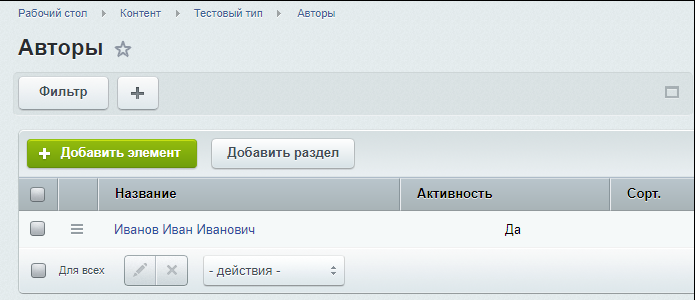
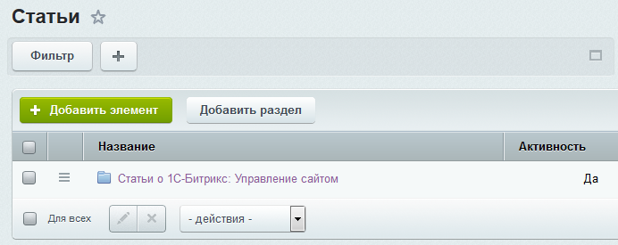
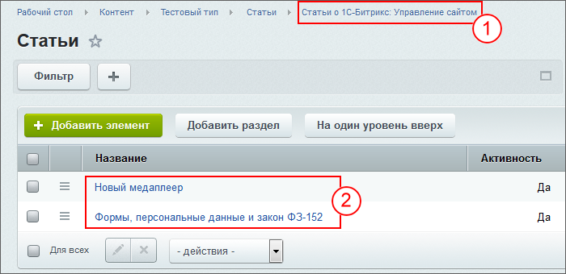

# Добавление статей и справочных данных

**Навигация**
- [← Оглавление курса](index.md)
- [← Предыдущий: 8655 — Создание и настройка Информационных блоков](lesson_8655.md)
- [Следующий: 8597 — Вывод данных в публичной части →](lesson_8597.md)

Официальная страница урока: https://dev.1c-bitrix.ru/learning/course/index.php?COURSE_ID=34&LESSON_ID=8603

|  | **По материалам уроков:** 
 [Разделы и элементы](https://dev.1c-bitrix.ru/learning/course/index.php?COURSE_ID=34&CHAPTER_ID=09921&LESSON_PATH=3905.4477.9921) |
| --- | --- |

#### Задание первое. Добавление справочных данных

Добавьте в инфоблок Авторы элемент с информацией об авторе книги. Пусть это будет некий Иванов Иван Иванович c выдуманной биографией.

Добавление информации сделайте в простейшем виде, только на закладе Подробно. Вывода анонсовой информации у нас не предполагается.

## Данные для создания автора и результат работы

Изображение:

Текст:

Иванов Иван Иванович (род. 1980) - крупный специалист по "1С-Битрикс: Управление сайтом". Окончил Калининградский политехнический институт. Работает с системой "1С-Битрикс: Управление сайтом" с самого её создания с 1998 года. Профессионально рос вместе с этой CMS. Широко известен в кругах разработчиков сайтов на этой платформе.

**Результат работы**

#### Задание второе. Создание раздела в каталоге статей

При большом количестве статей и тем статей использование разделов - единственный понятный пользователям способ сортировки. Создайте раздел **Статьи о 1С-Битрикс: Управление сайтом** в  инфоблоке статей.

## Результат выполнения второго задания

#### Третье задание: создание статей

В разделе **Статьи о 1С-Битрикс: Управление сайтом** создайте две статьи с привязкой к автору.

## Данные для создания статей

Тексты и картинки - просто примеры и смысловой нагрузки не несут.

**Первая статья**

Название - Формы, персональные данные и закон ФЗ-152

Аннотация для анонса:

С 1 июля 2017 года существенно ужесточена административная ответственность за нарушения при взаимодействии с персональными данными физических лиц.

Аннотация для подробного описания:

С 1 июля 2017 года существенно ужесточена административная ответственность за нарушения при взаимодействии с персональными данными физических лиц.

Мы надеемся, что вы уже ознакомлены с законом и ищете техническую информацию. Данная статья расскажет, что для разработчика решений и компонентов в продукте есть инструменты для помощи в соответствии закону.

Каждая форма, которая собирает, к примеру, имя, фамилию, email или телефон, должна запрашивать согласие пользователя на обработку персональных данных. Мы в обновлении главного модуля 17.0.9 выпустили набор инструментов, который поможет вам соответствовать закону ФЗ-152 о персональных данных. Начну с того, что в административном разделе в меню появился новый пункт: Настройки -&gt; Настройки продукта -&gt; Соглашения.

В нем вы можете создать новое соглашение для запроса согласия на обработку персональных данных, используя стандартный текст, который мы также включили в обновление.

Автор: Иванов Иван Иванович

Картинки для свойства MORE_PHOTO:

Заголовок окна браузера: Выполнение ФЗ-152

Ключевые слова: ФЗ-152, согласие пользователя

**Вторая статья**

Название: Новый медиаплеер

Аннотация для анонса:

В составе обновления 17.0.2 для модуля fileman вышел новый медиаплеер, в котором по-умолчанию воспроизведение видео и аудио файлов сделано с помощью video.js.

Аннотация для подробного описания:

В составе обновления 17.0.2 для модуля fileman вышел новый медиаплеер, в котором по-умолчанию воспроизведение видео и аудио файлов сделано с помощью video.js.

Мы настоятельно рекомендуем всем нашим клиентам установить это обновление и в настройках компонента выбрать "Тип плеера" - "videojs". Администраторы увидят соответствующее сообщение во всех местах, где будет выбран старый плеер ("Тип плеера" - "HTML5 / Flash плеер" ). Там, где было выбрано "определить автоматически", будет сразу применен новый тип плеера. Мы принудительно сделали замену, чтобы ускорить переход на новый плеер.

Важный момент: Если у вас в системе скопирован шаблон компонента, то после установки обновления необходимо перейти на использование шаблона компонента по-умолчанию. Это связано с тем, что код отображения нового плеера находится в шаблоне, этот код автоматически не попадёт в ваши копии. В этом случае на месте плеера будет пустое место.

Сам по себе, video.js - это всего лишь javascript-обёртка для тега **video**. Мы лишь постарались сделать максимально удобным использование компонента и добиться максимальной совместимости.
Кстати, о совместимости. Здесь многое зависит от типа проигрываемого файла и браузера посетителя. Если браузер не поддерживает тип файла, то сам плеер ничего с этим не сделает. Кроме того, веб-сервер должен формировать правильный заголовок Content-Type, иначе плеер работать не будет.

Автор: Иванов Иван Иванович

Картинки для свойства MORE_PHOTO:

Заголовок окна браузера: Новый видеопроигрыватель

Ключевые слова: видео, видеопроигрыватель

## Результат выполнения третьего задания

Созданные статьи

Где:

1 - Раздел в котором созданы статьи,

2 - Сами статьи.

Привязку к автору мы увидим в публичной части.
