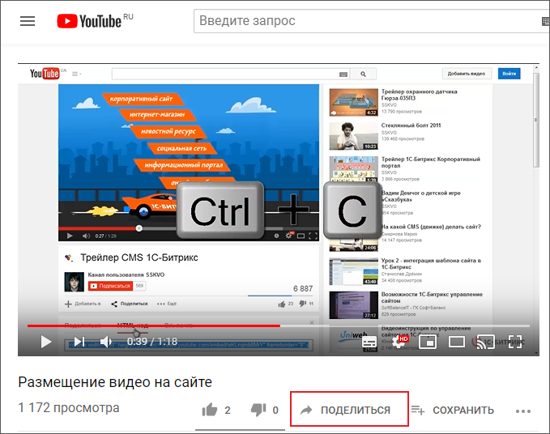
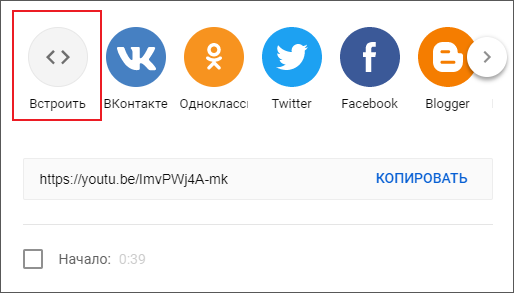
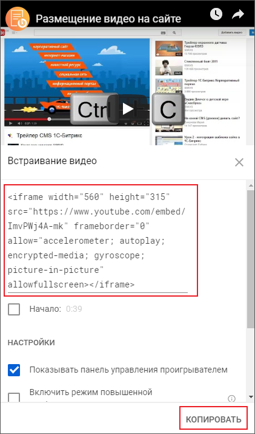
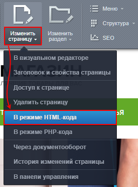
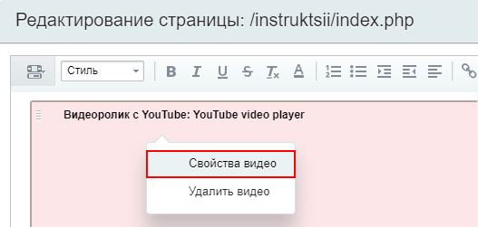

# HTML-код с видеохостинга

**Навигация**
- [← Оглавление курса](index.md)
- [← Предыдущий: 2205 — Настройка Медиа проигрывателя в Видеотеке](lesson_2205.md)
- [Следующий: 12487 — Если не добавляется видео со стороннего сервиса →](lesson_12487.md)

Официальная страница урока: https://dev.1c-bitrix.ru/learning/course/index.php?COURSE_ID=34&LESSON_ID=8623

Очень часто видео размещают на видеохостингах типа Youtube, Rutube и других. "1С-Битрикс: Управление сайтом" предоставляет удобную и простую в настройках возможность для показа такого видео на сайтах.


### Видеоурок

В видеоролике показываем примеры размещения видео с помощью вставки **html-кода** с видеохостингов Youtube и Rutube.

### Как встроить видео с видеохостинга

Для вставки видео с помощью html-кода:

- Откройте страницу видеохостинга, например Youtube, с видеороликом;
- Нажмите кнопку
  			Поделиться
                      
  		;
- Выберите вариант
  			Встроить
                      
  		;
- Скопируйте
                      
  		 полученный код;
- Вставьте его на страницу одним из способов:

  - Первый способ: откройте страницу на редактирование в
    			режиме HTML-кода
                        
    		;
  - Второй способ: откройте визуальный редактор и переключите его в
    			режим
                        Визуальный редактор может работать в двух режимах. Визуальный режим - более простой и интуитивно понятный вариант. Мы сразу видим, как будут выглядеть элементы на странице. Второй вариант - режим исходного кода.
    
    [Подробнее](lesson_6301.md#code)...
    		 редактирования исходного кода.

Код вставки видео может выглядеть так:

```
<iframe width="560" height="315" src="https://www.youtube.com/embed/C7G2ymeRYEk?controls=0" title="YouTube video player" frameborder="0" allow="accelerometer; autoplay; clipboard-write; encrypted-media; gyroscope; picture-in-picture" allowfullscreen></iframe>
```

При необходимости поменяйте размеры окна видео изменив значения высоты (height) и ширины (width) прямо в коде, или открыв

			свойства видео

                    

		 в визуальном редакторе (в визуальном режиме). Если устанавливаете размеры вручную, не забудьте соблюсти пропорцию сторон, иначе в окне появятся черные полосы по краям.

**Примечание**: Если при просмотре сайта с мобильной версии видео не масштабируется, то это значит, что шаблон вашего сайта не адаптирован для мобильных устройств.

Желательно это знать:

- [HTMLbook](http://htmlbook.ru/) - справочник по HTML
