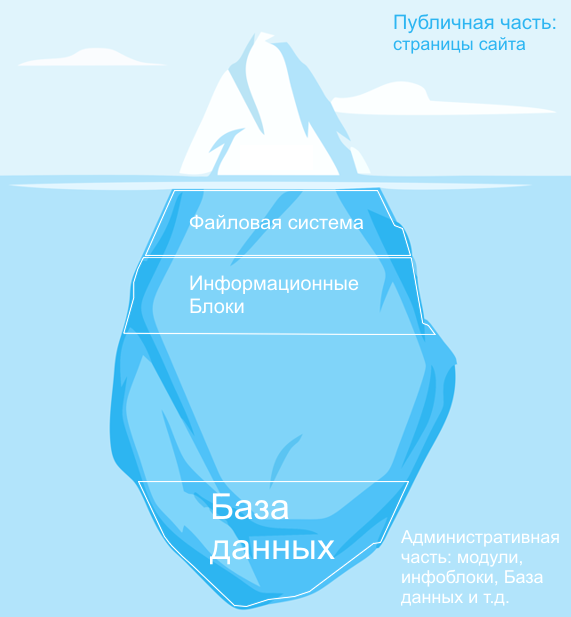
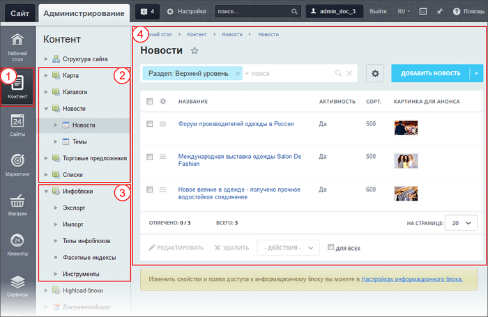

# Информационные блоки

**Навигация**
- [← Оглавление курса](index.md)
- [← Предыдущий: 1977 — Файловая система](lesson_1977.md)
- [Следующий: 7987 — Модули и компоненты →](lesson_7987.md)

Официальная страница урока: https://dev.1c-bitrix.ru/learning/course/index.php?COURSE_ID=34&LESSON_ID=8627

|  | Это ознакомительный материал. Детальнее смотрите в главе [Информационные блоки](https://dev.1c-bitrix.ru/learning/course/index.php?COURSE_ID=34&CHAPTER_ID=04477&LESSON_PATH=3905.4477) |
| --- | --- |

|  | ### Модуль Информационные блоки - инструмент для работы с Базой данных |
| --- | --- |

Работать с Базой данных Контент-менеджер напрямую не может. Если может, то это уже не контент-менеджер, а программист, знающий теорию Баз данных, умеющий писать программный код. А так как программисты не будут выполнять работу по наполнению сайта содержанием (им это просто неинтересно), то и создан такой инструмент для Контент-менеджера - модуль

			Информационные блоки

Модуль **Информационные блоки** предназначен для управления различными блоками однородной информации. На базе информационных блоков можно реализовать каталоги товаров, блоки новостей, справочники и т.д.

[Подробнее](https://dev.1c-bitrix.ru/learning/course/index.php?COURSE_ID=34&CHAPTER_ID=04477&LESSON_PATH=3905.4477)...

		.

Это специальный универсальный инструмент, который:

- загружает информацию в Базу Данных;
- редактирует эту информацию;
- отдаёт информацию тому или иному модулю для отображения на сайте.

При работе с информацией с помощью этого модуля Контент-менеджер создаёт специальные

			сущности

                    **Сущность** - это любой, однозначно идентифицируемый, конкретный или абстрактный объект, информация о котором хранится и обрабатывается в базе данных.
**Упрощенный пример**: модуль - это цех по производству ящиков, а сущность - ящик, произведенный этим цехом.

		. Называются эти сущности так же, как и модуль - **Информационные блоки**. В интерфейсе продукта и в уроках вы часто встретите короткий вариант названия сущностей - **Инфоблоки**.

> Чтобы не путаться, определим такое правило:
>
> - Если речь идет о модуле, то всегда используется полное название и слово модуль: модуль Информационные блоки;
> - Если же речь идет о сущностях, то может использоваться как короткое название Инфоблоки, так и длинное название Информационные блоки (без дополнительных слов).

<!-- Это гибкая сущность, изучив её детально, вы сами удивитесь доступным возможностям. -->

Инфоблоки – это пакеты однородной информации. Число их в системе не ограничено, они создаются каждый под свой тип информации. Инфоблокам всё равно, какую информацию вы в них размещаете: текст, картинки, видео и так далее. Надо просто правильно его настроить и создать нужные поля.

Инфоблоки имеют своё место пребывания в Административном разделе. Они группируются по типам, каждый тип назван по-своему и выводится в разделе Контент 1 в списке 2

			сразу за Структурой сайта

                    На иллюстрации пример списка информационных блоков из демоверсии программы.На вашем сайте их число и названия будут другими.

		:

Ниже списка инфоблоков размещаются инструменты работы с ними 3, а работа с разделами и элементами инфоблоков выполняется в Рабочей области 4.

Сами по себе инфоблоки информацию на сайте не выводят. Они это делают через компоненты и модули.

#### Динамическая информация на сайте - это инфоблоки

Динамическая информация, в отличие от статической,

                    Информация делится на два типа (статическая и динамическая). Такое деление облегчает работу контент-менеджера над содержанием сайта. Хотя работа с текстом в обоих случаях происходит через Визуальный редактор , эти два типа имеют существенные различия.

[Подробнее](https://dev.1c-bitrix.ru/learning/course/index.php?COURSE_ID=34&CHAPTER_ID=01848&LESSON_PATH=3905.4461.1848)...

		 формируется на основе Инфоблоков. (Но не только, есть ещё и Модули, об этом - ниже.) Страница динамической информации на сайте - это элемент инфоблока, раздел сайта - это раздел Инфоблока.

Так как инфоблок - это инструмент для работы с Базой данных, то страница с динамической информацией - это html-код, который создаётся программным кодом модуля **Информационные блоки** каждый раз при обращении посетителя к этой странице. В отличие от страницы со статической информацией, html-код которой записан в файле и является постоянным.

|  | #### Важно запомнить! |
| --- | --- |

- Инфоблоки в Административной части размещаются сразу за файловой структурой сайта в разделе Контент.
- Инфоблоки - инструмент для работы с Базой данных.
- Динамическая информация формируется из инфоблоков.
- Страница сайта с динамической информацией - это программный код, а не физический файл.
- Инфоблоки сами по себе информацию на сайте не выводят.
