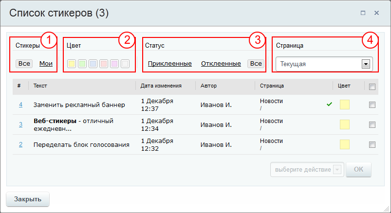

# Список стикеров

**Навигация**
- [← Оглавление курса](index.md)
- [← Предыдущий: 5346 — Основные сведения](lesson_5346.md)
- [Следующий: 1908 — Приложения для публикации в блог →](lesson_1908.md)

Официальная страница урока: https://dev.1c-bitrix.ru/learning/course/index.php?COURSE_ID=34&LESSON_ID=8635

Стикеров стало много, искать нужный среди них - сложно. Воспользуйтесь списком и фильтром в нём.

### Видеоурок

### Просмотр списка стикеров

Для просмотра списка всех стикеров на текущей странице или на сайте целиком используются соответствующие команды в административной панели:

По этим командам, либо по набору клавиш CRTL+SHIFT+L, открывается **Список стикеров**:

Отфильтровать стикеры можно с помощью выбора в секциях нужных позиций:

1 Стикеры:

- **Все** - в списке будут отображены стикеры всех пользователей с пометкой **Общий**;
- **Мои** - в списке будут отображены только стикеры текущего пользователя.

2 Цвет - фильтрация стикеров по цвету.

3 Статус:

- **Приклеенные** - в списке будут отображены только
  			приклеенные
                      **Приклеенные стикеры** - стикеры, которые отображаются
   на сайте. Приклеенные стикеры могут быть не видны
   на сайте, если не отмечен пункт меню **Показать стикеры**
  .
  		 стикеры;
- **Отклеенные** - в списке будут отображены только
  			отклеенные
                      **Отклеенные стикеры** получают такой статус после их закрытия (кнопка **х** в правом верхнем углу стикера) и не отображаются на сайте. При этом они не удаляются и могут быть наклеены обратно в любой момент времени.
  		 стикеры;
- **Все** - в списке будут отображены все стикеры.

4 Страница

- **Текущая** - в списке будут отображены стикеры, расположенные только на текущей странице;
- **Все** - в списке будут отображены стикеры, расположенные на всех страницах сайта;
- **&lt;Название_страницы&gt;** - в списке будут отображены стикеры, расположенные на выбранной странице.

### Управление стикерами в форме "Список стикеров"

Для управления стикерами используются флажки, для выделения требуемых стикеров, и список, с доступными действиями:

- **Наклеить заново** - возвращает отклеенные стикеры обратно на сайт.
- **Отклеить** - отключает требуемые стикеры. Они перестают отображаться на сайте, но не удаляются. Действие аналогично действию
  			кнопки х
                      
  		 на самом стикере.
- **Удалить** - безвозвратно удаляет выбранные стикеры.

Для перехода к просмотру желаемого стикера, кликните на его идентификатор в колонке **#** или на адрес страницы в колонке **Страница**.
