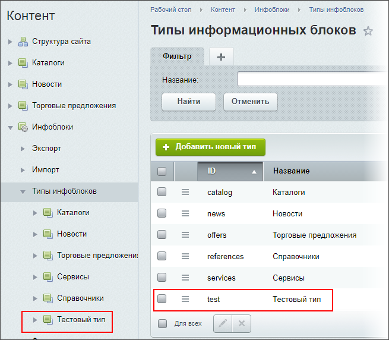
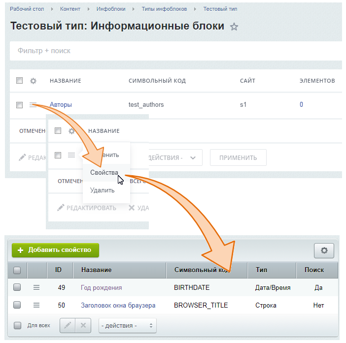
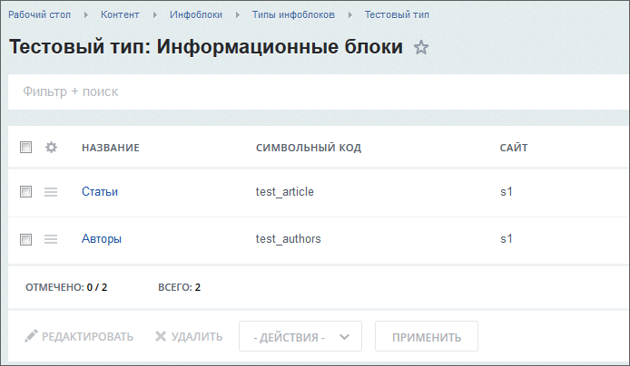
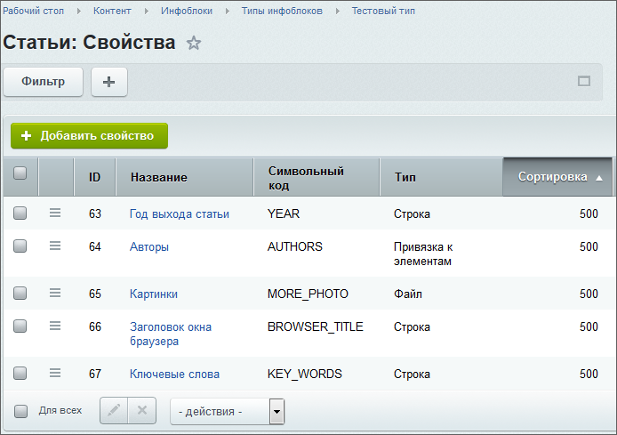

# Создание и настройка Информационных блоков

**Навигация**
- [← Оглавление курса](index.md)
- [← Предыдущий: 2739 — Работа с текстом](lesson_2739.md)
- [Следующий: 8603 — Добавление статей и справочных данных →](lesson_8603.md)

Официальная страница урока: https://dev.1c-bitrix.ru/learning/course/index.php?COURSE_ID=34&LESSON_ID=8655

|  | **По материалам уроков:** 
 [Создание и настройка информационных блоков](https://dev.1c-bitrix.ru/learning/course/index.php?COURSE_ID=34&CHAPTER_ID=02011&LESSON_PATH=3905.4477.2011) |
| --- | --- |

#### Первое задание: создание Типа инфоблока

В этом типе инфоблока будем создавать инфоблоки, нужные для работы. В отдельном типе - чтобы было легче ориентироваться в списке инфоблоков.

Создайте Тип инфоблока Тестовый с ID - test.

## Результаты выполнения первого задания

#### Второе задание: создание инфоблока-справочника

Это будет инфоблок для справочных данных. Автор напишет много статей. Статьи публикуются в разных журналах. Но биография автора от количества статей и журналов не зависит. Это ситуация, когда какая-либо информация может быть привязана к нескольким статьям.

Создайте инфоблок с параметрами:

- **Символьный код**: test_authors
- **Сайты** - привязка к вашему сайту
- **Название** - Авторы
- Свойства:

  - **Год рождения**: Тип - Дата/время, Код - BIRTHDATE;
  - **Заголовок окна браузера**: Тип - Строка, Код - BROWSER_TITLE.

## Результат выполнения второго задания

#### Третье задание. Создание инфоблока для каталога статей

Создайте информационный блок с параметрами:

- **Символьный код**: test_article
- **Сайты** - привязка к вашему сайту
- **Название** - Статьи
- **Свойства инфоблока**:

  - **Год выхода статьи**: Код - YEAR, Тип - Строка;
  - **Автор(ы)**: Код - AUTHORS, Тип - Привязка к элементам, множественное. В настройках свойства в поле **Информационный блок** укажите инфоблок-справочник созданный вами выше.
  - **Картинки**: Код - MORE_PHOTO, Тип - Файл, множественное, тип загружаемых файлов - изображения;
  - **Заголовок окна браузера**: Тип - Строка, Код - BROWSER_TITLE
  - **Ключевые слова**: Тип - строка, Код - KEY_WORDS

## Результат выполнения третьего задания

Новый инфоблок в списке:

Свойства инфоблока:

