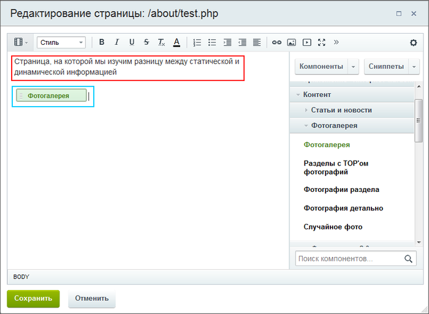
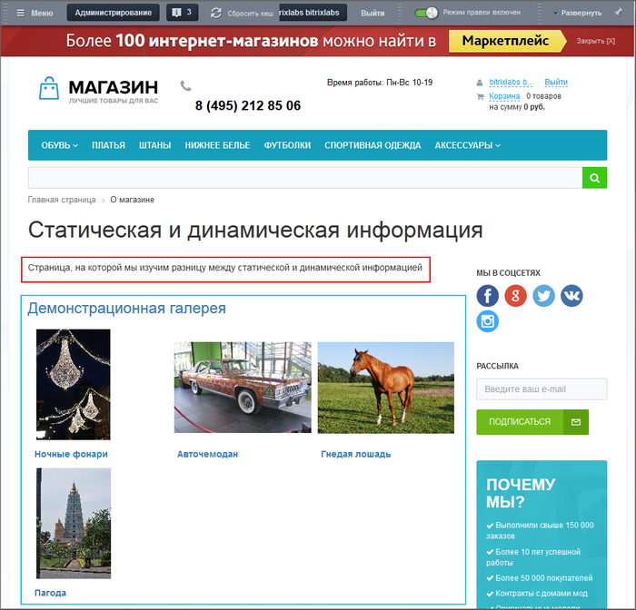
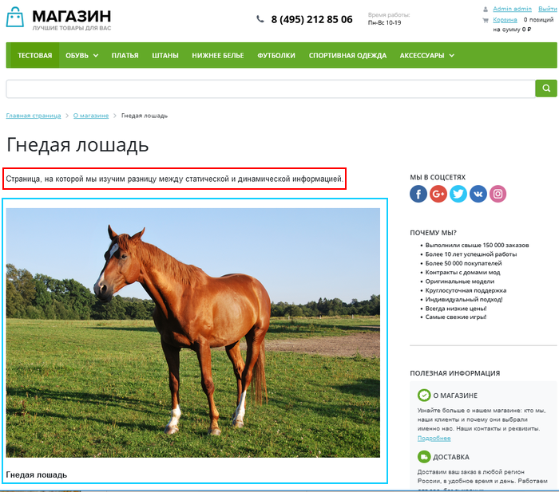

# Пример размещения информации

**Навигация**
- [← Оглавление курса](index.md)
- [← Предыдущий: 9141 — Общее и отличия](lesson_9141.md)
- [Следующий: 1847 — Из чего состоит страница сайта →](lesson_1847.md)

Официальная страница урока: https://dev.1c-bitrix.ru/learning/course/index.php?COURSE_ID=34&LESSON_ID=9135

### Видеоурок

### Пример размещения статической и динамической информации

На статической странице допускается размещение как статической, так и динамической информации. Как правило, статическая информация размещается над динамической информацией.

При редактировании статической страницы в

			Визуальном редакторе

                    Визуальный редактор - инструмент, позволяющий отображать редактируемый текст в точности так же, как он будет выглядеть на странице, без использования HTML кода. [Подробнее](https://dev.1c-bitrix.ru/learning/course/index.php?COURSE_ID=34&CHAPTER_ID=06299&LESSON_PATH=3905.6299)...

		 статическая информация отображается непосредственно в виде текста. На иллюстрации этот текст в красной рамке. Динамическая информация в визуальном редакторе не показывается. Видна только иконка

			компонента

                    Компонент - специальный элемент системы, предназначенный для вывода информации из Базы данных сайта. [Подробнее](https://dev.1c-bitrix.ru/learning/course/index.php?COURSE_ID=34&CHAPTER_ID=04457&LESSON_PATH=3905.4457)...

		 (в синей рамке), который будет выводить эту самую динамическую информацию на странице сайта.

На странице сайта статическая информация видна так же в виде текста (красная рамка). Динамическая информация (синяя рамка) может выводиться самым разным образом: текст, картинки, иконки, ссылки и так далее. Конкретный вид вывода динамической информации зависит от типа и настроек компонента, осуществляющего этот вывод.

**Примечание**: Если на статической странице есть и статическая информация и размещен компонент, то статическая информация будет видна на каждой динамической странице, создаваемой этим компонентом.

В нашем случае использован компонент

			фотогалерея

                    Комплексный компонент **Фотогалерея 2.0** позволяет получить полнофункциональную фотогалерею,
 создавая физически только одну страницу.

						[Описание компонента «Фотогалерея 2.0 (комплексный компонент)» в пользовательской документации.](http://dev.1c-bitrix.ru/user_help/detail.php?ID=91321)

		, при

			просмотре каждой фотографии

                    

		 из фотогалереи на каждой динамической странице будет отображаться введённый нами статический текст.
