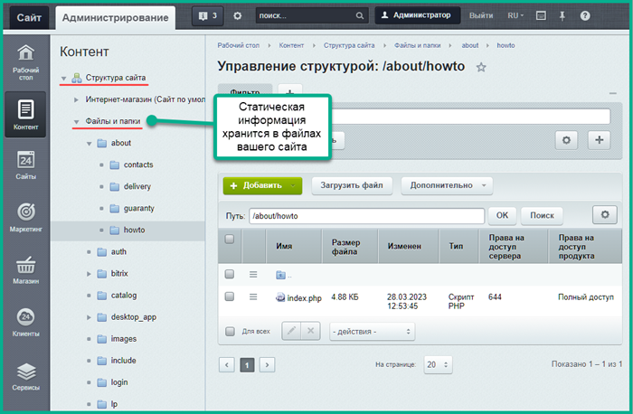
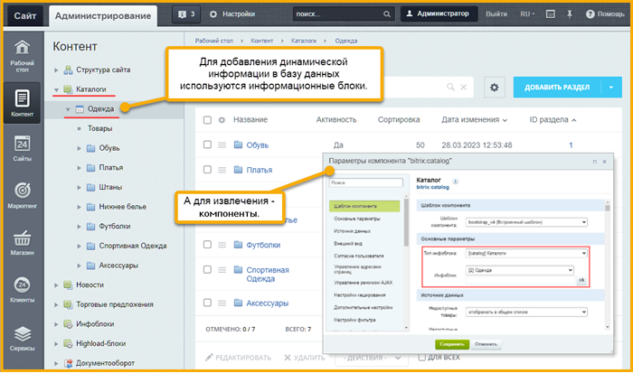
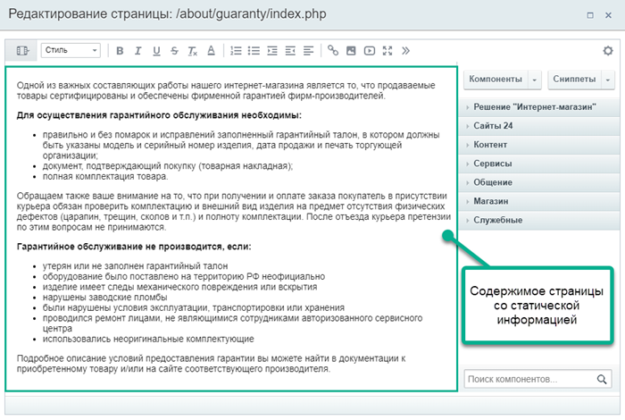
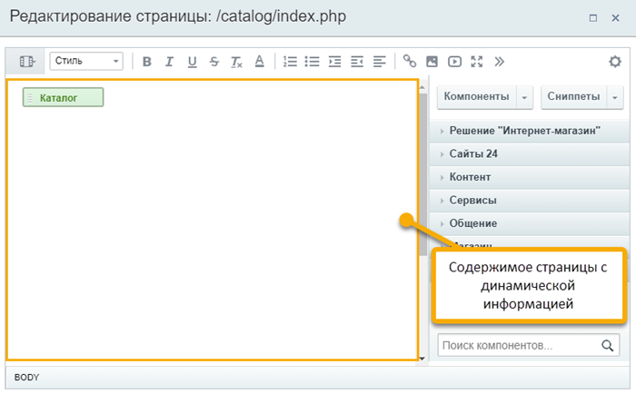
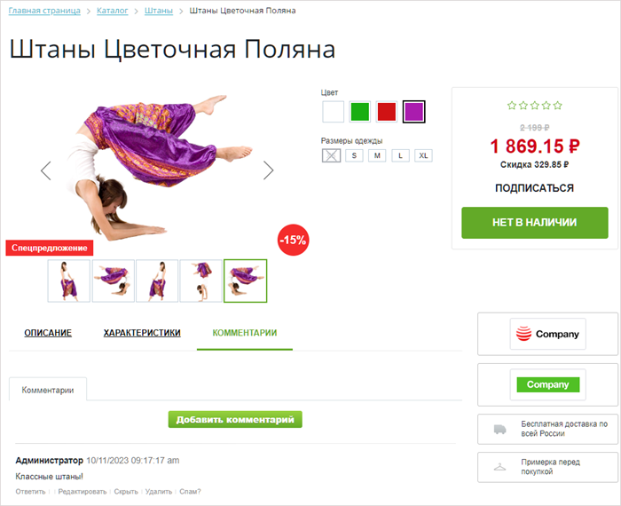

# Общее и отличия

**Навигация**
- [← Оглавление курса](index.md)
- [← Предыдущий: 3397 — Статическая и динамическая информация](lesson_3397.md)
- [Следующий: 9135 — Пример размещения информации →](lesson_9135.md)

Официальная страница урока: https://dev.1c-bitrix.ru/learning/course/index.php?COURSE_ID=34&LESSON_ID=9141

Давайте рассмотрим общие и отличительные особенности двух типов информации, чтобы вы могли более эффективно решать задачи по наполнению сайта. Оба типа информации редактируются в

			Визуальном редакторе

                    Визуальный редактор - инструмент, позволяющий отображать редактируемый текст в точности так же, как он будет выглядеть на странице, без использования HTML кода. [Подробнее...](https://dev.1c-bitrix.ru/learning/course/index.php?COURSE_ID=34&CHAPTER_ID=06299&LESSON_PATH=3905.6299)

		, но имеют множество отличий, на которые стоит обратить внимание. Понять эти отличия несложно, поэтому давайте рассмотрим их подробнее.

### Первое отличие

> **Первое отличие** – место размещения информации в системе.

Статическая информация хранится в файлах вашего сайта, а динамическая – в

			Базе данных

                    База данных – часть вашего сайта, в которой хранится однородная информация. Недоступна для управления Контент-менеджером.

		, которую использует ваш сайт.

Для добавления информации в базу данных используются

			информационные блоки

                    Информационный блок (или Инфоблок) – специальный инструмент "1С-Битрикс: Управление сайтом" с помощью которого заносится информация в Базу данных.
 [Подробнее...](https://dev.1c-bitrix.ru/learning/course/index.php?COURSE_ID=34&CHAPTER_ID=04477&LESSON_PATH=3905.4477)

		, а для извлечения –

			компоненты

                    Компонент – это программный код, оформленный в визуальную оболочку, выполняющий определённую функцию какого-либо модуля по выводу данных в Публичной части. Мы можем вставлять этот блок кода на страницы сайта без непосредственного написания кода. [Подробнее...](https://dev.1c-bitrix.ru/learning/course/index.php?COURSE_ID=34&CHAPTER_ID=04457)

		.

### Второе отличие

> **Второе отличие** непосредственно вытекает из первого: где отображается статическая и динамическая информация.

Давайте сделаем небольшое пояснение, чтобы избежать путаницы. В «1С-Битрикс: Управление сайтом» термин «раздел» используется как для разделов со статической, так и для разделов с динамической информацией. Для сайта они означают одно и то же: логическую структурную единицу, в которой размещаются другие логические единицы. Например, раздел сайта «О компании», в котором есть отдельные страницы: «О нас», «Контакты», «Наши услуги» и так далее. Или раздел «Каталог» с подразделами «Обувь», «Одежда» и так далее.

Однако, с технической точки зрения (смотрите первое отличие), это разные вещи:

- Раздел с динамической информацией – это запись в базе данных.
- Раздел со статической информацией – это папка с файлами.

То же самое относится и к страницам – они могут быть как

			статическими, так и динамическими

                    Статическую страницу ещё называют «физической», а динамическую – «виртуальной».

		.

Как определить, является ли раздел (страница) на сайте статическим или динамическим? По адресу страницы: если в логической файловой структуре сайта есть папка (файл) с таким же именем, то это статическая страница. Если такой папки нет, то это динамическая.

Дополнительно предлагаем посмотреть видеоролик, в котором наглядно показываем разницу:

### Третье отличие

> **Третье отличие** заключается в том, как информация отображается.

Если второе отличие можно показать на видео, то здесь нам придется объяснить словами. Когда речь идет о статической информации, «1С-Битрикс: Управление сайтом» просто показывает файл с текстом, картинкой, видео и так далее. Если пользователь открывает динамическую страницу, то запускается выполнение программного кода, создается страница и показывается пользователю.

Программный код, который отвечает за создание динамической страницы и ее отображение пользователю, называется компонентом. Мы подробнее рассмотрим это понятие позже, по мере изучения учебного курса.

Так, если открыть страницу со статической информацией в редакторе, вы увидите содержимое этой страницы (текст, изображения и т.д.):

А в случае с динамической информацией, вы увидите в редакторе только блок с названием компонента:

### Чётвертое отличие

> **Четвертое отличие** – возможность программной обработки информации.

Поскольку динамическая информация хранится в базе данных, она может быть изменена и адаптирована «на лету». Например, она:

- связывается с другой информацией: описание товара соединяется с ценами и скидками на них или с другими похожими товарами;
- показывается в списке в зависимости от разных критериев: фильтр в поиске товаров, наличие на складе, участие в акции и т.д.;
- добавляет общие ключевые слова к конкретному товару, принадлежащему к определённой
  			группе
                      Группе, к которой относится товар.
  		 товаров;
- и многое другое.

Для примера, посмотрим на карточку товара. Здесь мы видим скидку в 15% – это связь с модулем «Торговый маркетинг». Выбранного предложения фиолетового цвета и размера XS нет в наличии – эту информацию нам предоставляет «Складской учёт». А ниже, под товаром, мы видим комментарий от пользователя – комментарии хранит модуль «Блоги».

### Пятое отличие

> **Пятое отличие** – возможность быстрого изменения вида отображения информации.

Для изменения вида отображения статической информации необходимо вносить изменения непосредственно на странице. Хотя Визуальный редактор позволяет делать это максимально комфортно, всё же это требует дополнительных усилий. В некоторых сложных случаях может потребоваться знание

			HTML

                    HTML – технические коды, обеспечивающие различное отображение информации. Самый простой пример: выделить текст **жирным шрифтом** или с подчёркиванием.
Знание и умение применять эти коды – не обязательное, но желательное умение для Контент-менеджера.

		.

Посмотрите в видеоролике, насколько просто изменять внешний вид с помощью простых действий в настройках компонента, когда мы имеем дело с динамической информацией:

### Заключение

При выборе типа информации для наполнения сайта, важно понимать различия между статической и динамической информацией. Так какой же тип выбрать?

Статическая информация хранится в файлах сайта и редактируется в визуальном редакторе. Такой тип лучше подходит для постоянного контента, который редко меняется. Например для страниц с информацией об истории компании, её контактах для связи, графике работы и адресах офисов.

Динамическая информация хранится в базе данных и для её отображения используется специальный программный код. Такой тип лучше выбрать для однородной информации, которая показывается и меняется в зависимости от различных условий. Как правило это ленты новостей, каталоги товаров, фотогалереи, блоги, форумы и так далее.
