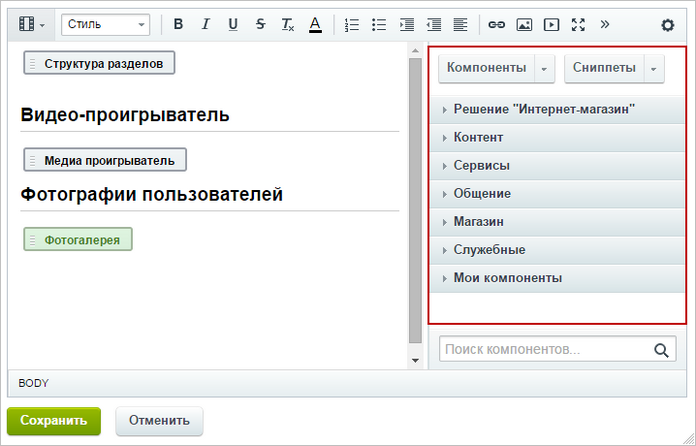
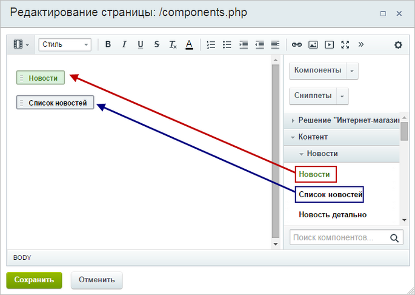

# Как использовать компонент

**Навигация**
- [← Оглавление курса](index.md)
- [← Предыдущий: 1992 — Что такое компоненты](lesson_1992.md)
- [Следующий: 9165 — Как настроить компонент →](lesson_9165.md)

Официальная страница урока: https://dev.1c-bitrix.ru/learning/course/index.php?COURSE_ID=34&LESSON_ID=9163

### Видеоурок

В предыдущих уроках мы разобрались, что такое

			компонент

**Компонент** - специальный элемент системы, предназначенный для вывода информации из Базы данных сайта.

[Подробнее...](https://dev.1c-bitrix.ru/learning/course/index.php?COURSE_ID=34&CHAPTER_ID=04457&LESSON_PATH=3905.4457)

		. Система *"1С-Битрикс: Управление сайтом"* обладает стандартным набором компонентов, которые помогают решить практически все возможные задачи.

### Где найти компоненты?

Мы сказали, что в системе есть стандартный набор компонентов. Где же они находятся? На специальной панели в

			визуальном редакторе

**Визуальный редактор** - инструмент, позволяющий отображать редактируемый текст в точности так

же, как он будет выглядеть на странице, без использования HTML кода.

[Подробнее](https://dev.1c-bitrix.ru/learning/course/index.php?COURSE_ID=34&CHAPTER_ID=06299&LESSON_PATH=3905.6299)...

		, в которой компоненты разделены на группы (например - контент, общение, магазин). Строка поиска чуть ниже поможет вам найти компонент по названию.

### Как разместить компонент на странице?

Просто

			переместите

 

		 его мышкой в рабочую область слева от списка. Заметьте, что у простых компонентов серая иконка, а у комплексных - зеленая:

Сразу после размещения появится окно настройки компонента. Пока можете его закрыть, мы обратимся к настройке чуть позже.

### Если что-то не получается

- **Не вижу панели компонентов в визуальном редакторе**:
  **1.** Сначала проверьте, возможно, панель просто скрыта. Раскройте её, нажав на
  			стрелочку
                      
  		 справа;
  **2.** Панель компонентов показана только для страниц со
  			статической информацией
  **Статическая информация** - это информация, которая редко меняется с течением времени. Например, рекламные тексты, история компании, контактная информация. Статическая информация создается и редактируется вручную.
  [Подробнее](https://dev.1c-bitrix.ru/learning/course/index.php?COURSE_ID=34&CHAPTER_ID=01848&LESSON_PATH=3905.4461.1848)...
  		. Если вы ее не видите, значит, вы редактируете
  			Инфоблок
                      Информационный блок (или Инфоблок) – специальный инструмент "1С-Битрикс: Управление сайтом" с помощью которого заносится информация в Базу данных.
   [Подробнее...](https://dev.1c-bitrix.ru/learning/course/index.php?COURSE_ID=34&CHAPTER_ID=04477&LESSON_PATH=3905.4477)
  		.
- **Не могу найти нужный компонент в визуальном редакторе**. В этом случае возможны два варианта:
  **1.** либо вы пользуетесь редакцией продукта, в которой отсутствует данный компонент;
  **2.** либо
  			администратор ограничил
  Ограничение работает так: если в поле нет ни одного компонента, то разрешены все. Если в поле добавлен хотя бы один компонент, то будет разрешен только он (все остальные запрещены). Иными словами, для запрета доступа к единственному компоненту в это поле нужно внести все компоненты, которые разрешены.
  [Подробнее](https://dev.1c-bitrix.ru/learning/course/index.php?COURSE_ID=35&LESSON_ID=1902)...
  		 список разрешенных компонентов.
- **Я разместил два комплексных компонента, а правильно работает только один из них**. Все верно, работать будет только первый комплексный компонент.

### Заключение

Компоненты расположены в визуальном редакторе и добавляются на страницу простым переносом. Однако недостаточно просто разместить компонент, мы должны также настроить его. Об этом поговорим в следующем уроке.
