# Как настроить компонент

**Навигация**
- [← Оглавление курса](index.md)
- [← Предыдущий: 9163 — Как использовать компонент](lesson_9163.md)
- [Следующий: 4486 — Пример работы с компонентами: создаем новостной раздел →](lesson_4486.md)

Официальная страница урока: https://dev.1c-bitrix.ru/learning/course/index.php?COURSE_ID=34&LESSON_ID=9165

Мы разместили на странице

			компонент

**Компонент** - специальный элемент системы, предназначенный для вывода информации из Базы данных сайта.

[Подробнее](https://dev.1c-bitrix.ru/learning/course/index.php?COURSE_ID=34&CHAPTER_ID=04457&LESSON_PATH=3905.4457)...

		, теперь приступим к настройке.

### Видеоурок

Настройка выполняется двумя способами:

- в визуальном редакторе;
- в  публичной части сайта в режиме "Правка".

### В визуальном редакторе

В

			визуальном редакторе

**Визуальный редактор** - инструмент, позволяющий отображать редактируемый текст в точности так же, как он будет выглядеть на странице, без использования HTML кода.

[Подробнее](https://dev.1c-bitrix.ru/learning/course/index.php?COURSE_ID=34&CHAPTER_ID=06299&LESSON_PATH=3905.6299)...

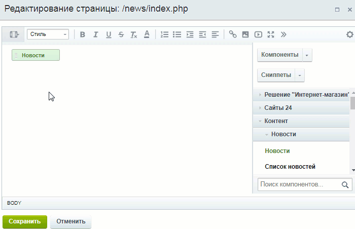

		 нажмите дважды левой кнопкой мыши на иконку компонента 1 или нажмите правой кнопкой мыши по иконке и выберите пункт меню **Параметры компонента** 2:

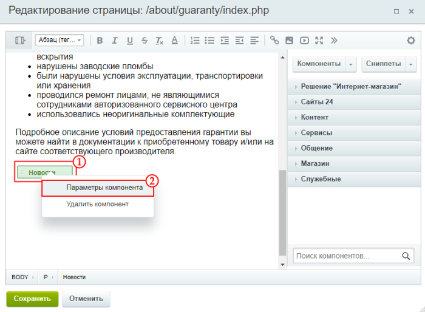

Tакже вы можете изменять настройки компонента в режиме редактирования исходного кода, однако мы не рекомендуем пользоваться этим способом контент-менеджерам.

Откроется форма настройки:

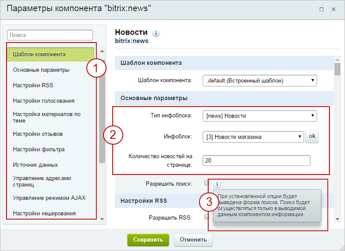

Для удобства параметры разделены на группы 1. Сами параметры расположены правее 2. Наведите мышку на значок  для получения подсказки 3. Не все параметры требуют вашего вмешательства, зачастую достаточно определить только основные параметры.

Чтобы быстро найти конкретный параметр воспользуйтесь строкой

			**Поиск**

		, которая расположена над группами параметров 1. Начните вводить текст в строку и в правой части формы отобразятся только те параметры, в которых присутствует искомое слово (или часть слова).

### В публичной части сайта

1. В
  			публичной части
  **Публичный раздел** - то, что видит посетитель сайта, но для контент-менеджера - это основное место работы.
  [Подробнее](https://dev.1c-bitrix.ru/learning/course/index.php?COURSE_ID=34&CHAPTER_ID=04458&LESSON_PATH=3905.4455.4458)...
  		 сайта в
  			режиме Правки
  Режим **Правка** - специальный режим работы "1С-Битрикс: Управление сайтом", в котором
  происходит изменение информации на сайте.
  
  [Подробнее...](lesson_1832.md)
  			наведите мышь
  
  		 на область компонента, появится панель настроек. Выберите пункт **Редактировать параметры компонента**. Откроется форма настройки, ее описание выше.
  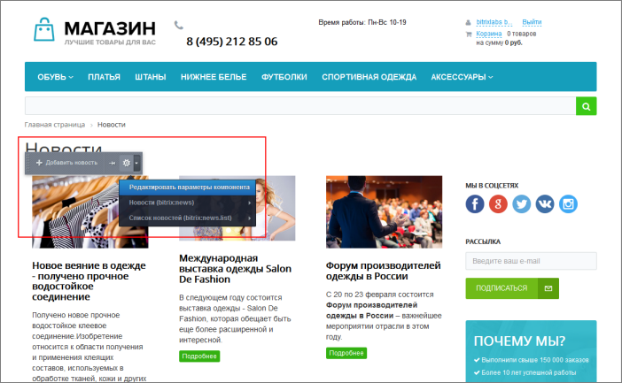
2. В режиме правки дважды щелкните мышью на области компонента. Откроется форма настройки.

Для чего нужны остальные пункты всплывающего меню? Давайте разберемся.

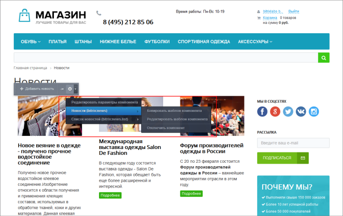

Помимо команды редактирования мы видим список компонентов, которые использованы в интересующей нас области. Для каждого компонента видим три команды:

- Копировать шаблон;
- Редактировать шаблон;
- Отключить компонент.

Первые две команды используют для работы с шаблоном, чаще всего это задача администратора сайта. А вот команда **Отключить компонент** может помочь контент-менеджеру. Эта опция делает компонент неактивным, но выполненные настройки компонента не сбрасывает. Данные из этого компонента не будут показаны на странице, пока  вы не

			включите его вновь

                    Место расположения компонента при включённом режиме правки обозначится квадратом с красной
 точкой. Для включения компонента выполните обратные действия:

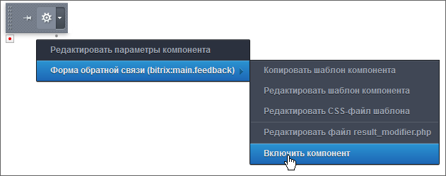

		.

### Параметры компонентов

Рассмотрим

			часто встречающиеся

                    Параметры отличаются для каждого компонента, мы рассмотрим только часто встречающиеся параметры. Если у вас возникнут вопросы по настройке того или иного компонента - обратитесь к [документации](https://dev.1c-bitrix.ru/user_help/components/index.php).

		 группы параметров компонентов:

- [Шаблон компонента](#templ)
- [Основные параметры и Источник данных](#main)
- [Шаблоны ссылок](#links)
- [Управление адресами страниц](#url)
- [Управление режимом AJAX AJAX - технология обращения к серверу без перезагрузки страницы.](#ajax)
- [Настройки кеширования](#cache)
- [Дополнительные настройки](#additional)

#### Шаблон компонента

Параметр **Шаблон компонента** отвечает за внешний вид. У большинства компонентов только один шаблон по умолчанию (**.default**). Разработчики сайтов добавляют собственные шаблоны, которые появляются в этом списке

Если шаблонов несколько - выберите нужный в выпадающем списке. Учтите, что при смене шаблона изменится внешний вид создаваемой страницы.

#### Основные параметры и Источник данных

Здесь мы задаем источник публикуемых данных (инфоблок, форумы, веб-форма, опрос и т.д.):

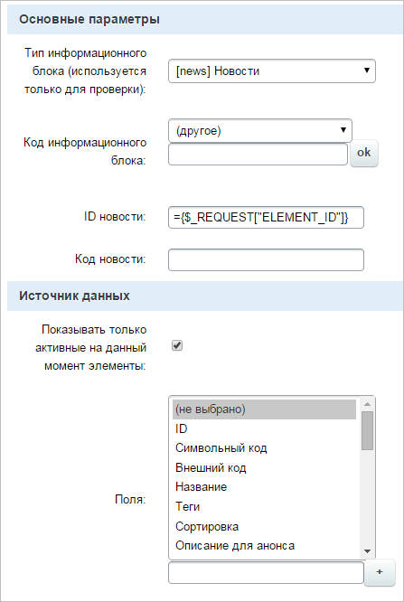

В некоторых случаях источник следует задавать с помощью кода, в котором передается идентификатор элемента данных (однако это редко входит в обязанности контент-менеджера).

Тут же следует задать параметры сортировки (по какому признаку и как сортируются данные), например:

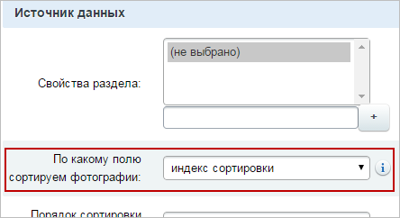

#### Шаблоны ссылок

Здесь мы производим настройку адресов страниц (обратитесь к администратору за дополнительной информацией):

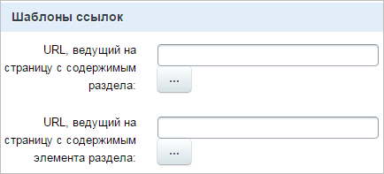

Подробнее о настройке адресов почитайте на примере [публикации веб-формы](lesson_2929.md) на сайте.

#### Управление адресами страниц

Тут мы выполняем настройку режима

			ЧПУ

**ЧПУ** - это веб-адрес, удобный для восприятия человеком. Это аббревиатура от словосочетания «человеко-понятный урл» (где «урл» — жаргонное обозначение URL).

[Подробнее](lesson_3579.md)...

		:

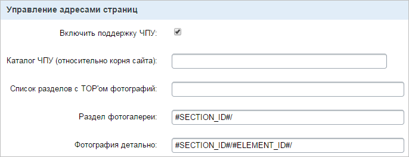

#### Управление режимом AJAX AJAX - технология обращения к серверу без перезагрузки страницы.

Здесь мы настраиваем AJAX в компоненте. Технология AJAX обновляет (загружает) не всю страницу, а только некоторую ее часть после действий пользователя (например, при нажатии на кнопку). Таким образом, пользователь быстрее увидит результат своих действий.

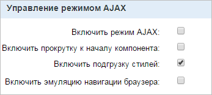

#### Настройки кеширования

Тут мы определяем поведения

			кеша

                    **Кеш** - это некое хранилище для ускорения просмотра информации на сайте. Когда пользователь просматривает информацию на сайте, то она не всегда запрашивается из базы данных, а берется из кеша.

		 для компонента:

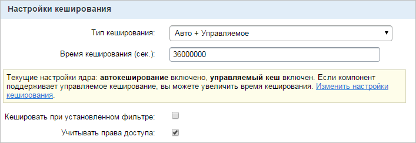

Кеширование используют для уменьшения нагрузки на сервер и ускорения отображения данных. Время кеширования зависит, в основном, от частоты обновления информации: чем реже обновляется информация, тем больше может быть время кеширования. Будьте аккуратны, производите настройки кеша только в согласовании с администратором сайта.

#### Дополнительные настройки

Здесь определяются дополнительные параметры - навигационная цепочка, заголовки страниц, форматы показа даты и т.п.:

### Распространенные вопросы

- **Как определить какой компонент используется в конкретном месте страницы?** В
  			режиме Правки
  Режим **Правки** - специальный режим работы "1С-Битрикс: Управление сайтом", в котором происходит изменение информации на сайте.
  
  [Подробнее...](lesson_1832.md)
  		 наведите мышь на интересующую вас область страницы. Появится всплывающая панель, наведите мышь на
  			"шестеренку"
                      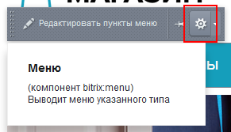
  		 и вы увидите название компонента и информацию о нем.
- **Я не могу понять, для чего нужны все эти параметры и какие значения мне нужны**. В системе множество компонентов и сотни параметров. Каждый параметр отвечает за отображение определенной части информации на странице. Не бойтесь обращаться к [документации](http://dev.1c-bitrix.ru/user_help/) по интересующему вас компоненту. В ней дано подробное описание и назначение каждого параметра.
  Например, у вас на странице расположен компонент
  			Корзина
                      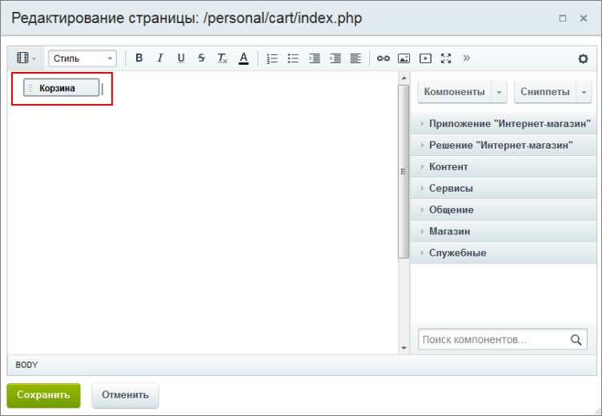
  		 и вам не до конца понятны параметры этого компонента. Переходим в пользовательскую документацию, в поиске
  			вводим
                      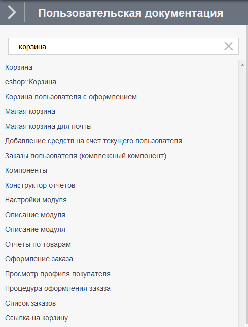
  		 название нужного нам компонента, выбираем первый результат и видим страницу с подробным объяснением каждого параметра.
- **В режиме правки я навожу мышь на область и появляется несколько панелей, какая из них мне нужна?**
  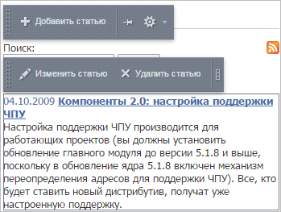
  Это значит что вы пытаетесь редактировать комплексный компонент (освежите свои знания о комплексных компонентах в [предыдущих уроках](https://dev.1c-bitrix.ru/learning/course/index.php?COURSE_ID=34&CHAPTER_ID=04457&LESSON_PATH=3905.4457)). В этом случае верхняя панель служит для настройки самого комплексного компонента. Для управления простыми компонентами используются панели ниже.
- **Я настроил компонент, как мне теперь добавить на страницу новость, статью, товар?** В режиме правки наведите мышь на область компонента, появится панель. Нас интересует команда **Добавить новость** (для каталога товаров это будет **Создать товар** и т.д.):
  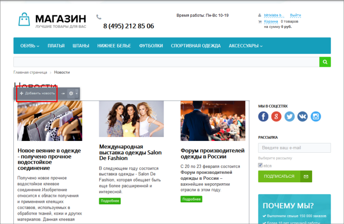
- **Почему у страницы какой-то другой заголовок, не тот, что мне нужен?** Это значит, что на странице несколько компонентов, которые могут изменять заголовок. По правилам системы последний по очереди компонент устанавливает заголовок.

### Заключение

В этом непростом уроке мы разобрались с настройкой компонентов. Стоит отметить, что набор параметров у каждого компонента свой. Для подробной информации по конкретному компоненту и его параметрам обращайтесь к [документации](http://dev.1c-bitrix.ru/user_help/). В следующем уроке мы закрепим полученные знания с помощью реальных примеров использования компонентов.
