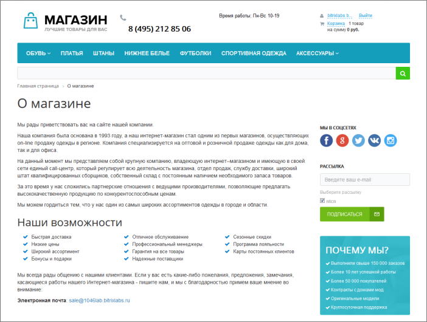
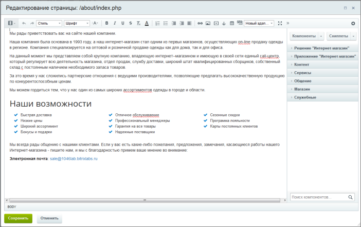
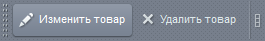
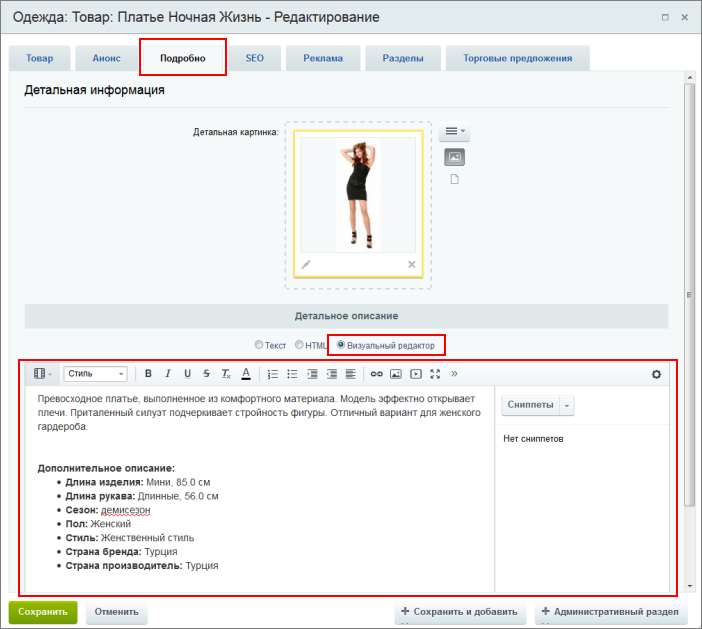

# Где используется редактор

**Навигация**
- [← Оглавление курса](index.md)
- [← Предыдущий: 2484 — Визуальный редактор](lesson_2484.md)
- [Следующий: 6301 — Внешний вид редактора →](lesson_6301.md)

Официальная страница урока: https://dev.1c-bitrix.ru/learning/course/index.php?COURSE_ID=34&LESSON_ID=9201

### Применение редактора

Мы узнали, что в системе *"1С-Битрикс: Управление сайтом"* присутствует встроенный редактор. Давайте разберемся, в каких случаях нам придется его использовать и как он облегчит нашу работу. Визуальный редактор используется и в публичной и в административной части сайта. Использовать редактор мы будем в двух случаях:

- **Для редактирования страниц** - например, когда нам нужно просто поменять
  			статический
                      Статическая информация - это информация, которая редко меняется с течением времени. Например, рекламные тексты, история компании, контактная информация. Статическая информация создается и редактируется вручную. [Подробнее...](https://dev.1c-bitrix.ru/learning/course/index.php?COURSE_ID=34&CHAPTER_ID=01848&LESSON_PATH=3905.4461.1848)
  		 текст на странице.
- **Для редактирования текстовых описаний** - например, для изменения описания товара или редактирования новости.

### Видеоурок

### Редактирование страниц

Предположим, нам нужно отредактировать информацию страницы

			О магазине

                    

		.

На

			панели управления

                    На Панели управления собраны все команды, которые доступны контент-менеджеру при работе с сайтом. [Подробнее](lesson_1831.md)...

		 нажмем кнопку

			Изменить страницу

                    

		. Это действие  откроет страницу в редакторе:

Вот так выглядит визуальный редактор. Мы разберем внешний вид и возможности чуть позже.

Также мы можем перейти к редактированию страницы в административном разделе с помощью опции

			Изменить страницу в панели управления

                    

		. Окно редактора в этом случае будет выглядеть аналогично.

### Редактирование текстовых описаний

Рассмотрим вторую ситуацию. Предположим, нам необходимо изменить описание товара. В

			режиме Правки

                    Режим Правка - специальный режим работы "1С-Битрикс: Управление сайтом", в котором

происходит изменение информации на сайте.

[Подробнее...](lesson_1832.md)

		 наведем мышь на нужный нам товар и выберем

			Изменить товар

                    

		. Откроется форма редактирования. В ней нас интересует вкладка **Подробно** и пункт **Визуальный редактор**. Мы опять видим окно редактора, которое на этот раз содержит подробное описание товара:

### Заключение

Встроенный визуальный редактор используется для редактирования статических и динамических текстов. Мы можем обращаться к редактору разными способами, однако его интерфейс всегда одинаков. Дальше мы подробнее остановимся на внешнем виде редактора и его возможностях.
