# Форматирование текста

**Навигация**
- [← Оглавление курса](index.md)
- [← Предыдущий: 6301 — Внешний вид редактора](lesson_6301.md)
- [Следующий: 9239 — Как работать с таблицами →](lesson_9239.md)

Официальная страница урока: https://dev.1c-bitrix.ru/learning/course/index.php?COURSE_ID=34&LESSON_ID=9235

Достаточно часто в работе нам приходится менять цвет, размер шрифта, выравнивание текста. Чуть реже мы добавляем специальные символы и разрывы страниц. Для всех этих операций мы будем использовать панель инструментов визуального редактора *"1С-Битрикс: Управление сайтом"*.

### Сделать текст красивым и читаемым

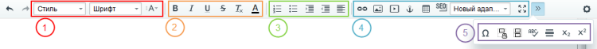

Слева располагаются кнопки отмены и повтора последнего действия - важные команды для повседневной работы. Остальные инструменты разделены на смысловые блоки:

- 1 - заголовки и шрифт.
- 2 - изменение написания текста.
- 3 - списки и выравнивание текста.
- 4 - инструменты для работы со ссылками, картинками и видео, таблицами и стилями шаблона.
- 5 - дополнительные инструменты.

Разберем их по отдельности.

### Видеоурок

### Шрифты и заголовки

С помощью выпадающего списка

			Стиль

                    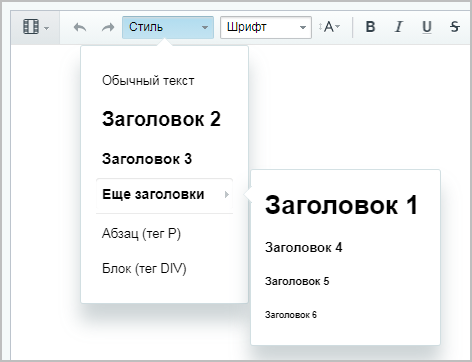

		 мы задаем стиль текста. Список предлагает нам:

- **Обычный текст** - формат текста по умолчанию;
- **Заголовок 1-6** - Шесть вариантов заголовка, от самого большого к самому маленькому. Эти стили соответствуют HTML тегам ≺h1≻-≺h6≻.
- **Абзац (тег P)** - оформляем текст как абзац, что соответствует HTML тегу ≺p≻.
- **Блок (тег DIV)** - оформляет текст как блок, соответствует HTML тегу ≺div≻.

Следующие два выпадающих списка позволяют выбрать

			шрифт

                    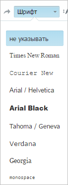

		 и размер шрифта.

### Изменение написания текста

Далее располагаются кнопки для изменения написания текста:

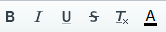

-  - **Жирный текст**
-  - *Курсив*
-  - Подчеркнутый текст
-  - Зачеркнутый текст
-  - Удалить форматирование - удалить все форматирование выделенного текста.
-  - Цвет текста и фона -
  			выбор цвета
                      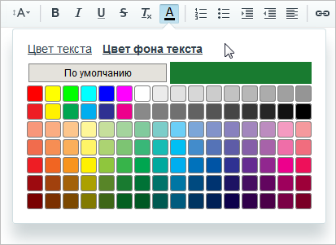
  		 отдельно для текста и для фона.

Каждому варианту соответствует HTML тег. То есть с помощью таких тегов мы бы изменяли написание, если бы писали HTML код вручную:

| \| **Кнопка** \| **Текст** \| **Теги** \| \| --- \| --- \| --- \| \|  \| **Жирный** \| `<b>Жирный</b>` \| \|  \| *Курсив* \| `<i>Курсив</i>` \| \|  \| Подчеркнутый \| `<u>Подчеркнутый</u>` \| \|  \| Зачеркнутый \| `<del>Зачеркнутый</del>` \| |
| --- |

### Списки и выравнивание текста

Следующая группа кнопок предназначена для создания списков и выравнивания текста:

В редакторе мы можем создавать два вида списков:

			нумерованный

                    Cоответствует HTML тегу ≺ol≻ - ≺/ol≻

		 и

			маркированный

                    Cоответствует HTML тегу ≺ul≻ - ≺/ul≻

		. Нумерованный список создается с помощью кнопки  и выглядит так:

1. первый
2. второй
3. третий

В маркированном списке нет нумерации элементов, каждый элемент отмечен маркером. Такой список создается с помощью кнопки  и выглядит так:

- первый
- второй
- третий

Кнопки  и  служат для увеличения и уменьшения отступа от края. Увеличение/уменьшение отступа списков, меняет также вид маркеров списков.

Кнопка  позволяет задать выравнивание текста:

- По левому краю.
- По центру.
- По правому краю.
- По ширине.

### Ссылки, медиа, таблицы и стили

Следующая группа элементов содержит инструменты для работы со ссылками, картинками и видео, таблицами и стилями шаблонов:

В этом уроке мы рассмотрим только работу со стилями шаблонов, остальные инструменты достаточно сложные и описаны в следующих уроках текущей главы о визуальном редакторе.

Шаблоны сайта представлены выпадающим списком 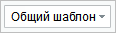. Этот инструмент позволяет наглядно посмотреть, как меняется форматирование текста для разных шаблонов сайта. Форматирование текста может быть различным, потому что в разных шаблонах используются

			разные стили

                    Если описывать техническим языком: для хранения информации о внешнем виде страницы используются каскадные таблицы стилей (CSS). **CSS** (Cascading Style Sheets — каскадные таблицы стилей) — формальный язык описания внешнего вида документа, написанного с использованием языка разметки.

		 для одних и тех же элементов. Например, возможны различия в междустрочных интервалах или типах маркеров в списках.

**Обратите внимание**, что этим инструментом мы не меняем шаблон сайта. Это делается в

			настройках сайта

                    Шаблон дизайна - программный код, который определяет как внешне будет выглядеть сайт. Создаётся разработчиком сайта, применяется к сайту - администратором, реже - контент-менеджером. [Подробнее...](https://dev.1c-bitrix.ru/learning/course/index.php?COURSE_ID=34&CHAPTER_ID=01851)

		.

Кнопка **SEO** отправляет текст страницы как оригинальный в Яндекс, чтобы закрепить за этим текстом свои права. Инструмент пригодится вам, при подключении сайта к поисковой системе Яндекс. Подробнее об этом рассказывается в курсе [Продвижение сайта и маркетинг](https://dev.1c-bitrix.ru/learning/course/index.php?COURSE_ID=139&LESSON_ID=5818).

Кнопка  разворачивает визуальный редактор на весь экран. Нажмите кнопку еще раз, чтобы выйти из этого режима.

### Дополнительно

Нажмите на кнопку 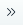 для вызова панели дополнительных инструментов:

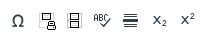

-  - **Вставить специальный символ**. Иногда нам нужно вставить в текст специальный символ. Нажмите на эту кнопку и откроется
  			таблица
                      
  		 часто используемых символов. Если среди них нет нужного вам - нажмите кнопку **Другой спецсимвол**. Откроется полная
  			таблица
                      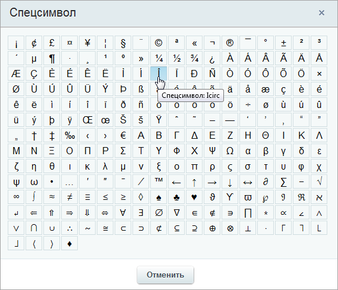
  		 спецсимволов, нажмите на символ и он появится на странице.
-  - **Вставить разрыв страницы для печати**. Эта кнопка позволяет вручную задать
  			разбивку
                      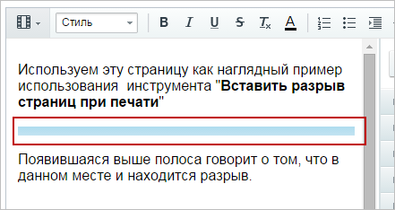
  		 страницы при отправке её на печать. В тех местах, где установлен разрыв, при печати будет выполнен перенос текста на следующую страницу.
-  - **Вставить разделитель страниц**. Позволяет вставить
  			разрыв страницы
                      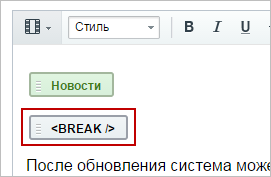
  		 в нужном месте. После чего статья будет показана несколькими страницами с
  			кнопками перехода
                      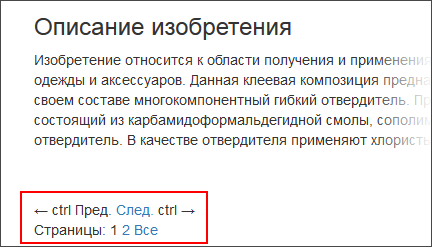
  		.
  **Примечание**: Эта кнопка работает только при редактировании инфоблоков.
-  - **Проверка орфографии**. Визуальный редактор позволяет автоматически проверять введенный текст на ошибки. Некоторые браузеры (например Mozilla) обладают встроенной системой проверки орфографии. Система *"1С-Битрикс: Управление сайтом"* для этой функции использует библиотеку *pSpell*. [Установить эту библиотеку](https://dev.1c-bitrix.ru/learning/course/index.php?COURSE_ID=35&LESSON_ID=2026#orfo) может администратор сайта. Если расширение не установлено, то при попытке проверки орфографии будет выдана
  			ошибка
                      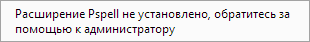
  		.
  Если расширение *pSpell* установлено и работает, то при нажатии на кнопку **Проверка орфографии** откроется
  			окно настроек
                      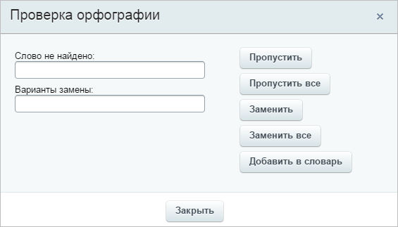
  		.
-  - **Вставить горизонтальный разделитель**. Вставляет
  			горизонтальную полосу
                      Соответствует HTML тегу ≺hr≻
  		. Используется, например, для визуального разделения частей текста.
-  - **Нижний индекс**. Добавляет к тексту нижний индекс.
-  - **Верхний индекс**. Добавляет к тексту верхний индекс.

### Заключение

Инструменты по работе с текстом делятся на группы. Редактор позволяет работать со шрифтами и заголовками, модифицировать текст, задавать его положение, работать со спецсимволами и списками. В следующих уроках мы рассмотрим работу со ссылками и таблицами.

Желательно это знать:

- [HTMLbook](http://htmlbook.ru/) - справочник по HTML
