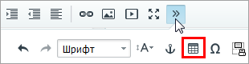
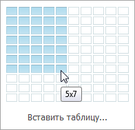
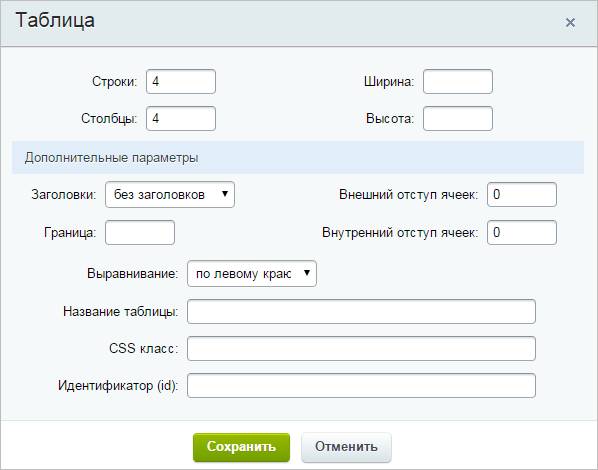
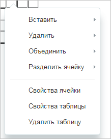
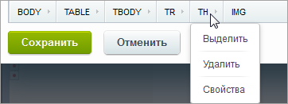

# Как работать с таблицами

**Навигация**
- [← Оглавление курса](index.md)
- [← Предыдущий: 9235 — Форматирование текста](lesson_9235.md)
- [Следующий: 9241 — Как работать со ссылками →](lesson_9241.md)

Официальная страница урока: https://dev.1c-bitrix.ru/learning/course/index.php?COURSE_ID=34&LESSON_ID=9239

Визуальный редактор *"1С-Битрикс: Управление сайтом"* позволяет легко и наглядно создавать и редактировать таблицы без использования

			HTML

                    HTML – технические коды, обеспечивающие различное отображение информации. Самый простой пример: выделить текст **жирным шрифтом** или с подчёркиванием.
 Знание и умение применять эти коды - не обязательное, но желательное умение для Контент-менеджера.

		 кода. Давайте рассмотрим процесс создания и редактирования таблицы.

### Видеоурок

### Как создать таблицу?

Кнопка создания таблицы находится на панели инструментов:

Появится

			поле

                    

		, на котором вы мышью выделяете необходимое количество строк и столбцов.

Для более детальной настройки таблицы нажмите кнопку **Вставить таблицу...**:

Разберем поля формы:

- **Строки/столбцы** - количество строк и столбцов в создаваемой таблице.
- **Ширина/высота** - размер таблицы в пикселях (можно также задать размеры в процентах, используя знак %).
- **Заголовки** - расположение заголовка таблицы (верхняя строка, левая колонка, и сверху и слева).
- **Граница** - толщина границы таблицы в пикселях.
- **Внешний/внутренний отступ ячеек** - отступы внутри и снаружи ячейки в пикселях.
- **Выравнивание** - выравнивание таблицы на странице (слева, по центру, справа).

При необходимости задайте название таблицы, а также CSS класс и идентификатор (эта возможность для подготовленных пользователей, в большинстве случаев мы оставляем эти поля пустыми).

### Как отредактировать таблицу?

Если у вас уже есть таблица, нажмите на нее правой кнопкой мыши для редактирования:

Меню позволяет вставлять ячейки и столбцы, удалять и объединять ячейки и выполнять другие операции по работе с таблицей.

Если вы выберете мышью таблицу, то увидите на панели навигации полную структуру таблицы:

Это удобно для редактирования отдельных элементов таблицы (элементы представлены в виде [html-тегов](https://webref.ru/html/table)). Просто нажмите на нужный элемент и выберите пункт **Свойства**.

**Внимание!** Штатный функционал редактирования не охватывает все возможности html-форматирования. Часть функционала, например: цвет рамки, фон таблицы, индивидуальный размер строк и так далее, можно реализовать только непосредственным редактированием кода таблицы. Для этого используйте режим правки страницы как html-кода и добавьте нужные [теги](http://htmlbook.ru/html/table).

### Заключение

Для быстрого создания таблицы используйте визуальную форму, для подробной настройки - ручное создание таблицы. В следующем уроке мы поговорим о работе со ссылками.

Желательно это знать:

- [HTMLbook](http://htmlbook.ru/) - справочник по HTML
