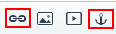
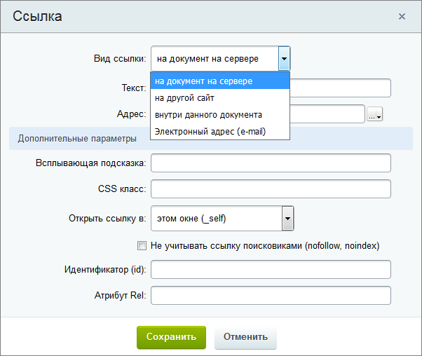
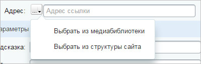

# Как работать со ссылками

**Навигация**
- [← Оглавление курса](index.md)
- [← Предыдущий: 9239 — Как работать с таблицами](lesson_9239.md)
- [Следующий: 9245 — Настройки редактора и вставка текста →](lesson_9245.md)

Официальная страница урока: https://dev.1c-bitrix.ru/learning/course/index.php?COURSE_ID=34&LESSON_ID=9241

Ссылки обладают большими возможностями: мы можем создать ссылку на другой сайт, на документ, на часть страницы или даже на создание электронного письма.

### Задаём ссылки

Рассмотрим работу со ссылками в визуальном редакторе *"1С-Битрикс: Управление сайтом"*. Кнопки для управления ссылками находятся на панели инструментов:

-  - Позволяет установить якорь (закладку) в нужном месте страницы, для создания ссылки именно на это место страницы. О создании якоря мы поговорим чуть дальше в уроке;
-  - Создает ссылку. Установите курсор в необходимое место в редакторе и нажмите эту кнопку. Появится форма создания ссылки:
  
  В этой форме мы вводим текст ссылки и её адрес. А также задаём при необходимости
  			Дополнительные параметры
                      Если вы умеете работать с HTML кодом, то эти параметры покажутся вам знакомыми. На самом деле они соответствуют атрибутам тега &lt;a&gt;. Посмотреть описание тега и список его атрибутов можно [здесь](http://htmlbook.ru/html/a).
  		 ссылки. Выпадающий список наверху формы позволяет выбрать тип создаваемой ссылки.
  Редактор предусматривает создание четырех видов ссылок:
  Поговорим о каждом варианте по отдельности.

  - На документ на сервере;
  - На другой сайт;
  - Внутри данного документа;
  - На электронный адрес (e-mail).

### Видеоурок

### Ссылка на документ на сервере

Предположим, мы хотим разместить на странице ссылку на текстовый файл или таблицу. Этот файл должен быть заранее

			загружен на сервер

                    Мы разбирали процесс загрузки файла на сервер в отдельном [уроке](lesson_1880.md)

		.

1. Нажмите кнопку создать ссылку - ;
2. В поле тип выберите **На документ на сервере**;
3. В поле адрес укажите прямую ссылку на требуемый документ. Также вы можете
  			выбрать файл
                      
  		 в структуре сайта или медиабиблиотеке;
4. При необходимости задайте дополнительные параметры.

### Ссылка на другой сайт

[#link_outside](#link_outside)

Что, если нам необходимо разместить на странице ссылку на другой сайт?

1. Нажмите кнопку создать ссылку - ;
2. В поле тип выберите **На другой сайт**. Форма настроек изменит свой вид;
3. Выберите нужный
  			протокол
                      Сетевой протокол — набор правил и действий (очерёдности действий), позволяющий осуществлять соединение и обмен данными между двумя и более включёнными в сеть устройствами.
  		 (в большинстве случаев используется вариант - **https://**), а в поле **Адрес сайта** введите название сайта;
4. При необходимости задайте дополнительные параметры.

### Ссылка внутри документа (якорь)

Иногда бывает удобно создать на странице меню, которое перенаправляет пользователя на разные части страницы. В этом случае нам поможет создание ссылки внутри документа:

1. Сначала создайте якорь в нужном месте страницы с помощью кнопки  на панели инструментов. Дайте якорю смысловое название на латинице. Например: "books", а не "книги".
2. Нажмите кнопку создать ссылку - ;
3. В поле тип выберите **Внутри данного документа**;
4. Задайте текст ссылки и в поле **Закладка (якорь)** выберите якорь, который вы создали ранее;
5. При необходимости задайте дополнительные параметры;
6. Повторите операции для создания нескольких якорей.

### Ссылка на электронный адрес

Если вы создаете страницу контактов компании, то разумно будет разместить ссылку на адрес электронной почты. При нажатии на эту ссылку браузер откроет почтовую программу, которая установлена по умолчанию.

1. Нажмите кнопку создать ссылку - ;
2. В поле тип выберите **Электронный адрес (e-mail)**. Форма изменит свой вид, появится поле **e-mail**;
3. Задайте текст ссылки и в поле **e-mail** укажите почтовый ящик, на который будут приходить письма;
4. При необходимости задайте дополнительные параметры;

### Заключение

Ссылки - мощный инструмент для удобной навигации пользователя по странице, размещения документов и написания электронных писем. Визуальный редактор позволяет разместить четыре вида ссылок. В следующих уроках мы рассмотрим работу с изображениями и видео.

Желательно это знать:

- [HTMLbook](http://htmlbook.ru/) - справочник по HTML
