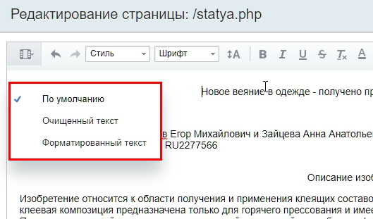
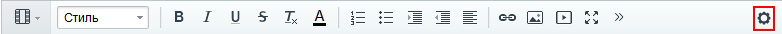
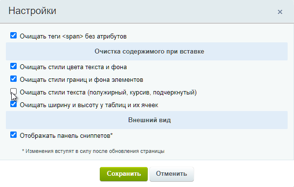

# Настройки редактора и вставка текста

**Навигация**
- [← Оглавление курса](index.md)
- [← Предыдущий: 9241 — Как работать со ссылками](lesson_9241.md)
- [Следующий: 9247 — Как разместить изображение →](lesson_9247.md)

Официальная страница урока: https://dev.1c-bitrix.ru/learning/course/index.php?COURSE_ID=34&LESSON_ID=9245

В работе контент-менеджера возникают ситуации, когда необходимо вставить на страницу текст из другого места. Как правило, это текст из MS Word. Такой текст часто обладает собственным форматированием, и его вставка может нарушить внешний вид страницы вашего сайта. Визуальный редактор *"1С-Битрикс: Управление сайтом"* обладает возможностью настроить вставку текста - выбрать какие стили оставить, а какие удалить.

### Видеоурок

### Как настроить вставку текста

При вставке форматированного текста в рабочую область визуального редактора появляется всплывающее окно, которое предлагает

			три варианта

                    

		 вставки:

- **По умолчанию**. Вставка текста регулируется настройками визуального редактора:
  
  Секция **Очистка содержимого при вставке** содержит опции очистки форматирования:
  
  Например, если снята галочка с опции *Очищать стили текста (полужирный, курсив, подчеркнутый)*, то при вставке текста стили, перечисленные в скобках, будут сохранены.
- **Очищенный текст**. Форматирование будет полностью очищено.
- **Форматированный текст**. Форматирование будет сохранено.

**Примечание:** Визуальный редактор поддерживает не все виды форматирования, которые могут быть в исходном документе. Например, не переносятся стиль и размер шрифта. А маркированные и нумерованные списки переносятся в виде

			текста

                    Маркеры и цифры станут просто текстом, не списком.

		. Поэтому, перед публикацией, дополнительно адаптируйте текст для вашего сайта с помощью панели инструментов.

Обратите внимание, что в форме настроек вы также можете включить или выключить панель

			сниппетов

                    Сниппет - это заранее подготовленный фрагмент текста или кода, этакие заготовки. Предположим, что вам каждый день приходится вставлять на страницы сайта одну и ту же таблицу или форму. Вы можете сохранить эту таблицу в сниппетах и затем простым перетаскиванием размещать ее в нужном месте. [Подробнее..](lesson_6301.md)

		.
