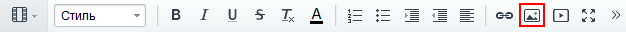
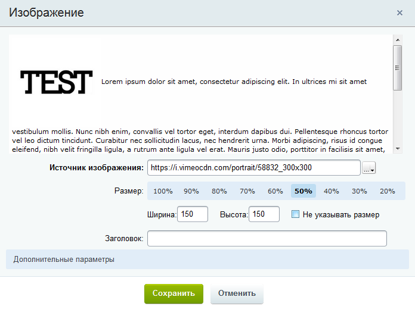
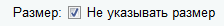
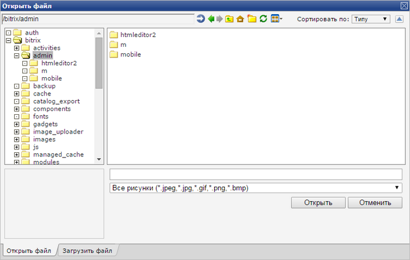

# Как разместить изображение

**Навигация**
- [← Оглавление курса](index.md)
- [← Предыдущий: 9245 — Настройки редактора и вставка текста](lesson_9245.md)
- [Следующий: 9249 — Как разместить видео →](lesson_9249.md)

Официальная страница урока: https://dev.1c-bitrix.ru/learning/course/index.php?COURSE_ID=34&LESSON_ID=9247

Визуальный редактор *"1С-Битрикс: Управление сайтом"* позволяет загружать графику с вашего компьютера и размещать ее на страницах сайта.

### Три способа

Для размещения изображения нажмите кнопку **Изображение** на панели инструментов редактора:

Появится форма настроек, в которой мы задаем источник изображения, заголовок и дополнительные параметры ([CSS-атрибуты изображения](https://webref.ru/html/img)). Источник изображения мы можем задать тремя способами:

- указать прямой адрес;
- выбрать из медиабиблиотеки;
- выбрать из структуры сайта.

Давайте рассмотрим эти способы поподробнее.

### Видеоурок

### Прямой адрес

Укажите путь к картинке на сервере или полный адрес изображения в сети. После ввода значения вы увидите "миниатюру" изображения, а также сможете

			задать его размер

                    

		. Размер может быть определен в пикселях или процентах. Обратите внимание, что современные шаблоны сайтов используют разные размеры изображения в зависимости от размера экрана. Такой шаблон называется

			адаптивным

                    Адаптивный веб-дизайн (англ. Adaptive Web Design) — дизайн веб-страниц, обеспечивающий правильное отображение сайта на различных устройствах, подключённых к интернету и динамически подстраивающийся под заданные размеры окна браузера.

		. В этих случаях мы рекомендуем отмечать опцию

			Не указывать размер

                    

		;

**Обратите внимание!** Размеры картинок могут регламентироваться CSS-стилями шаблона, которые переопределяют масштабирование картинок внутри редактора.

### Выбор из медиабиблиотеки

В предыдущих главах мы рассматривали работу с

			медиабиблиотекой

                    Медиабиблиотека - специальный инструмент для размещения и управления файлами: фотографиями, видео и другими. Используется для удобной и лёгкой сортировки по группам файлов определённого типа с дальнейшим применением на страницах сайта. [Подробнее](https://dev.1c-bitrix.ru/learning/course/index.php?COURSE_ID=34&CHAPTER_ID=04471&LESSON_PATH=3905.4460.4471)...

		. Если нужное нам изображение находится в медиабиблиотеке, то разместить его на странице достаточно просто.

1. Нажмите кнопку размещения изображения на панели инструментов визуального редактора:
  
2. Нажмите кнопку  для перехода к выбору из медиабиблиотеки;
3. Появится
  			окно библиотеки
                      
  		, выберите нужное изображение и нажмите кнопку **Выбрать**;
4. Как и в предыдущем пункте вы увидите "миниатюру" изображения и сможете задать настройки размера.

### Выбор из структуры сайта

Этот вариант используется, если изображение находится не в медиабиблиотеке, а уже

			загружено на сервер

                    Процесс загрузки файла на сервер мы рассматривали в отдельном [уроке](lesson_1880.md):

		. Также мы расскажем, как загрузить изображение с вашего компьютера на сервер.

1. Нажмите кнопку размещения изображения на панели инструментов визуального редактора:
  
2. Нажмите на стрелку на кнопке  и выберите пункт **Выбрать из структуры сайта**;
3. Откроется встроенный менеджер файлов:
  
  В нижней части менеджера расположены две вкладки:

  - **Открыть файл** - вкладка для выбора файла, который уже расположен на сервере. Просто в файловой структуре вашего сайта выберите нужное изображение и нажмите кнопку **Открыть**. Обратите внимание, что для удобства вы можете выбрать
    			вид менеджера
                        
    		 - например, режим **Предпросмотр** позволяет сразу видеть миниатюру изображений, что облегчает поиск.
  - **Загрузить файл** - вкладка для загрузки файла с локального компьютера. Нажмите кнопку **Обзор** и выберите изображение для загрузки. При необходимости измените имя файла на сервере и опцию **Открыть файл после загрузки**.

### Дополнительно

[Как загрузить изображения](lesson_1880.md).
