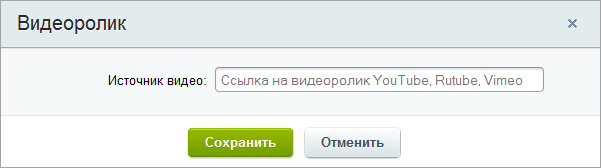
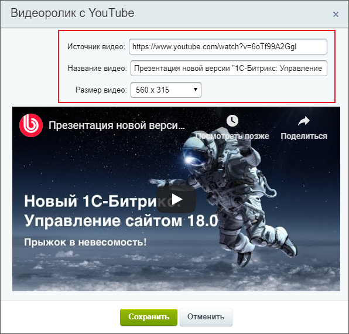

# Как разместить видео

**Навигация**
- [← Оглавление курса](index.md)
- [← Предыдущий: 9247 — Как разместить изображение](lesson_9247.md)
- [Следующий: 26244 — Управление объектами в редакторе →](lesson_26244.md)

Официальная страница урока: https://dev.1c-bitrix.ru/learning/course/index.php?COURSE_ID=34&LESSON_ID=9249

Современные сайты часто содержат на страницах встроенные видеофайлы.
Система *"1С-Битрикс: Управление сайтом"* предлагает несколько способов добавления видео на страницу сайта: инструмент визуального редактора, компоненты Медиабиблиотека и Видеотека, а также вставка готового кода видео со сторонних сервисов (таких как *YouTube* и *RuTube*). В этом уроке рассмотрим самый простой из них – с помощью инструмента визуального редактора. Для остальных способов дадим краткое описание и ссылки на соответствующие уроки с подробной информацией о каждом способе.

### Видеоурок

### Размещение стороннего видео

Размещение видео в визуальном редакторе выполняется кнопкой **Вставить видео** на панели инструментов:

1. По нажатии появится простая
  			форма настройки
                      
  		 с одним полем. Укажите ссылку на видеоролик в поле **Источник видео**;
2. Дождитесь загрузки окна предпросмотра видео. Настройте в нем поля **Название** и **Размер видео**:
  
  **Внимание!** Размер видео может регламентироваться CSS-стилями шаблона, которые переопределяют масштабирование окна изображения.
3. Нажмите кнопку **Сохранить** и видео появится на странице.

### Другие способы размещения видео

- С помощью вставки готового HTML кода c видеохостингов (таких как *YouTube* и *RuTube*). Способ описан в уроке [HTML-код с видеохостинга](lesson_8623.md);
- Если видеофайл расположен на сервере, то для его размещения используйте компонент
  			Медиапроигрыватель
                      Компонент осуществляет проигрывание медиафайлов на веб-страницах.
  						[Описание компонента «Медиа проигрыватель» в пользовательской документации.](http://dev.1c-bitrix.ru/user_help/detail.php?ID=102532)
  		. Способ описан в главе курса [Медиа проигрыватель](https://dev.1c-bitrix.ru/learning/course/index.php?COURSE_ID=34&CHAPTER_ID=04592);
- Если у Вас много видеофайлов, разместите их в инфоблоке и воспроизводите с помощью компонента
  			Видеотека
                      Одностраничный компонент осуществляет вывод и поочередное проигрывание серии видеороликов в одном **Медиа проигрывателе**. Компонент является стандартным и входит в дистрибутив модуля.
  						[Описание компонента «Видеотека» в пользовательской документации.](http://dev.1c-bitrix.ru/user_help/detail.php?ID=131381)
  		. Способ описан в главе курса [Видеотека](https://dev.1c-bitrix.ru/learning/course/index.php?COURSE_ID=34&CHAPTER_ID=04593).

Также рекомендуем ознакомиться со сравнением компонентов в уроке [Медиапроигрыватель и Видеотека, в чём разница](lesson_5193.md). Узнайте, чем они отличаются.
