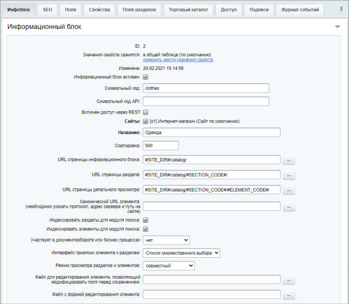
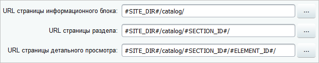
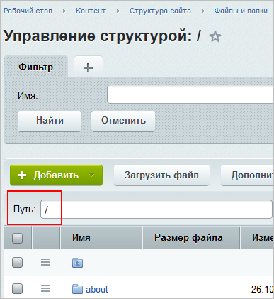
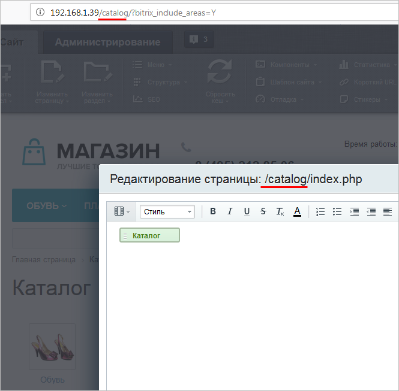
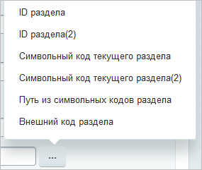
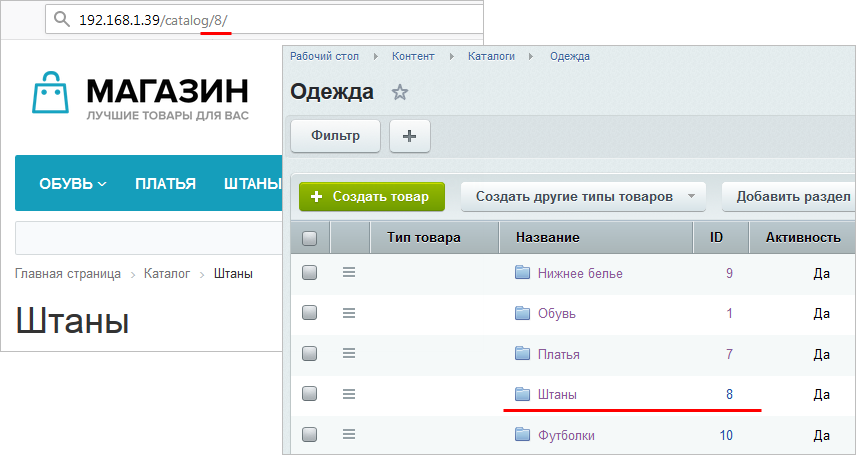
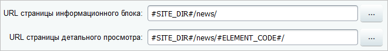

# Основные настройки

**Навигация**
- [← Оглавление курса](index.md)
- [← Предыдущий: 4534 — Создание, редактирование и удаление инфоблока](lesson_4534.md)
- [Следующий: 16862 — Символьный код →](lesson_16862.md)

Официальная страница урока: https://dev.1c-bitrix.ru/learning/course/index.php?COURSE_ID=34&LESSON_ID=9253

### Видеоурок

Видео предназначено для внимательного изучения вопроса о том, как заполнять основные параметры инфоблока. Если вас интересует информация лишь по конкретному параметру, то ее проще будет найти в текстовой части урока.

### Основные настройки

Настройка инфоблока начинается с указания общих параметров, а именно с вкладки **Инфоблок**:

|  | #### Как выполняется настройка основных параметров |
| --- | --- |

Разберем подробнее

			некоторые параметры вкладки Инфоблок

                    Полное описание настроек общих параметров информационного блока смотрите в пользовательской документации.
[Подробнее](https://dev.1c-bitrix.ru/user_help/content/iblock/iblock_edit.php#iblock)...

		:

- **Символьный код** - это заданный латиницей
  			осмысленный код
                      В своей работе программы не используют смысловые значения, аналогичные человеческим. Чтобы людям было легче оперировать с программными сущностями, используют мнемоники.
  [Подробнее...](lesson_16862.md)
  		;
- **Символьный код API** и **Включен доступ через REST** - параметры не настраиваются контент-менеджером, предназначены исключительно для разработчиков;
- **Сайты** - отметьте сайты, на которых используется инфоблок;
- **URL страницы ...** - поскольку страницы просмотра материалов инфоблока формируются динамически, то обязательно опишите принцип создания адресов этих страниц. При этом способ построения адресов в первую очередь зависит от того, используется ли
  			ЧПУ
   Вы обращали внимание, что при публикации на сайте динамической информации
  ссылки на материалы имеют примерно такой вид:
  Согласитесь, что они не несут большой информативности (особенно для тех,
  кто не знаком со структурой веб-адресов). Средства *«1С-Битрикс: Управление сайтом»*
  позволяют сделать ссылки более понятными с помощью специальной функции.
  Функция встроена во все комплексные компоненты (и отдельные простые) и преобразует
  стандартный веб-адрес в так называемый человеко-понятный URL (сокращенно ЧПУ).
  Например:
  [Подробнее](lesson_3579.md)...
  		 для показа материалов;

## Пример построения адресов страниц

Разберем построение адресов страниц на следующем

			примере

                    Дополнительно читайте урок:
 [Настройки инфоблока для корректного поиска элементов](lesson_2335.md).

		:

- #SITE_DIR#
                      Специальный макрос, который позволяет автоматически подставлять путь к корневой папке сайта и избавляет контент-менеджера от части ручной работы.
  		 - это
  			корневая директория
                      
  		 сайта.
- После #SITE_DIR# во всех страницах указывается **папка** ( у нас это
  			catalog
                      
  		), в которой размещен выводящий материалы инфоблока компонент.
- Поле **URL страницы раздела** - доступно и заполняется только, если в инфоблоке включено создание разделов. В этом поле после папки компонента указывается макрос, передающий информацию о разделе. Указать макрос проще всего с помощью кнопки
  			[...]
                      
  [Какие могут быть макросы](https://dev.1c-bitrix.ru/user_help/content/iblock/iblock_edit.php#url)
  		. Так, в нашем случае указано **#SECTION_ID#** и поэтому адрес страницы для раздела строится с помощью
  			идентификатора
                      
  		.
- В поле **URL страницы детального просмотра** сначала обязательно указывается макрос раздела, если в инфоблоке включено создание разделов, а затем уже указывается макрос, передающий информацию об элементе. Причем он должен быть в таком же формате, что и макрос для раздела. Например, если для вывода раздела используется #SECTION_ID#, то и для элемента нужно использовать соответственно #ELEMENT_ID#, а если для раздела используется #SECTION_CODE#, то для элемента следует использовать #ELEMENT_CODE#.
  Если же в инфоблоке создание разделов отключено, то в поле **URL страницы детального просмотра** после папки компонента указывается макрос, передающий информацию элемента:
   

- Настройка поля **Канонический URL элемента** требуется, когда элемент привязан к нескольким разделам инфоблока одновременно. В такой ситуации возникают дубли страниц элементов, а это нехорошо с точки зрения SEO. Поле позволяет задать
  			шаблон построения канонических ссылок
                      Элемент инфоблока может быть привязан к нескольким разделам. Но при этом могут быть претензии по дублям страниц от SEO. Избежать этого помогает такое понятие как "основной раздел" элемента. Раньше основным разделом считался раздел с минимальным идентификатором, что было не совсем удобно. С версии 15.5.0 все изменилось, теперь вы можете самостоятельно задать основной раздел и, следовательно, пометить нужную страницу элемента как **каноническую**.
  [Подробнее](lesson_7199.md)...
  		;
- **Индексировать элементы (разделы) для модуля поиска** - отметьте, чтобы искать добавляемые элементы (разделы) через поисковую строку;
- **Участвует в документообороте или бизнес процессах** - выберите один из модулей, если требуется, чтобы работа с элементами инфоблока велась в режиме
  			документооборота
                      Модуль **Документооборот** используется для организации цепочки движения документа от момента создания до момента публикации. Этот механизм используется если документ (новость, товар, страница сайта) должен быть проверен перед выпуском редактором или кем-то ещё.
  [Подробнее](https://dev.1c-bitrix.ru/learning/course/index.php?COURSE_ID=34&CHAPTER_ID=05305&LESSON_PATH=3905.4753.5305)...
  		 или через
  			бизнес-процессы
                      **Бизнес-процесс** - это процесс обработки документа, для которого задана одна точка входа и несколько точек выхода и последовательность действий (шагов, этапов, функций), совершаемых в заданном порядке и в определенных условиях.
  [Подробнее](https://dev.1c-bitrix.ru/learning/course/index.php?COURSE_ID=57)...
  		;
- Поля **Интерфейс привязки элемента к разделам** и **Режим просмотра разделов и элементов** - выберите наиболее удобный для вас
  			интерфейс работы
  **Интерфейс привязки элемента к разделам:**
  **-**Список множественного выбора
  **-**Выпадающие списки
  **-**Окно поиска
  **Режим просмотра разделов и элементов:**
  **-**из настроек модуля
  **-**раздельный
  **-**совместный
  [Подробнее](https://dev.1c-bitrix.ru/user_help/content/iblock/iblock_edit.php?#interface)...
  		 с разделами и элементами;
- Поля с указанием своих **файлов редактирования форм элементов** и поле **Значения свойств хранятся** предназначены для использования разработчиками.

**Примечание**: при создании инфоблока главное указать **Название** и **Сайты**.

Остальные настройки можно задать по мере необходимости, ознакомившись с другими уроками курса и постепенно настраивая нужный Вам функционал.

Еще можно добавить **Описание** инфоблока – некоторые сведения/заметки (эта информация будет видна только в форме создания/редактирования инфоблока), и его изображение (используется при выводе в публичной части

			списка всех инфоблоков

                    Компонент выводит список всех информационных блоков заданного типа. Компонент стандартный и входит в дистрибутив модуля.

						[Описание компонента «Список информационных блоков заданного типа» в пользовательской документации.](http://dev.1c-bitrix.ru/user_help/detail.php?ID=62985)

		).
