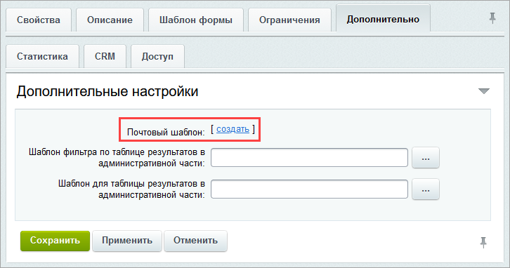
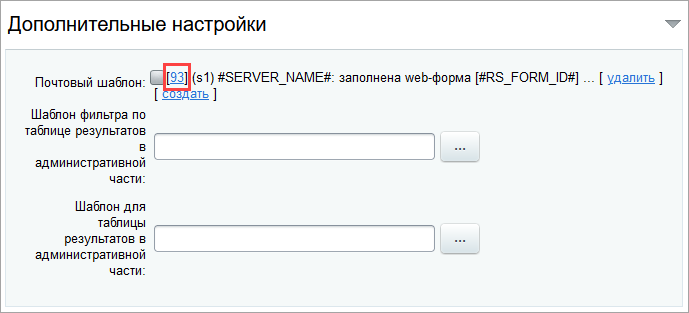

# Отправка результатов веб-формы на почту

**Навигация**
- [← Оглавление курса](index.md)
- [← Предыдущий: 3642 — Интеграции веб-формы и CRM Битрикс24](lesson_3642.md)
- [Следующий: 10279 — Настройка шаблонов уведомлений →](lesson_10279.md)

Официальная страница урока: https://dev.1c-bitrix.ru/learning/course/index.php?COURSE_ID=34&LESSON_ID=9265

Настройка получения результатов веб-формы на электронную почту позволяет быстро реагировать на запросы пользователей. Разберем, как это сделать в зависимости от

			режима

                    Работа в упрощённом режиме возможна, если в настройках модуля **Веб-формы** установлен флаг **Использовать упрощённый режим редактирования форм**.

Расширенный режим работы с веб-формами помимо управления вопросами и результатами веб-форм позволяет настраивать статусы результатов и создавать вычисляемые поля веб-форм.

		 работы модуля **Веб-формы**.

### Упрощенный режим

1. В настройках веб-формы отметьте опцию **Отправлять результаты по email**.
  
2. Сохраните настройки, нажав **Применить**. Система автоматически создаст почтовый шаблон.
3. Перейдите по ссылке **[список шаблонов]**.
4. Откройте
  			созданный шаблон
                      
  		 и убедитесь, что он:

  - активен,
  - привязан к вашему сайту,
  - настроен на нужный язык,
  - имеет правильно заполненные поля **От кого** и **Кому**.
5. Оставшиеся параметры настройте по своему усмотрению и сохраните изменения.

### Расширенный режим

1. Во вкладке **Дополнительно** настроек веб-формы создайте шаблон для отправки результатов:
  
2. Перейдите по
  			ссылке с его номером
                      
  		 и убедитесь, что шаблон:

  - активен,
  - привязан к вашему сайту,
  - настроен на нужный язык,
  - имеет правильно заполненные поля **От кого** и **Кому**.
3. Настройте остальные параметры шаблона по своему усмотрению и сохраните изменения.

### Заключение

Настройка получения результатов веб-формы на электронную почту не занимает много времени и заключается в настройке почтового шаблона.

### Дополнительно

- [Упрощенный режим](lesson_2926.md)
- [Расширенный режим](https://dev.1c-bitrix.ru/learning/course/index.php?COURSE_ID=34&CHAPTER_ID=02927)
- [Настройка шаблонов уведомлений](lesson_10279.md)
- [Работа с почтовыми шаблонами](https://dev.1c-bitrix.ru/learning/course/index.php?COURSE_ID=41&LESSON_ID=3523)
