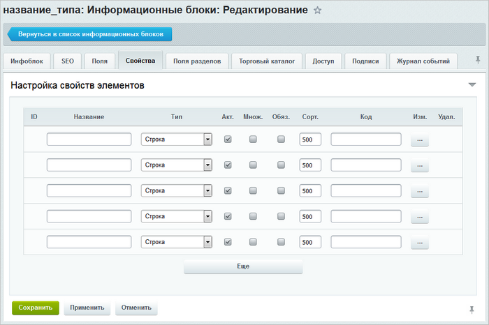
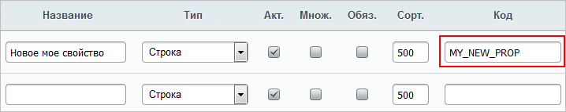
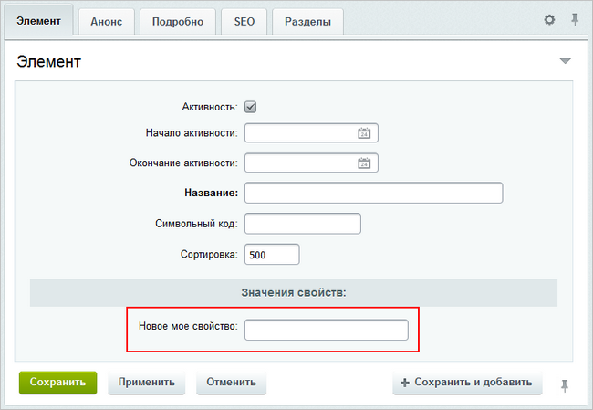
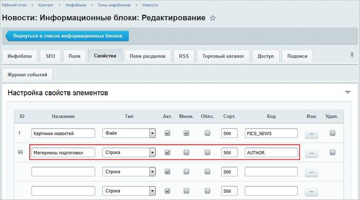
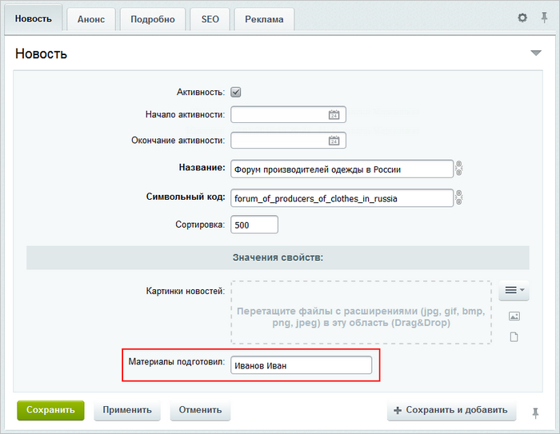
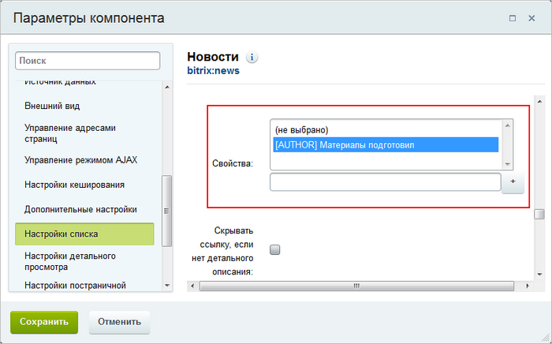
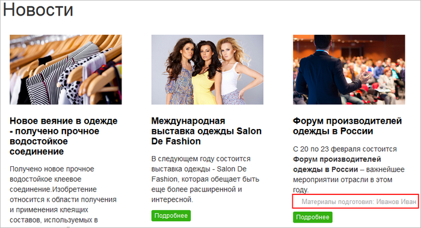
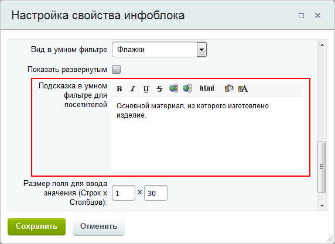
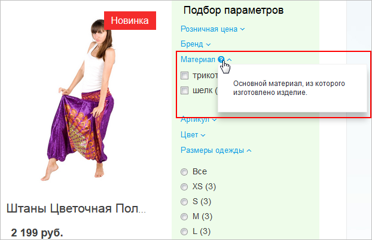

# Свойства элементов

**Навигация**
- [← Оглавление курса](index.md)
- [← Предыдущий: 5840 — Настройка SEO данных в инфоблоке](lesson_5840.md)
- [Следующий: 9411 — Настройка доступа к инфоблокам →](lesson_9411.md)

Официальная страница урока: https://dev.1c-bitrix.ru/learning/course/index.php?COURSE_ID=34&LESSON_ID=9407

### Видеоурок

Посмотрите видеоролик и узнайте, как создавать свойства:

### Свойства элементов

Согласитесь, что посетителям сайта приятнее читать статьи, где указан автор и добавлены фотографии. Выбирать товары в интернет-магазине удобнее, если приведены их характеристики. Создавайте в инфоблоке свойства и храните информацию в элементах  наиболее полно.

#### Общий подход при работе со свойствами

**Примечание:** свойства создаются для каждого инфоблока отдельно. Для создания свойств нужно иметь право на инфоблок "Изменение".

### Как создать свойство?

1. Откройте форму настроек информационного блока (Контент &gt; Инфоблоки &gt; Типы инфоблоков &gt; название_типа &gt; название_инфоблока).
2. Перейдите на вкладку
  			Свойства
                      
  		.
3. В свободной строчке:

  - введите название свойства (название будет показываться на сайте);
  - выберите тип хранимых в свойстве данных;
  - отметьте флаг **Множ.**, если значений у свойства может быть несколько;
  - отметьте флаг **Обяз.**, если указание значений данного свойства - это обязательная процедура;
  - заглавными латинскими буквами укажите
    			код свойства
                        
    		;
  - нажмите кнопку **[…]** для детального редактирования настроек свойства.
4. Во всплывающем окне проверьте уже сделанные вами настройки и выполните оставшиеся.
  **Примечание:** перечень полей зависит от выбранного типа свойства. Описание каждого поля приведено в
  			документации по продукту.
  Форма позволяет выполнить детальную настройку свойств инфоблока. Поля некоторых форм могут
  отличаться для разных свойств. Для открытия формы нужно:
  1. Перейдите на страницу
    *Контент &gt; Информ. блоки &gt; Типы информ. блоков &gt; Название типа инфоблоков*.
  2. В колонке команд выбрать команду **Свойства** для нужного инфоблока.
    Откроется страница списка свойств для элементов инфоблока.
  3. На контекстной панели нажмите кнопку **Добавить свойство** или
    в меню действий конкретного свойства выберите команду **Изменить**.
  либо:
  1. Перейдите на страницу
    *Контент &gt; Информ. блоки &gt; Типы информ. блоков &gt; Название типа инфоблоков &gt; Название инфоблока*.
  2. В колонке команд выбрать команду **Изменить**.
  3. Перейдите на вкладку **Свойства**.
  4. В строке с нужным свойством элемента нажмите на кнопку [**...**].
    Откроется форма настройки свойств информационного блока.
  [Подробнее](https://dev.1c-bitrix.ru/user_help/content/iblock/iblock_edit_property.php)...
5. Сохраните настройки.

Теперь вы можете указывать значения этого свойства при

			создании/редактировании

Следуйте **инструкциям на схеме** и расширяйте контент вашего сайта: публикуйте статьи, добавляйте товары и новости.

[Подробнее](lesson_10131.md)...

		 элементов:

Свойство будет доступно для отображения в

			списке элементов

                    Чтобы выбрать среди всего многообразия полей те, которые нужны именно вам, нажмите на значок шестеренки над колонкой меню действий. В открывшемся окне выберете нужные поля и нажмите Применить:

[Подробнее](lesson_11767.md)...

		. А если вы хотите использовать свойство для

			фильтрации

                    Выбирайте те параметры, по которым вам удобнее искать нужный элемент, с помощью кнопки Добавить поле.

[Подробнее](lesson_11771.md)...

		 списка элементов, включите опцию **Выводить на странице списка элементов поле для фильтрации по этому свойству** в детальных настройках свойства.

**Важно!** Если свойство не появилось в форме создания/редактирования элемента, то

			перенастройте внешний вид

При работе с товарами, материалами статей, каталогами справочников вы зачастую обращаете внимание на следующий момент: в форме присутствуют поля, которые не используются на сайте. Лишние поля увеличивают размеры формы редактирования и затрудняют внесение данных.

Облегчите свой труд, используйте инструмент настройки форм инфоблоков. Инструмент учитывает индивидуальные потребности,  позволяет настроить формы редактирования разделов и элементов инфоблока под себя:

- удаляйте лишние поля или целые вкладки;
- перемещайте поля между вкладками;
- создавайте свои вкладки.

[Подробнее](lesson_1883.md)...

		 формы.

**Примечание**: для

			торговых каталогов

Чтобы нужный информационный блок работал в режиме торговых каталогов, отметьте его флажком в поле **Является торговым каталогом** на странице настроек модуля **Торговый каталог** (Настройки &gt; Настройки продукта &gt; Настройки модулей &gt; Торговый каталог).

[Подробнее](https://dev.1c-bitrix.ru/learning/course/index.php?COURSE_ID=42&LESSON_ID=3456)...

		 свойства можно создавать

			двумя способами.

Свойства можно создать двумя способами:

1) на странице Магазин &gt; [ваш каталог] &gt; Свойства товаров / Свойства торговых предложений, кликнув по кнопке **Добавить свойство**;

2) в форме настроек информационного блока (Контент &gt; Инфоблоки &gt; Типы инфоблоков &gt; название_типа &gt; название_инфоблока, вкладка "Свойства"), кликнув по кнопке настроек.

[Подробнее](https://dev.1c-bitrix.ru/learning/course/index.php?bitrix_include_areas=Y&COURSE_ID=42&LESSON_ID=12623)...

### Как вывести информацию из свойства?

Когда свойство

			уже создано

                    

		 и в элементах инфоблока проставлены его

			значения

                    

		, можно приступать к выводу этих значений на сайт:

1. Откройте на сайте страницу, где демонстрируется посетителям информация из вашего инфоблока.
2. Включите
  			режим правки
                      Режим Правки - специальный режим работы "1С-Битрикс: Управление сайтом", в котором
  происходит изменение информации на сайте.
  
  [Подробнее...](lesson_1832.md)
  		.
3. Откройте форму с
  			настройками компонента.
  В режиме правки наведите мышь на область компонента, появится панель настроек. Выберите пункт **Редактировать параметры компонента**. Откроется форма настройки.
  [Подробнее](lesson_9165.md#pub)...
4. Перейдите к настройкам списка и/или детального просмотра и отметьте
  			ваше свойство
                      
  		.
5. Сохраните настройки.

Теперь значения из свойства показываются на сайте:

**Примечание:** на сайте выводятся только непустые значения свойств.

**Примечание:** Если вы настраиваете вывод свойств **каталога товаров** (используете комплексный компонент

			Каталог

                     Комплексный компонент осуществляет вывод полного каталога товаров из определенного инфоблока.

						[Описание компонента «Каталог (комплексный компонент)» в пользовательской документации.](http://dev.1c-bitrix.ru/user_help/detail.php?ID=62978)

		 и другие компоненты каталога), то настройки показа свойств в списке и детальном просмотре элемента выполняются в

			детальных настройках свойства

                    При включенном механизме компоненты модуля не содержат в себе настроек для отображения свойств. Теперь показ свойств настраивается только через формы редактирования (создания).

Подробнее в [курсе Администратор. Бизнес](https://dev.1c-bitrix.ru/learning/course/index.php?COURSE_ID=42&LESSON_ID=1986)

		.

### Как вывести подсказки в фильтре?

Бывают ситуации, когда в фильтре каталога товаров требуется прояснить фильтруемые параметры. Поскольку параметры фильтра - это свойства инфоблока, то используйте механизм подсказок. Добавить подсказку очень просто:

1. Откройте форму редактирования вашего каталога с товарами (Контент &gt; Инфоблоки &gt; Типы инфоблоков &gt; название_типа &gt; название_инфоблока).
2. Перейдите на вкладку **Свойства**.
3. В строке с требуемым свойством нажмите кнопку **[…]**.
4. Введите текст подсказки в поле
  			Подсказка в умном фильтре для посетителей
                      
  		.
5. Сохраните настройки.

Теперь в фильтре рядом с параметром отображается подсказка:

### Заключение

Свойства создаются отдельно для каждого инфоблока. Значения свойства задаются в элементах инфоблока. Показ значений свойства на сайте определяется настройками компонента.
