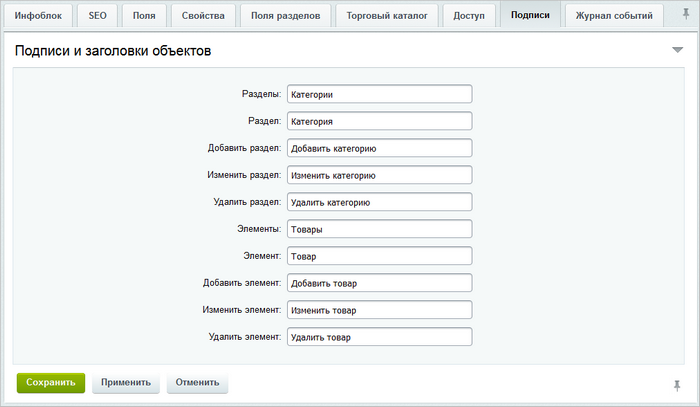
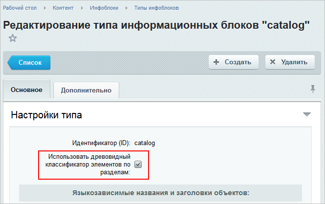
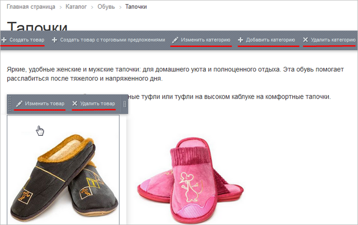
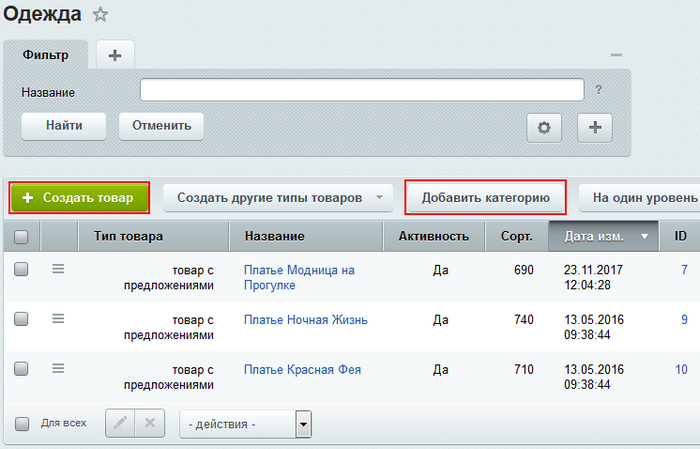

# Подписи

**Навигация**
- [← Оглавление курса](index.md)
- [← Предыдущий: 13272 — Нанесение авторского знака](lesson_13272.md)
- [Следующий: 13032 — Практические задания →](lesson_13032.md)

Официальная страница урока: https://dev.1c-bitrix.ru/learning/course/index.php?COURSE_ID=34&LESSON_ID=9409

Работу с сайтом по добавлению материалов сделайте более наглядной.

### Видеоурок

### Подписи

Настройте подписи для объектов инфоблока в зависимости от "характера" инфоблока:

Так, если инфоблок предназначен для показа на сайте некой продукции, то в форме редактирования инфоблока на закладке **Подписи** фразы Элементы и Элемент логично заменить на *Товары* и *Товар* соответственно, а названия для кнопок: Добавить элемент, Изменить элемент, Удалить элемент - на *Добавить товар*, *Изменить товар*, *Удалить товар*.

Если у вас новостной инфоблок или инфоблок с услугами, то во всех фразах слово элемент предпочтительно заменить на *новость* или *услуга*.

Настройки подписей для разделов доступны в том случае, если в инфоблоке

			разрешено создание самих разделов

                    

		. Тогда в фразах разделов слово раздел заменяется, например, для товаров на *категория*, для каталога книг на *жанр* и т.д.

В результате с материалами инфоблока гораздо приятнее и понятнее работать, как из

			публичной

                    

		, так и из

			административной

                    

		 части сайта.

### Заключение

Итак, вы познакомились с тем, как сделать работу с инфоблоком более наглядной: открывайте закладку **Подписи** и во всех фразах заменяйте слова элемент и раздел (при наличии) на соответствующие тематике хранимой информации.
