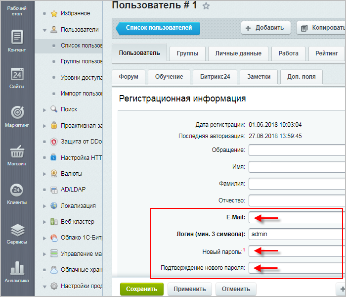
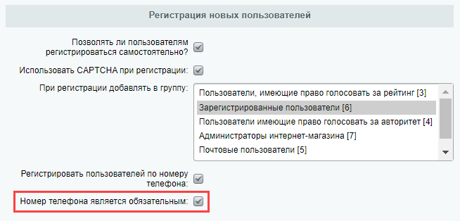

# Как закрыть доступ к сайту другому администратору

**Навигация**
- [← Оглавление курса](index.md)
- [← Предыдущий: 3091 — Если боты всё же зарегистрировались](lesson_3091.md)
- [Следующий: 7364 — Предотвращаем вторжения →](lesson_7364.md)

Официальная страница урока: https://dev.1c-bitrix.ru/learning/course/index.php?COURSE_ID=35&LESSON_ID=11363

|  | ### Как закрыть доступ к сайту другому администратору |
| --- | --- |

Иногда бывают такие ситуации, когда необходимо «вчерашнему» администратору сайта закрыть доступ к этому сайту (например, при смене подрядчика, создавшего и сопровождавшего ваш сайт). Как же это сделать, ведь у него, как у администратора, есть все «адреса/пароли/явки»?

Чтобы подрядчик **не смог** восстановить свой доступ (см. урок [Как восстановить пароль администратора](lesson_2161.md)), выполните три действия:

1. Сначала найдите
  			Пользователя с ID=1
  
  		 (Настройки &gt; Пользователи &gt; Список пользователей) и смените E-mail и пароль:
  
  Если в настройках Главного модуля (Настройки &gt;Настройки продукта &gt; Настройки модулей &gt; Главный модуль, вкладка Авторизация) разрешена
  			регистрация пользователей по номеру телефона
  Начиная с версии 18.5.0, в 1С-Битрикс появились возможность регистрироваться и восстанавливать пароль по СМС. Теперь при регистрации наравне с почтовым ящиком можно использовать и номер мобильного телефона.
  [Подробнее](lesson_12575.md)...
  		 и отмечена опция
  			Номер телефона является обязательным
  
  		, то у пользователя с ID=1 необходимо будет сменить и номер телефона.
  **Примечание**: Пользователь с ID=1 по умолчанию является администратором. Конечно, можно лишить его этих прав, сняв
  			соответствующую галку.
  
  		 Однако мы настоятельно рекомендуем этого не делать, так как вы сами потом не сможете [восстановить пароль администратора](lesson_2161.md), если возникнет такая необходимость.
2. Смените пароль доступа по
  			FTP,
  **FTP** (File Transfer Protocol – протокол передачи файлов) – это протокол передачи файлов по сети. Именно протокол FTP позволяет клиенту обращаться к файлам и папкам, которые хранятся на сервере.
  		 чтобы подрядчик не смог зайти на ваш сервер.
3. Проверьте у всех остальных пользователей (Настройки &gt; Пользователи &gt; Список пользователей) наличие полных прав на Главный модуль (есть хоть и маленькая, но все-таки вероятность того, что подрядчик создал своего тестового пользователя и дал ему права администратора).
