# Как создать форму авторизации (регистрации) на простых компонентах

**Навигация**
- [← Оглавление курса](index.md)
- [← Предыдущий: 2161 — Как восстановить доступ администратора на сайт](lesson_2161.md)
- [Следующий: 7174 — Настройка CAPTCHA →](lesson_7174.md)

Официальная страница урока: https://dev.1c-bitrix.ru/learning/course/index.php?COURSE_ID=35&LESSON_ID=11379

В этом уроке разберем, как штатными способами без кастомизации компонентов и изменения шаблона сайта создать форму регистрации с нужными именно вам полями.

 

### Видеоурок

Суть работы заключается в размещении простых компонентов на четырех страницах:

- `/auth/index.php` - существующая страница раздела **/auth**;
- `/auth/registration.php` - страница регистрации;
- `/auth/forget.php` - страница забытого пароля (восстановления пароля);
- `/auth/personal.php` - страница профиля (личных данных пользователя).

### Как создать форму авторизации (регистрации) на простых компонентах

1. Сначала нужно удалить
  			всю имеющуюся информацию
                       Возможный вид страницы авторизации до её чистки:
  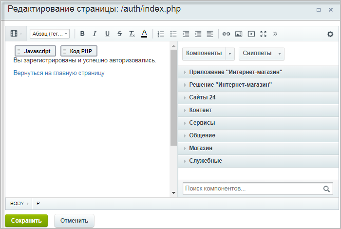
  		 на странице авторизации (**/auth/index.php**) и разместить
  			два компонента:
  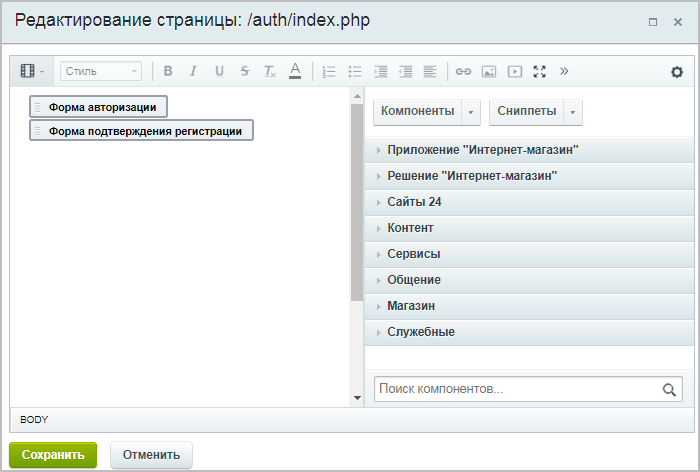
  В дополнительных настройках компонента **Форма авторизации (system.auth.form)** укажем адреса трех создаваемых страниц (регистрации, забытого пароля и профиля):
  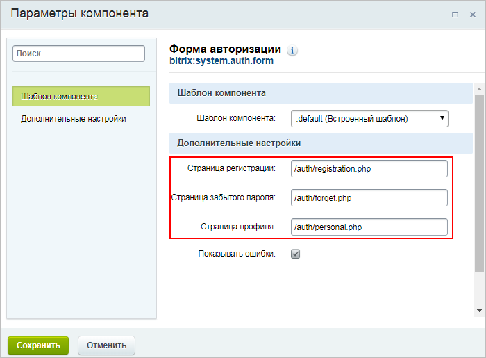
  Компонент **Форма подтверждения регистрации (**system.auth.confirmation**)** можно не настраивать.

  - Форма авторизации (system.auth.form)
                         Компонент служит для вывода формы авторизации.
    						[Описание компонента «Форма авторизации» в пользовательской документации.](http://dev.1c-bitrix.ru/user_help/detail.php?ID=63411)
  - Форма подтверждения регистрации (system.auth.confirmation)
                         Компонент выводит форму подтверждения регистрации.
    						[Описание компонента «Форма подтверждения регистрации» в пользовательской документации.](http://dev.1c-bitrix.ru/user_help/detail.php?ID=135678)
2. Теперь приступим, собственно, к созданию трех необходимых страниц и размещению на них соответствующих компонентов.

  - `/auth/registration.php`
                        **Здесь и далее:** чтобы прописать нужное имя файла, необходимо отключить функцию
    автоматического формирования имени из заголовка страницы.
    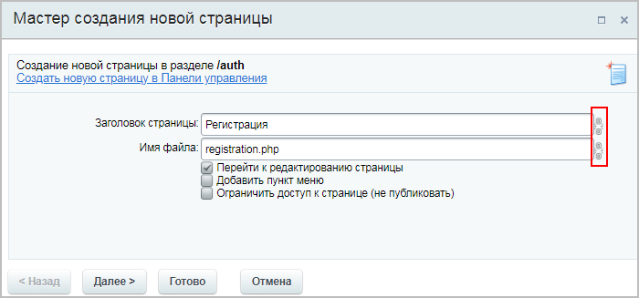
    		 - страница регистрации;
    Разместим на этой странице компонент
    			Настраиваемая регистрация (main.register).
                         Компонент позволяет настроить форму регистрации на сайте.
    						[Описание компонента «Настраиваемая регистрация» в пользовательской документации.](http://dev.1c-bitrix.ru/user_help/detail.php?ID=63409)
    		 В настройках этого компонента можно
    			выбрать поля
    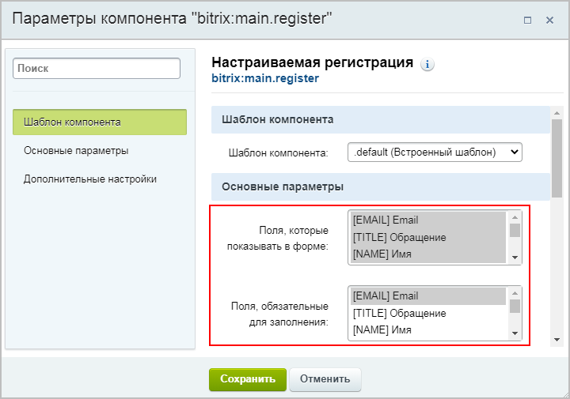
    		, которые должны отображаться в форме, а также обязательные для заполнения поля.
    **Примечание**: Можно добавить собственные поля, которые будут отображаться в форме регистрации. Для этого нужно создать желаемые
    			пользовательские поля
    **Пользовательское поле** - инструмент, позволяющий добавлять к объектам системы поля, не предусмотренные штатным функционалом.
    [Подробнее](https://dev.1c-bitrix.ru/learning/course/index.php?COURSE_ID=43&CHAPTER_ID=04804&LESSON_PATH=3913.3516.4804)...
    		 для
    			объекта USER
    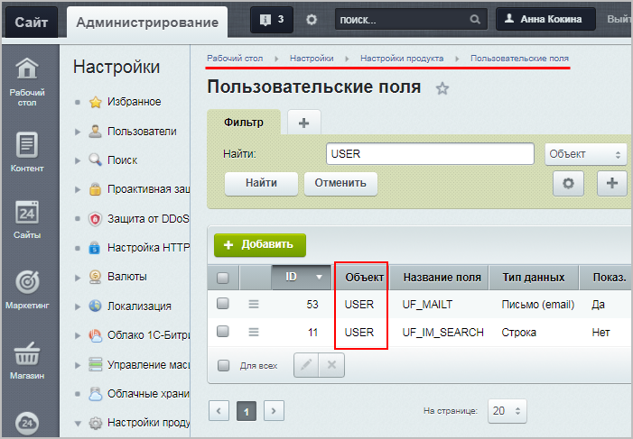
    		, а затем выбрать их
    			в настройках компонента
    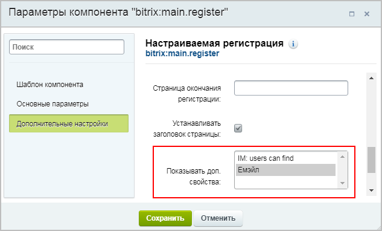
    		.
  - `/auth/forget.php`
    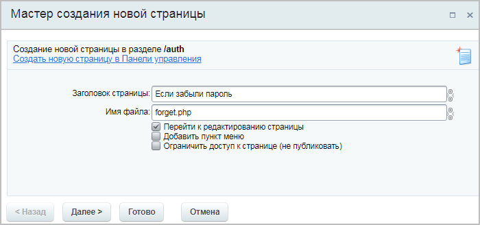
    		 - страница забытого пароля (восстановления пароля);
    На этой странице нужно разместить системный компонент **system.auth.forgotpasswd**, но сделать это можно только не совсем привычным способом.
    Сначала разместим компонент
    			Форма авторизации (system.auth.form).
    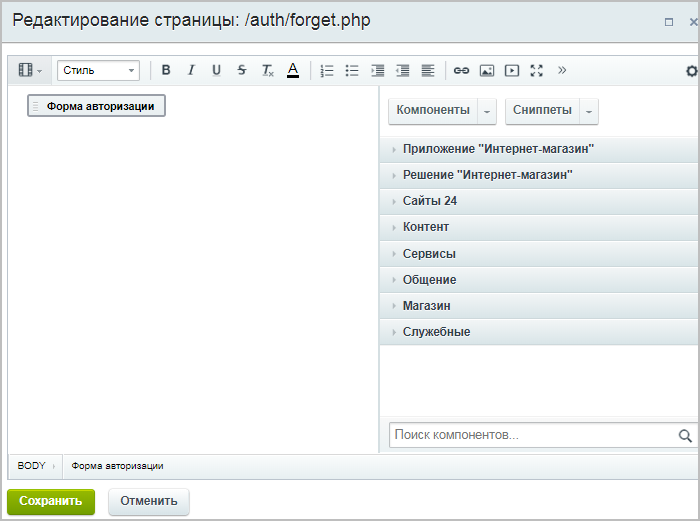
    Теперь в **административном разделе** изменим эту страницу (Контент &gt; Структура сайта &gt; Файлы и папки &gt; auth) в режиме
    			редактирования PHP.
    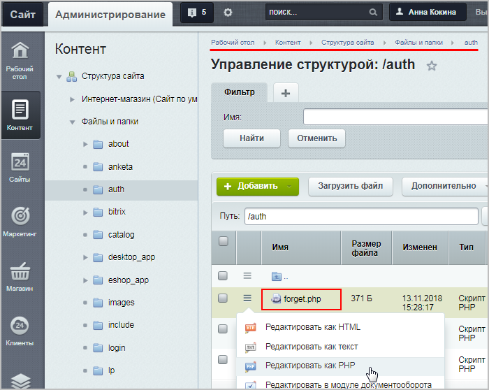
    		 Вместо **system.auth.form** пропишем **system.auth.forgotpasswd** в соответствующей строке. Должно получиться так:
    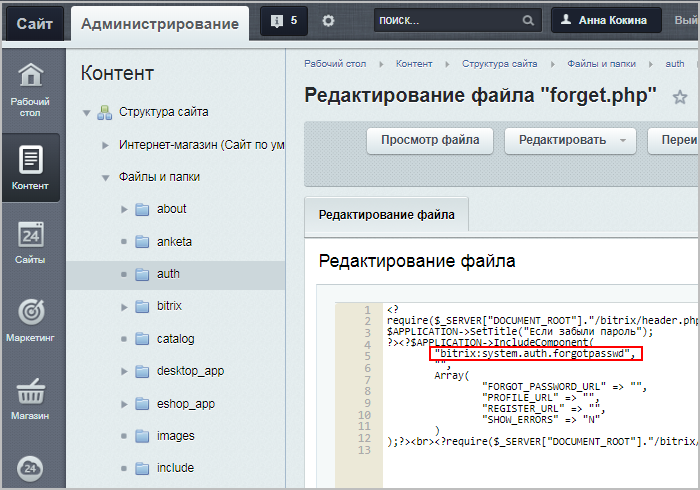
    После этого на странице **/auth/forget.php** будет подключен компонент восстановления пароля.
  - `/auth/personal.php`
    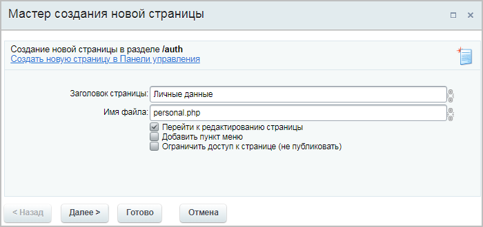
    		 - страница профиля (личных данных пользователя).
    Разместим на этой странице компонент
    			Параметры пользователя (main.profile).
                         Компонент позволяет вывести в публичную часть сайта информацию о пользователе.
    						[Описание компонента «Параметры пользователя» в пользовательской документации.](http://dev.1c-bitrix.ru/user_help/detail.php?ID=63410)
    		 В настройках этого компонента можно выбрать поля, которые будут отображаться в форме.
3. Теперь в настройках Главного модуля (Настройки &gt; Настройки продукта &gt; Настройки модулей &gt; Главный модуль) укажем **Страницу регистрации (для системного компонента авторизации): `/auth/registration.php`**
  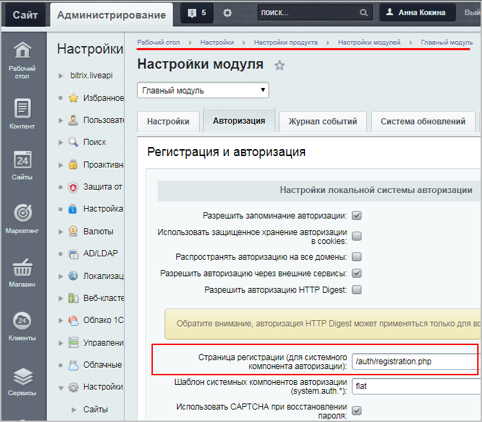
4. Наконец, найдём на сайте ссылки, ведущие на страницы профиля пользователя (если такие ссылки имеются). В демо-версии продукта на сайте есть ссылки на
  			авторизацию и личный кабинет
                      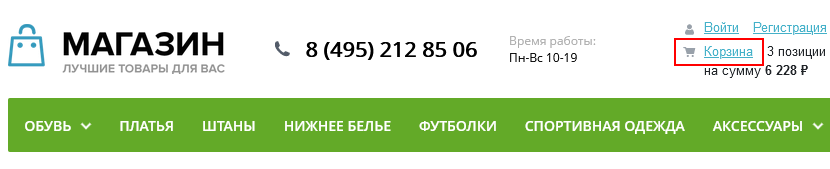
  		, выводящиеся с помощью компонента
  			sale.basket.basket.line
                       Одностраничный компонент, который отображает специальный блок корзины с набором в зависимости от настроек самого компонента информации.
  						[Описание компонента «Ссылка на корзину» в пользовательской документации.](http://dev.1c-bitrix.ru/user_help/detail.php?ID=63318)
  		. Откорректируем адреса в настройках этого
  			компонента
  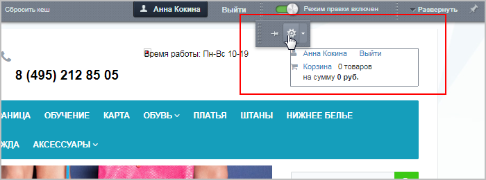
  		:
  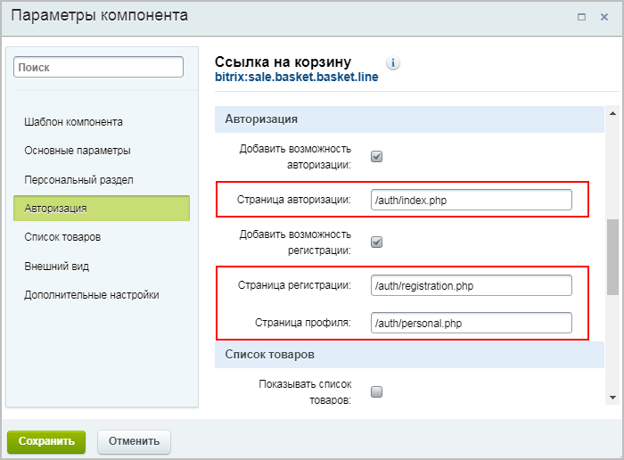

**Готово!** Форма регистрации и авторизации создана, и в настройках используемых компонентов можно выбрать те поля, которые нужны именно вам.

### Документация по теме

- [Как изменить стандартную форму авторизации (регистрации)?](http://dev.1c-bitrix.ru/support/faq/8366/#112843) (способ с кастомизацией компонента и изменением шаблона сайта)
- [Как подключить социальные сервисы для возможности авторизации через социальные сети](https://dev.1c-bitrix.ru/learning/course/index.php?COURSE_ID=41&LESSON_ID=3036)
- Компонент [Форма авторизации (system.auth.form)](https://dev.1c-bitrix.ru/user_help/components/sluzhebnie/user/system_auth_form.php)
- Компонент [Форма подтверждения регистрации (system.auth.confirmation)](https://dev.1c-bitrix.ru/user_help/components/sluzhebnie/user/system_auth_confirmation.php)
- Компонент [Настраиваемая регистрация (main.register)](https://dev.1c-bitrix.ru/user_help/components/sluzhebnie/user/main_register.php)
- Компонент [Параметры пользователя (main.profile)](https://dev.1c-bitrix.ru/user_help/components/sluzhebnie/user/main_profile.php)
- Компонент [Ссылка на корзину (sale.basket.basket.line)](https://dev.1c-bitrix.ru/user_help/components/magazin/basket/sale_basket_basket_line.php)
