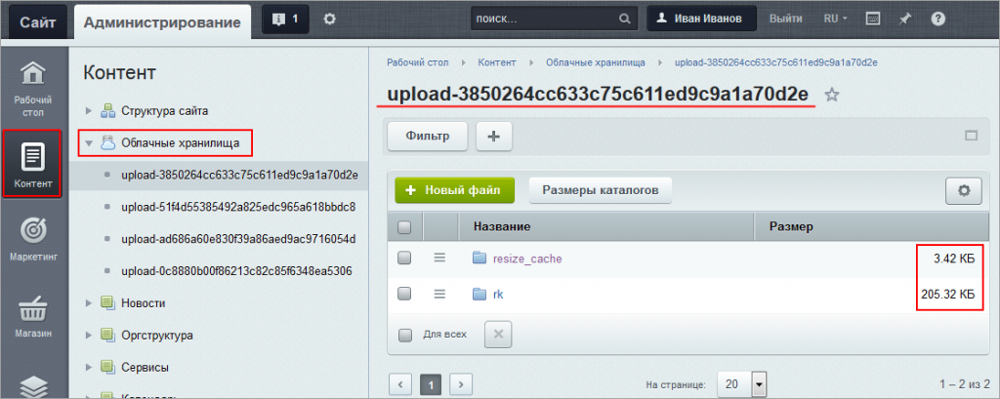
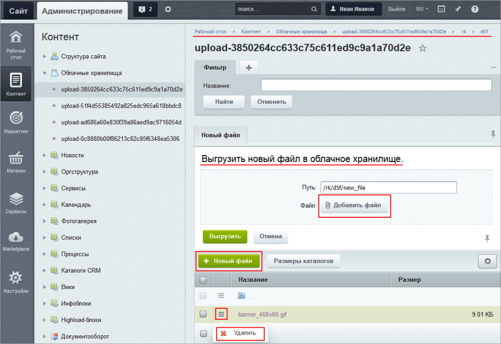

# Что можно сделать с файлами в облачном хранилище

**Навигация**
- [← Оглавление курса](index.md)
- [← Предыдущий: 3089 — Перенос файлов и поиск дубликатов](lesson_3089.md)
- [Следующий: 1943 — Управление масштабированием →](lesson_1943.md)

Официальная страница урока: https://dev.1c-bitrix.ru/learning/course/index.php?COURSE_ID=35&LESSON_ID=11637

|  | ### Возможные действия с файлами в облачном хранилище |
| --- | --- |

Просмотреть список подключенных

			контейнеров

                    **Контейнер** - логическая структура облачного хранилища.

		 облачных хранилищ и их содержимое можно на странице **Облачные хранилища** (Контент &gt; Облачные хранилища).

	

**Примечание:** страница доступна только при установленном модуле **Облачные хранилища** и после подключения хотя бы одного контейнера.

В зависимости от настроенных

			прав доступа

                    
На вкладке **Доступ** настраиваются права доступа к модулю **Облачные хранилища** для групп пользователей.

[Подробнее](https://dev.1c-bitrix.ru/learning/course/index.php?COURSE_ID=35&CHAPTER_ID=04826)...

		, для содержимого каждого контейнера можно:

- Посмотреть список файлов и папок. Также отображаются **Размеры каталогов** (с учетом вложенности) при нажатии на соответствующую кнопку контекстной панели:
   
- Удалить. Операция удаления доступна в меню действий.
- Добавить новый файл. Файл добавляется непосредственно в облако с помощью кнопки **Новый файл** на контекстной панели (Контент &gt; Облачные хранилища &gt; [название_контейнера]).
  

**Примечание:** С версии **20.0.100** модуля Облачные хранилища (**clouds**) доступно использование символа маски `*` в фильтре списка файлов.

|  | ### Документация по теме: |
| --- | --- |

- [Настройка модуля](https://dev.1c-bitrix.ru/learning/course/index.php?COURSE_ID=35&CHAPTER_ID=04826)
