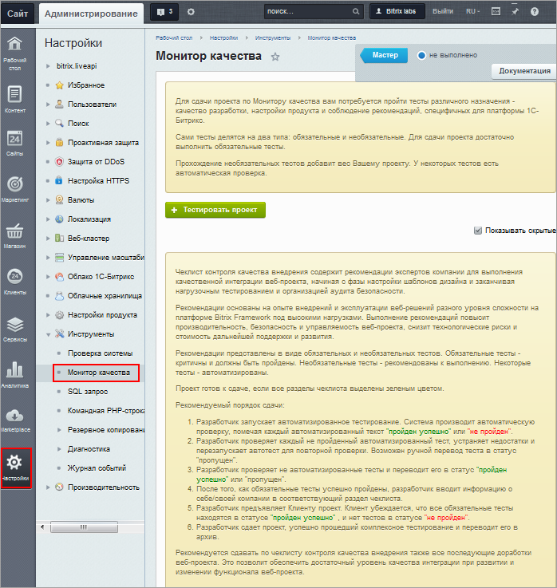

# Монитор качества

**Навигация**
- [← Оглавление курса](index.md)
- [← Предыдущий: 2562 — Проверка КП](lesson_2562.md)
- [Следующий: 2029 — SQL запрос и Командная PHP строка →](lesson_2029.md)

Официальная страница урока: https://dev.1c-bitrix.ru/learning/course/index.php?COURSE_ID=35&LESSON_ID=11785

|  | ### Проверка сайта перед сдачей |
| --- | --- |

Страница **Монитор качества** предназначена для проверки качества выполненного проекта перед сдачей его заказчику.На ней содержится встроенный набор автоматизированных и ручных тестов для проверки качества интеграции дизайна и разработки, внешнего программного окружения, безопасности, производительности, настроек хостинга, целостности ядра системы и другие.Благодаря контролю качества проекта веб-разработчик получает возможность провести доскональную проверку сайта перед сдачей, а клиент – уверенность в качестве сборки проекта.

 

Контроль качества проводится перед запуском сайта и выполняется разработчиком. Поэтому эта процедура подробно описана в курсе "Разработчик Bitrix Framework" в главе

			Монитор качества

                    Веб-проект – сложный и комплексный продукт. Он отличается от традиционного софта тем, что веб-сайт – это результат взаимодействия трех участников: клиента, партнера и разработчика платформы. В результате недопонимания между этими тремя сторонами возникает проблема качества внедрения.

Для разрешения этой проблемы создан инструмент Монитор качества. Он позволяет решить задачу обеспечения прозрачного и гибкого процесса сдачи веб-проекта клиенту, повышая уровень гарантированного результата и снижая общие риски.

[Подробнее ...](https://dev.1c-bitrix.ru/learning/course/index.php?COURSE_ID=43&CHAPTER_ID=04830)

		.

|  | #### Документация по теме: |
| --- | --- |

- [Монитор качества](https://dev.1c-bitrix.ru/user_help/settings/utilities/checklist.php)
