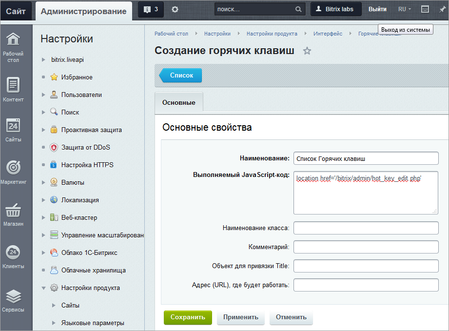

# Горячие клавиши

**Навигация**
- [← Оглавление курса](index.md)
- [← Предыдущий: 8587 — Административные настройки](lesson_8587.md)
- [Следующий: 11797 — Поведение мыши по умолчанию →](lesson_11797.md)

Официальная страница урока: https://dev.1c-bitrix.ru/learning/course/index.php?COURSE_ID=35&LESSON_ID=11795

### Специальные комбинации клавиш

Работу в *"1С-Битрикс: Управление сайтом"* можно сделать более эффективной и быстрой, если пользоваться не только мышью, но и применять «горячие клавиши» - специальные комбинации клавиш, призванные упростить и ускорить работу. Зачастую это гораздо удобнее.

**Примечание**: Управлять Горячими клавишами удобнее через

			Публичный раздел

                    Настройка горячих клавиш производится с помощью кнопки Горячие клавиши на панели управления.

[Подробнее ...](https://dev.1c-bitrix.ru/learning/course/index.php?COURSE_ID=34&LESSON_ID=3567)

		. К описанному ниже способу нужно прибегать когда требуется ограничить работу горячих клавиш определённой страницей или задать какую-то специфичную команду.

Управление горячими клавишами в административном разделе производится на странице Настройки &gt; Настройки продукта &gt; Интерфейс &gt; Горячие клавиши.

Чтобы добавить своё действие, нажмите кнопку **Добавить** на контекстной панели. После этого заполните форму создания для горячих клавиш:



Необходимо заполнить как минимум два поля:

- **Наименование** - выводится у пользователей в окне настроек горячих клавиш;
- **Выполняемый JavaScript код** - код, вызывающий нужное действие.

**Примечание**: Описание других полей смотрите в

			документации

						[Описание компонента «Горячие клавиши» в пользовательской документации.](http://dev.1c-bitrix.ru/user_help/detail.php?ID=433727)

		.

Пустое поле **Адрес (URL), где будет работать** означает, что действие для привязки к горячим клавишам будет доступно везде, где есть административная панель. Если необходимо, чтобы действие выполнялось на какой-то конкретной странице, или в конкретном разделе, то их нужно указать в данном поле, например:

[http://127.0.0.1:84/bitrix/admin/hot_keys_list.php](http://127.0.0.1:84/bitrix/admin/hot_keys_list.php) или 
 `/bitrix/admin/`.

По умолчанию горячие клавиши можно назначать на действия, выполняемые через основные кнопки публичной части

			Эрмитажа

                    **Эрмитаж** - это название интерфейса управления в продуктах *1С-Битрикс: управление сайтом* и *Битрикс24 в коробке*.

Подробнее в курсе [Контент-менеджер](https://dev.1c-bitrix.ru/learning/course/index.php?COURSE_ID=34&CHAPTER_ID=04455).

		 и Административной панели.

**Примечание**: Допускается назначение одинакового комплекта горячих клавиш на действия на разных страницах.

### Пример

Можно назначить по горячей клавише переход в наиболее часто используемый раздел. Код JavaScript для открытия страницы Настройки &gt; Настройки продукта &gt; Интерфейс &gt; Горячие клавиши Административного раздела будет выглядеть так:

```
location.href='/bitrix/admin/hot_keys_list.php';
```

### Документация по теме

- [Горячие клавиши](https://dev.1c-bitrix.ru/user_help/settings/settings/user_settings/hot_keys_list.php)
- [Создание и редактирование горячих клавиш](https://dev.1c-bitrix.ru/user_help/settings/settings/user_settings/hot_keys_edit.php)
