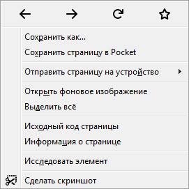

# Поведение мыши по умолчанию

**Навигация**
- [← Оглавление курса](index.md)
- [← Предыдущий: 11795 — Горячие клавиши](lesson_11795.md)
- [Следующий: 11799 — Добавление пункта меню в административный раздел →](lesson_11799.md)

Официальная страница урока: https://dev.1c-bitrix.ru/learning/course/index.php?COURSE_ID=35&LESSON_ID=11797

|  | Клавишами мыши в административном интерфейсе можно выполнить: |
| --- | --- |

- **левый клик** на кнопке меню действий или **правый клик** на строке таблицы отчета - вывод меню действий:
  |  | или |  |
  | --- | --- | --- |
- **Ctrl + правая кнопка** - выводит стандартное меню браузера:
  
- **двойной клик** на строке таблицы отчета - открывает сущность, отображаемую в строке, для редактирования;
- **Shift + двойной клик** на строке таблицы отчета - открывает сущность для редактирования в новом окне.
