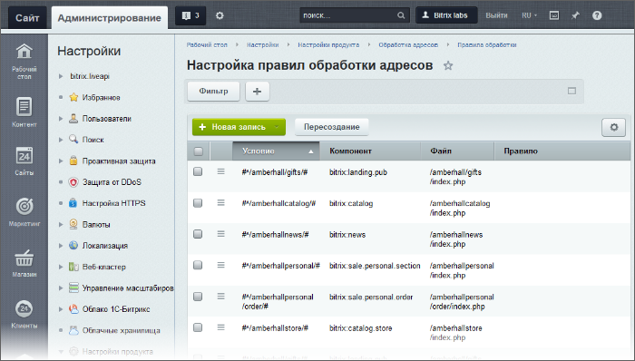
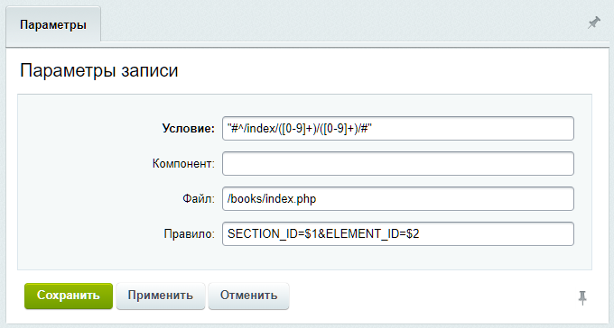
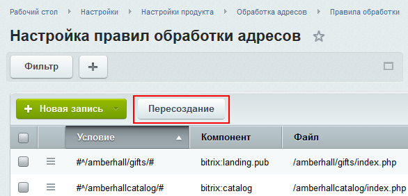

# Обработка адресов

**Навигация**
- [← Оглавление курса](index.md)
- [← Предыдущий: 8611 — Пример добавления поля](lesson_8611.md)
- [Следующий: 4519 — Особенности работы с правилами →](lesson_4519.md)

Официальная страница урока: https://dev.1c-bitrix.ru/learning/course/index.php?COURSE_ID=35&LESSON_ID=12057

Обработка адресов применяется для того, чтобы скрипт мог отвечать не только по своему физическому, но и по любому другому указанному адресу.

 

### Видеоурок

### Правила обработки адресов

Правила обработки адресов настраиваются отдельно для каждого сайта и каждое из них должно содержать уникальное в рамках сайта условие выполнения. К примеру, у вас есть скрипт, лежащий в файле */catalog/index.php* и отвечающий по адресу с параметром id: https://mysite.ru/catalog/index.php?id=15. C помощью правил обработки адресов, можно сделать так, чтобы он отвечал ещё и по адресу: https://mysite.ru/catalog/15.php.

Управление правилами обработки адресов производится в административном разделе на странице Настройки &gt; Настройки продукта &gt; Обработка адресов &gt; Правила обработки. Здесь вы найдете список всех правил, сможете создать новое или отредактировать существующее:

При необходимости работать с ними можно и вручную в файле **urlrewrite.php** в корневой папке сайта.

Важно понимать, что дополнительный адрес, по которому будет отвечать скрипт, не должен физически существовать на сервере. Если такой адрес (файл) существует, то в приоритете будет вызов скрипта по нему. Переадресация в таком случае не сработает.

Зачем это нужно? Так вы можете сократить длину ссылки или открывать подходящий материал сайта для старой страницы, которую вы уже удалили, но уверены, что где-то остались ссылки на неё. А ещё правила обработки адресов работают при настройке ЧПУ в компонентах.

### Форма создания

По нажатии на кнопку **Новая запись** требуется выбрать сайт, для которого создаётся правило. После открывается форма создания:

- **Условие** – условие, по которому будет работать правило обработки адресов. Задаётся с помощью регулярного выражения. Простыми словами, это тот самый несуществующий адрес, по которому будет открываться указанный ниже файл;
- **Компонент** – полное имя компонента *(пространство_имен:имя_компонента)*, для которого будет работать правило. Это поле заполняется автоматически, при настройке ЧПУ в компонентах;
- **Файл** – полный путь к странице (файлу), которая должна быть показана;
- **Правило** – правило вызова страницы, путь к которой указан в поле выше. В большинстве случае здесь вы будете прописывать параметры, с которыми будет вызвана страница. На скриншоте выше это SECTION_ID и ELEMENT_ID.

**Важно**: для создания даже простых правил необходимо изучить основы [PCRE](http://ru.wikipedia.org/wiki/PCRE) (Perl-совместимые регулярные выражения) и ознакомиться с различными примерами разбора url-адресов с помощью масок. Регулярные выражения – это не функционал продуктов Битрикс, а общепринятый язык для поиска и осуществления манипуляций с подстроками в тексте, основанный на использовании метасимволов.

## Описание простого регулярного выражения со скриншота

Что означают метасимволы (символы, обозначающие группы других символов) в шаблонах? Например, в выражении `"#^/index/([0-9]+)/([0-9]+)/#"`:

- **#** – превращает аргумент, которому он предшествует, в строку в кавычках;
- **^** – начало строки;
- **( )** – группировка;
- **[ ]** – класс символов. То есть **[0-9]** - все символы от нуля до девятки;
- **+** – один или большее число раз.

Таким образом, мы сформировали строку адреса, которая всегда начинается с **/index/**, а дальше возможен набор из любых чисел. Например: /index/35/12/.

В правиле указаны параметры вызова страницы SECTION_ID=$1&ELEMENT_ID=$2. Что такое $1 и $2? Так принято обозначать переменные в регулярных выражениях. Значением $1 будут первые круглые скобки из условия ([0-9]+), а $2 – вторые по счёту круглые скобки ([0-9]+). Счёт ведётся слева направо.

Таким образом, если мы впишем в адресную строку mysite.ru/index/35/12/, будет вызвана страница с параметрами mysite.ru/books/index.php?SECTION_ID=35&ELEMENT_ID=12.

### Человеко-понятные адреса

Механизм переопределения адресов задействован и для поддержки

			ЧПУ

                     **ЧПУ** (англ. Friendly URL) – веб-адреса, удобные для восприятия человеком (а также систем и методов построения таких адресов). Является аббревиатурой от словосочетания «человеко-понятный урл» (где «урл» – жаргонное обозначение URL).
[Подробнее...](https://dev.1c-bitrix.ru/learning/course/index.php?COURSE_ID=34&LESSON_ID=3579)

		 (человеко-понятных URL). Эта функция встроена во все комплексные

			компоненты

                    Компонент – это программный код, оформленный в визуальную оболочку, выполняющий определённую функцию какого-либо модуля по выводу данных в Публичной части. Мы можем вставлять этот блок кода на страницы сайта без непосредственного написания кода. [Подробнее...](https://dev.1c-bitrix.ru/learning/course/index.php?COURSE_ID=34&CHAPTER_ID=04457)

		 и некоторые простые. Таким образом её можно использовать для переопределения любых URL, как обычных со статической информацией, так и связанных с компонентами (динамической информацией).

При добавлении на страницу компонента с поддержкой ЧПУ (если файл сохраняется

			с помощью API

                    Для хранения идентификаторов элементов/разделов информационных блоков удобнее всего использовать поле **Символьный код**.

[Подробнее...](https://dev.1c-bitrix.ru/learning/course/index.php?COURSE_ID=43&CHAPTER_ID=02175)

		) автоматически создается правило переопределения адреса, в котором заполнено поле Компонент. Нужно учитывать, что если страница создаётся не стандартными способами системы, а записывается на сервер (например, через SFTP), то необходимо выполнить пересоздание правил на странице со списком.

### Материалы по теме

- Документация:

  - [Список правил обработки адресов](https://dev.1c-bitrix.ru/user_help/settings/settings/urlrewrite/urlrewrite_list.php);
  - [Создание и редактирование правила обработки адресов](https://dev.1c-bitrix.ru/user_help/settings/settings/urlrewrite/urlrewrite_edit.php);
  - [Пересоздание правил обработки адресов](https://dev.1c-bitrix.ru/user_help/settings/settings/urlrewrite/urlrewrite_reindex.php);
  - [Обработка адресов UrlRewrite](https://dev.1c-bitrix.ru/api_help/main/general/urlrewrite.php).
- Уроки:

  - [ЧПУ в компонентах](https://dev.1c-bitrix.ru/learning/course/index.php?COURSE_ID=43&LESSON_ID=3578) (курс «Разработчик Bitrix Framework»);
  - [Вложенные ЧПУ](https://dev.1c-bitrix.ru/learning/course/index.php?COURSE_ID=34&LESSON_ID=5319) (курс «Контент-менеджер»).
- Полезные статьи:

  - [Один из способов включения подразделов инфоблоков в пути для ЧПУ (для версий ниже 12.5);](https://dev.1c-bitrix.ru/community/webdev/user/42405/blog/3356/)
    [Другой способ включения подразделов инфоблоков в пути для ЧПУ (для версий ниже 12.5).](https://dev.1c-bitrix.ru/community/forums/messages/forum7/topic32979/message182984/#message182984)
