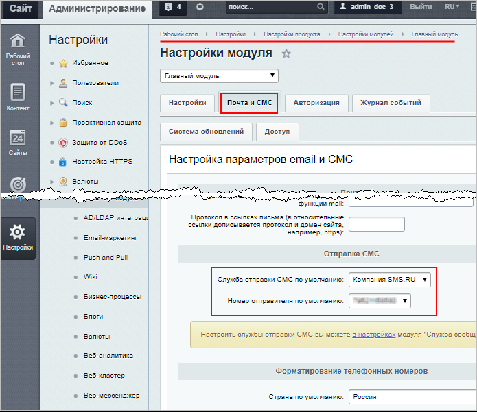
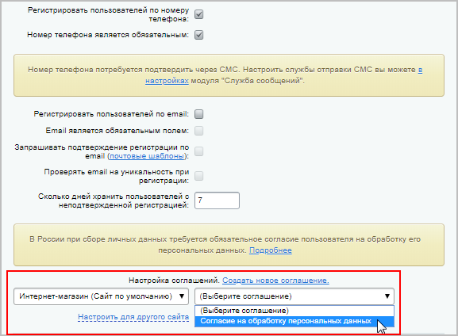
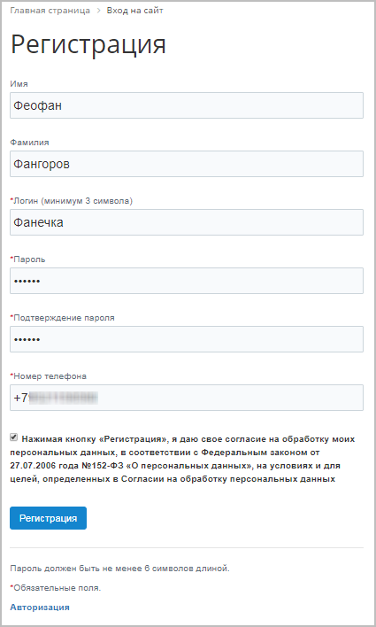
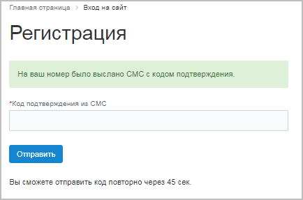
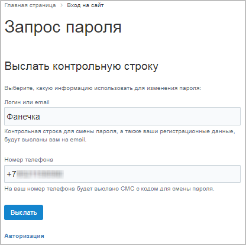
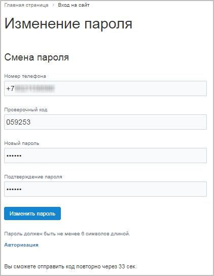

# Регистрация по номеру телефона

**Навигация**
- [← Оглавление курса](index.md)
- [← Предыдущий: 23828 — Права на работу с Сайтами24](lesson_23828.md)
- [Следующий: 2161 — Как восстановить доступ администратора на сайт →](lesson_2161.md)

Официальная страница урока: https://dev.1c-bitrix.ru/learning/course/index.php?COURSE_ID=35&LESSON_ID=12575

|  | ### Регистрация по номеру телефона |
| --- | --- |

Начиная с версии 18.5.0, в 1С-Битрикс появились возможность регистрироваться и восстанавливать пароль по СМС. Теперь при регистрации наравне с почтовым ящиком можно использовать и номер мобильного телефона.

Рассмотрим пошагово, как настроить этот полезный функционал:

1. Сначала
  			установите и настройте
  Прежде всего, не забудьте установить этот модуль (Настройки &gt;Настройки продукта &gt; Модули).
  Настройка модуля осуществляется в Административном разделе (Настройки &gt;Настройки продукта &gt; Настройки модулей &gt; Служба сообщений).
  [Подробнее](https://dev.1c-bitrix.ru/learning/course/index.php?COURSE_ID=41&LESSON_ID=11233)...
  		 модуль **Служба сообщений**, привязав одну из служб сообщений.
2. Далее укажите в настройках **Главного модуля** службу отправки СМС по умолчанию и выберите соответствующий номер отправителя (Настройки &gt;Настройки продукта &gt; Настройки модулей &gt; Главный модуль (Почта и СМС)):
  
3. И в завершении перейдите на вкладку **Авторизация** и разрешите регистрацию пользователей по номеру телефона, при необходимости сделав это поле обязательным (Настройки &gt;Настройки продукта &gt; Настройки модулей &gt; Главный модуль (Авторизация)):
  
  Подробнее о настройке остальных полей (по желанию) можете прочитать в
  			документации по продукту.
  **Настройки Главного модуля**, закладка "Авторизация".
  [Подробнее](https://dev.1c-bitrix.ru/user_help/settings/settings/settings.php#author)...
  **Примечание**: Не забудьте, что в России при сборе личных данных требуется обязательное согласие пользователя на обработку его персональных данных, поэтому
  			настройте соглашение
  
  		 на обработку персональных данных (можете выбрать существующее соглашение или
  			создать новое
  На странице **Соглашения** (Настройки &gt; Настройки продукта &gt; Соглашения) выводятся все созданные и используемые соглашения и с неё же можно перейти к списку полученных соглашений от пользователей.
  Соглашение - текст, который должен прочитать пользователь и согласится с ним. В дистрибутиве есть стандартный вариант соглашения, но у администратора всегда есть возможность создать свой текст соглашения. Для этого на странице **Соглашения** воспользуйтесь кнопкой **Добавить** и заполните открывшуюся форму.
  [Подробнее](lesson_6636.md)...
  		).

Готово! Теперь регистрация пользователей будет осуществляться по номеру мобильного телефона.

## Вид в публичном разделе

1. Форма регистрации:
  
  
2. Восстановление пароля:
  
  

|  |
| --- |

 

|  | ### Документация по теме: |
| --- | --- |

- [Настройки главного модуля](https://dev.1c-bitrix.ru/user_help/settings/settings/settings.php#sms) (закладка "Почта и СМС")
- [Настройки главного модуля](http://dev.1c-bitrix.ru/user_help/settings/settings/settings.php#author) (закладка "Авторизация")
