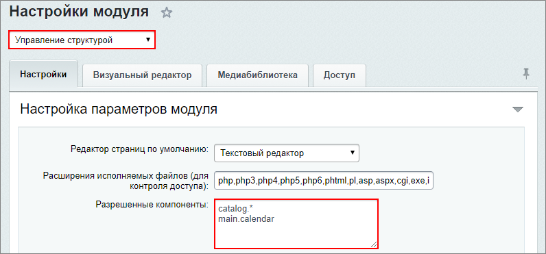
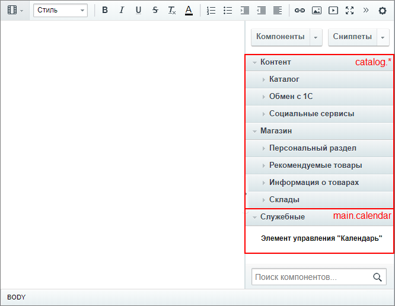
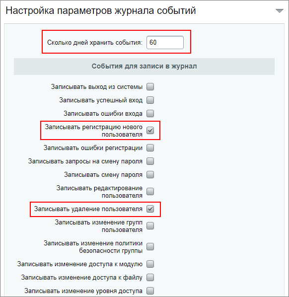
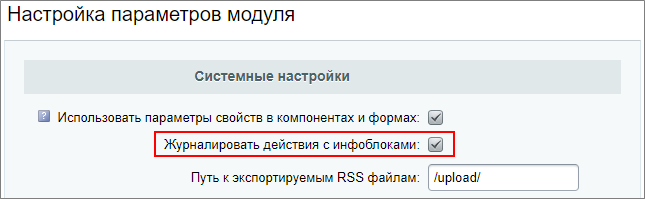
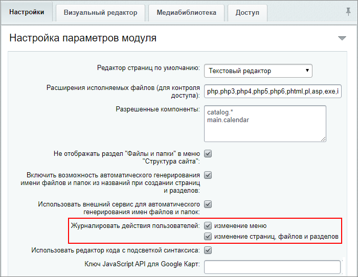
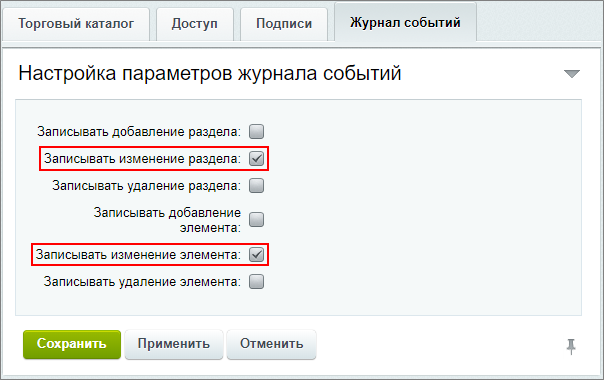
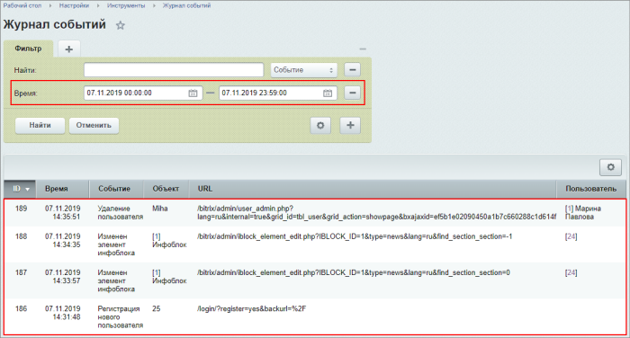

# Практические задания

**Навигация**
- [← Оглавление курса](index.md)
- [← Предыдущий: 12812 — Проверьте себя](lesson_12812.md)
- [Следующий: 7173 — Регистрация и разграничение прав →](lesson_7173.md)

Официальная страница урока: https://dev.1c-bitrix.ru/learning/course/index.php?COURSE_ID=35&LESSON_ID=12814

После изучения главы рекомендуем выполнить несколько практических заданий.

 

### Практические задания

Практические задания состоят из вопроса, скриншота или видео с конечным результатом и объяснением, как это получить в спойлере. Не торопитесь подглядывать в спойлер. 

1. Создайте раздел и страницу через физическую структуру в Административном разделе. Загрузите в папку файл (любое изображение) и разместите его на странице, выбрав из структуры. Закройте доступ к разделу и скройте пункт меню для неавторизованных пользователей.
  ## Решение
  **Задание составлено по материалам уроков:**
  - [Создание и редактирование новых страниц и разделов](lesson_2021.md).
  - [Управление правами доступа](lesson_2023.md).
  - [Загрузка и поиск файлов](lesson_1932.md).
  - [Расширенный режим настройки меню](lesson_2018.md).
  **Результат:**
  

2. Настройте отображение в визуальном редакторе всех компонентов **catalog.*** и компонента календарь (**main.calendar**).
  ## Решение
  **Задание составлено по материалам уроков:**
  - [Настройки отображения компонентов](lesson_1902.md) в визуальном редакторе.
  **Результат:**
  На странице настроек модуля **Управление структурой** (Настройки &gt; Настройки продукта &gt; Настройки модулей &gt; Управление структурой) внесите компоненты из задания в поле **Разрешенные компоненты**:
  
  Результат в визуальном редакторе:
  
3. Выполните различные настройки доступа. Для проверки настроек понадобится
  			создать пользователя
                      Создать пользователя просто на странице **Список пользователей** (Настройки &gt; Пользователи &gt; Список пользователей).
  Подробнее можно посмотреть в уроке [Работа с учетными записями пользователей](lesson_2004.md).
  		:
  ## Решение
  **Задание составлено по материалам уроков:**
  - [Доступ к модулям](lesson_2016.md).
  - [Управление доступом к папкам и файлам](lesson_2019.md).
  - [Настройка доступа к инфоблокам](lesson_9411.md).
  **Результат:**
  

  1. Добавьте нового пользователя в группу **Контент-редакторы**;
  2. Авторизуйтесь под этим пользователем и проверьте, что ему доступно;
  3. Вернитесь в учетную запись Администратора и настройте права доступа:

    - **Чтение** к папке /bitrix/admin;
    - **Доступ открыт** к модулю **Веб-формы**;
    - Закройте просмотр физической структуры в административном разделе;
    - Право доступа **Изменение** для инфоблока **Новости** конкретно для пользователя (не группы).
  4. Проверьте результат настроек, вновь авторизовавшись под пользователем.
4. Создайте пользовательские поля для формы создания пользователя:
  ## Решение
  **Задание составлено по материалам урока:**
  - [Создание Пользовательских полей](lesson_6309.md).
  **Результат:**
  

  - поле **Хобби** размером 32х3 во вкладке **Личные данные** после поля **Дата рождения**;
  - поле **Дата начала работы** во вкладке **Работа** после поля **Должность**.
5. Выполните настройки для журнала событий:
  После настроек выполните перечисленные действия и посмотрите, как они отражаются в журнале событий.
  ## Решение
  **Задание составлено по материалам урока:**
  - [Журнал событий](lesson_2034.md).
  **Результат:**
  Настройки модуля **Главный модуль**:
  
  Настройки модуля **Инфоблоки**:
  
  Настройки модуля **Управление структурой**:
  
  Настройки инфоблока **Новости**:
  
  Результат в **Журнале событий**:
  

  - Срок хранения событий - 60 дней;
  - Записывать регистрацию и удаление пользователей;
  - Журналирование действий с инфоблоками;
  - Сохранение действий пользователей;
  - Записывать изменение раздела и элемента для инфоблока **Новости**.

### Где выполнять задания?

Демонстрационную версию с пробным периодом в 30 дней вы можете установить на свой компьютер или на хостинг. Подробная информация о настройке каждого варианта представлена в уроке [Где практиковаться и выполнять задания](lesson_26638.md).

**Примечания:**

1. Настоятельно рекомендуем **НЕ** выполнять задания на работающем, «боевом» сайте.
2. Если вы всё же пытаетесь выполнять задания на работающем сайте, где вы не являетесь администратором, то не все задания можно выполнить.
