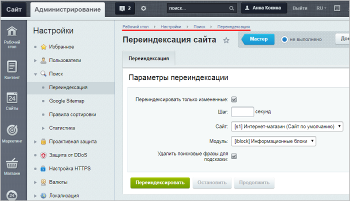

# Практические задания

**Навигация**
- [← Оглавление курса](index.md)
- [← Предыдущий: 12820 — Проверьте себя](lesson_12820.md)
- [Следующий: 6636 — Согласие на обработку персональных данных →](lesson_6636.md)

Официальная страница урока: https://dev.1c-bitrix.ru/learning/course/index.php?COURSE_ID=35&LESSON_ID=12818

После изучения главы рекомендуем выполнить несколько практических заданий.

 

### Практические задания

Практические задания состоят из вопроса, скриншота или видео с конечным результатом и объяснением, как это получить в спойлере. Не торопитесь подглядывать в спойлер. 

1. Для инфоблока **Одежда** (тип инфоблока **Каталоги**) измените URL страницы раздела и URL страницы детального просмотра таким образом, чтобы:
  ## Решение
  **Задание составлено по материалам уроков:**
  - [Настройки инфоблока для корректного поиска элементов](lesson_2335.md)
  - [Типичные ошибки](lesson_2165.md)
  **Результат:**
  

  - в этих URL выводился полный путь из символьных кодов раздела (используйте макрос `#SECTION_CODE_PATH#`);
  - найденные через поиск товары выводились корректно (с полным путём из символьных кодов раздела).
2. Допустим, на Вашем сайте произошли изменения в описании множества товаров. Проведите переиндексацию для таких товаров.
  ## Решение
  **Задание составлено по материалам уроков:**
  - [Индексация](lesson_2048.md)
  **Результат:**
  Обновить поисковые индексы можно на странице **Переиндексация сайта** (Настройки &gt; Поиск &gt; Переиндексация):
  
  - **Переиндексировать только измененные** – отмечаем опцию (согласно условиям задания);
  - **Шаг** – так как мы работаем на локальной установке, то не заполняем это поле (тогда переиндексация выполнится за один шаг);
  - **Сайт** – указываем текущий сайт (сайт Интернет-магазина);
  - **Модуль** – выбираем **Инфоблоки**, потому что товары магазина - это элементы инфоблока **Каталог**;
  - **Удалить поисковые фразы для подсказки** – отметим опцию, так как по условиям задания у товаров было изменено описание, и старые поисковые фразы могут быть уже не актуальны.
3. На странице новостей разместите форму поиска согласно следующим условиям:
  **Примечание**: в системе по умолчанию уже есть настроенная страница вывода результатов поиска `/search/index.php`, но в рамках практического занятия её использовать нельзя.
  ## Решение
  **Задание составлено по материалам уроков:**
  - [Компоненты Поиска](lesson_2047.md)
  **Результат:**
  

  - результаты поиска должны выводиться на новой странице `/news/results.php`
  - поиск должен осуществляться **только** по элементам инфоблока **Новости**
4. Сделайте так, чтобы при поиске новостей приоритет отдавался новости "Международная выставка одежды Salon De Fashion".
  ## Решение
  **Задание составлено по материалам уроков:**
  - [Правила сортировки](lesson_2053.md)
  **Результат:**
  

### Где выполнять задания?

Демонстрационную версию с пробным периодом в 30 дней вы можете установить на свой компьютер или на хостинг. Подробная информация о настройке каждого варианта представлена в уроке [Где практиковаться и выполнять задания](lesson_26638.md).

**Примечания:**

1. Настоятельно рекомендуем **НЕ** выполнять задания на работающем, «боевом» сайте.
2. Если вы всё же пытаетесь выполнять задания на работающем сайте, где вы не являетесь администратором, то не все задания можно выполнить.
