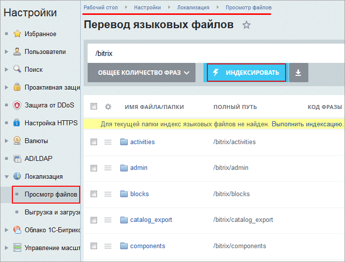
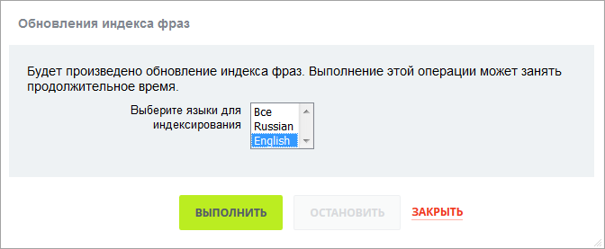
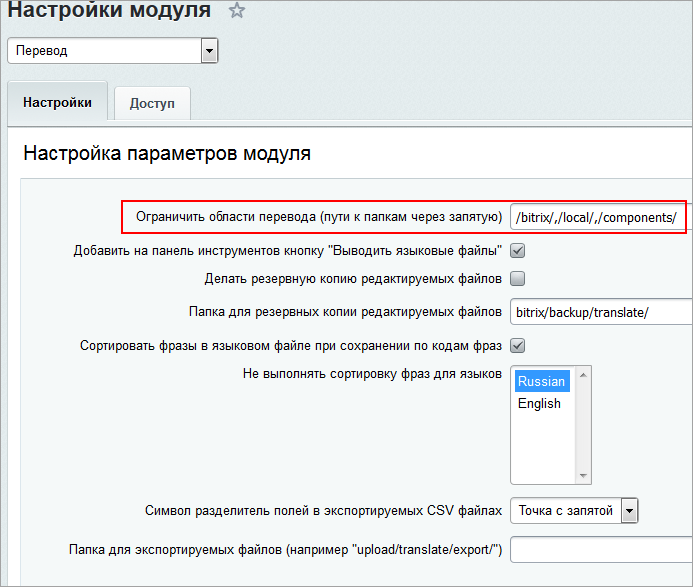
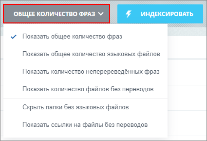
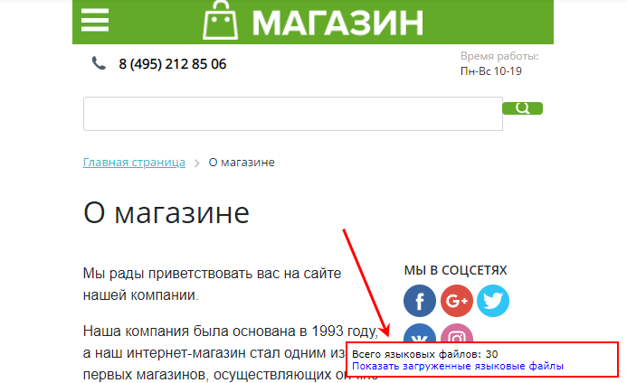
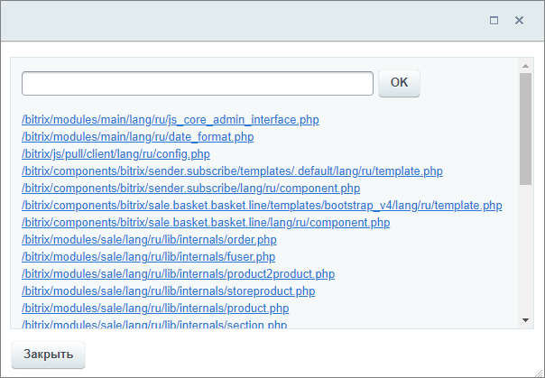
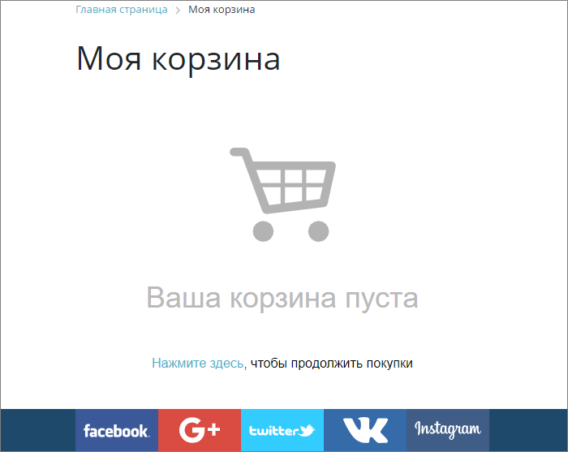

# Поиск языковых файлов

**Навигация**
- [← Оглавление курса](index.md)
- [← Предыдущий: 12980 — Mодуль Перевод](lesson_12980.md)
- [Следующий: 12984 — Перевод фраз →](lesson_12984.md)

Официальная страница урока: https://dev.1c-bitrix.ru/learning/course/index.php?COURSE_ID=35&LESSON_ID=12982

### Индексация

Все языковые сообщения распределены по разным файлам. Чтобы поиск этих сообщений работал корректно, необходимо выполнить индексацию фраз. Кроме того, индексация позволяет подсчитать число фраз без перевода, найти лишние, найти примеры фраз с полным переводом или с неправильным переводом.

Индексация выполняется по кнопке **Индексировать**:

 

Выполнение этой операции может занять продолжительное время. Чтобы сократить это время, можно выбрать только

			нужные языки

                    

		.

### Как найти языковые файлы

Для просмотра распределения языковых сообщений по файлам перейдите на страницу **Перевод языковых файлов** (Настройки &gt; Локализация &gt; Просмотр файлов):

Для поиска конкретных фраз или каталогов используйте

			фильтр + поиск

                    Визуально этот инструмент представляет собой строку поиска. При клике по строке поиска раскрывается расширенный режим поиска с областью настройки фильтра.

	 Подробнее в курсе [Контент-менеджер](https://dev.1c-bitrix.ru/learning/course/index.php?COURSE_ID=34&LESSON_ID=11771&LESSON_PATH=3905.4455.4459.1840.11771).

		. Области перевода могут быть ограничены

			настройками модуля

                    

		. В этом случае в строке поиска появится символ замка c возможностью

			выбора папки

                    

		.

А с помощью

			кнопки со списком действий

                    

		 укажите режим отображения: показывать общее количество фраз/языковых файлов или только без перевода.

Цифры синего и красного цвета показывают разницу в количестве языковых фраз от текущего языка интерфейса:

- красный цвет - фраз перевода меньше, чем на текущем языке;
- синий цвет - фраз перевода
  			больше
                      Т.е. есть фразы на выбранном языке, которых нет на текущем языке.
   **Например:** текущий язык RU, для языка EN указано **+36**. Это значит, что в языковых файлах имеется 36 фраз на английском языке, которых нет на русском языке.
  		, чем на текущем языке.

### Поиск файлов для перевода на конкретной странице

Для поиска файлов перевода на конкретной странице воспользуйтесь удобным инструментом, который позволяет перейти к форме выполнения перевода языковых сообщений непосредственно со страницы, на которой эти сообщения используются (как в публичной, так и административной части сайта).

Для этого требуется включить в настройках

			модуля Перевод

                    Модуль Перевод предоставляет удобный интерфейс для поиска и перевода языковых сообщений. Настройки модуля выполняются на странице Настройки &gt; Настройки продукта &gt; Настройки модулей &gt; Перевод :

 [Подробнее](lesson_12980.md)...

		 функцию **Добавить на панель инструментов кнопку "Выводить языковые файлы"**. Тогда на панели инструментов станет доступна кнопка

			Перевод

                    

		.

## Второй способ включения

Второй вариант - добавить в адресную строку браузера параметр `show_lang_files=Y`. Результат аналогичен нажатию кнопки **Выводить языковые файлы**, т.е. файлы отобразятся на всех страницах.

Для выключения функции измените параметр в адресной строке на `show_lang_files=N`.

При включенном выводе языковых файлов в правом нижнем углу страницы Вы увидите всплывающее окно с информацией о количестве найденных файлов:

При нажатии на ссылку **Показать загруженные языковые файлы** откроется окно со списком языковых файлов страницы. Любой файл можно открыть для редактирования языковых сообщений.

Также в окне отображается поле, позволяющее выполнять поиск языковых фраз в файлах по точному совпадению.

## Пример поиска фраз по совпадению

**Задача**: найдем языковое сообщение **Ваша корзина пуста**, используемое на странице

			просмотра корзины

                    

		 пользователем.

Для этого введем в поле для поиска **Корзина** и нажмем кнопку **OK**. В результате получим список файлов, содержащих это слово. Ссылка с текстом фразы позволяет перейти непосредственно к редактированию текста сообщения.

### Документация по теме

- [Просмотр файлов](https://dev.1c-bitrix.ru/user_help/settings/translate/translate_list.php);
- [Языковые файлы](/learning/course/index.php?COURSE_ID=43&LESSON_ID=3695) в курсе Разработчик Bitrix Framework.
