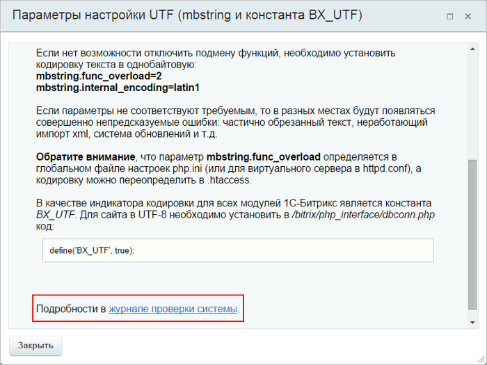
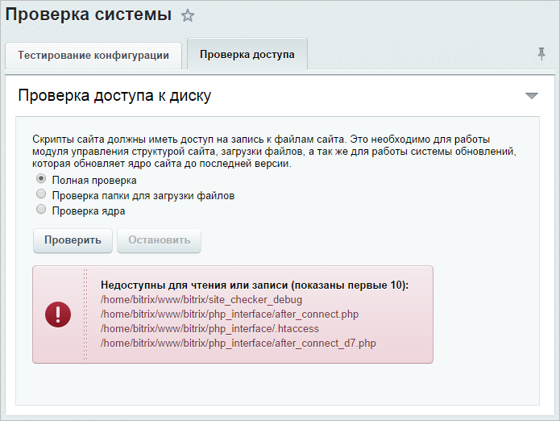

# Проверка системы

**Навигация**
- [← Оглавление курса](index.md)
- [← Предыдущий: 8607 — Раздел Инструменты](lesson_8607.md)
- [Следующий: 2562 — Проверка КП →](lesson_2562.md)

Официальная страница урока: https://dev.1c-bitrix.ru/learning/course/index.php?COURSE_ID=35&LESSON_ID=14020

### Форма Проверка системы

Форма **Проверка системы** (Настройки &gt; Инструменты &gt; Проверка системы) предназначена для всесторонней проверки соответствия параметров системы, на которой осуществляется функционирование проекта, минимальным и рекомендуемым техническим требованиям продукта.

**Примечание**:

1. Не осуществляется проверка структуры базы для Oracle и MS SQL.
2. Проверка не осуществляется в модулях, в которых присутствует точка в имени: в модулях Marketplace.
3. Тест ничего не знает об архитектуре сети и он пытается протестировать систему на основе той информации, что есть. Соответственно, при проверке на локальной установке могут возникать ошибки, связанные с необходимостью внешнего сканирования, например, ошибка сокетов.

### Закладка Тестирование конфигурации

Здесь проводится комплексное тестирование конфигурации сервера. В том числе проверяются параметры, некритичные для нормального функционирования, но которые желательно установить в рекомендуемые значения.

Каждый тест сопровождается подробной информацией, которую можно прочитать по кнопке  в строке теста. Откроется окно с

			подробными комментариями

                    
	

В окне комментариев есть ссылка на **Журнал проверки системы**. С помощью журнала можно понять

причину ошибки.
Файлы журналов проверки не хранятся. Доступен всегда только файл последней проверки.

		.

Если некоторый тест выявил ошибку, значит имеется либо проблема с настройкой хостинга, либо ошибка структуры базы данных. В первом случае рекомендуется написать в поддержку хостинга, а во втором - обратиться к вашим разработчикам или в техподдерку **1С-Битрикс**. Обязательно приложите скриншоты с формулировкой ошибки и детальным описанием из журнала проверки, чтобы получить точные инструкции для исправления ошибки.

### Закладка Проверка доступа

Здесь выполняется проверка доступности дисков физической системы не только на чтение, но и на запись. Это необходимо для управления структурой сайта, загрузки файлов, а также для работы системы обновлений, которая обновляет ядро сайта до последней версии. Проверку можно осуществлять по трем критериям:

- **Полная проверка** – анализируются на доступ все файлы системы.
- **Проверка папки для загрузки файлов** – проверяется доступность на чтение и на запись папки для загрузки файлов.
- **Проверка ядра** – анализу на доступ подвергаются системные файлы.

Результатом проверки может быть либо системное сообщение об успешном окончании, либо отображение файлов, недоступных на чтение или на запись.

### Другие возможности проверки системы

- Проверка сайта без авторизации
- Исправление ошибок базы данных
