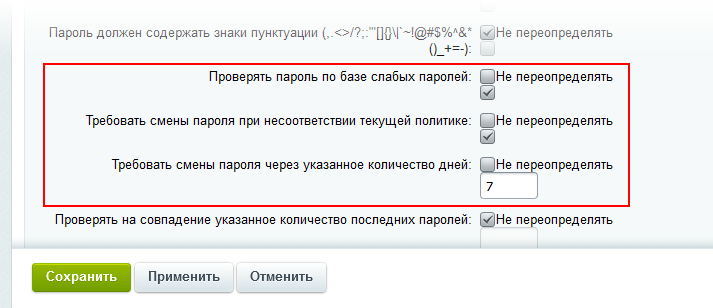

# Контроль слабых паролей

**Навигация**
- [← Оглавление курса](index.md)
- [← Предыдущий: 3081 — Безопасная авторизация](lesson_3081.md)
- [Следующий: 2167 — Если пропадает авторизация пользователя →](lesson_2167.md)

Официальная страница урока: https://dev.1c-bitrix.ru/learning/course/index.php?COURSE_ID=35&LESSON_ID=14172

**Слабый пароль** – пароль, который может быть легко угадан или подобран методом полного перебора.

 

### Контроль слабых паролей

Одна из проблем безопасности – использование пользователями слабых или стандартных паролей, которые, в большинстве своём, уже скомпрометированы. Требовать сложных паролей в этой ситуации – бессмысленно, люди всё равно будут использовать то, что им проще запомнить. Лучше использовать технические средства.

Оптимальным решением проблемы слабых паролей является [двухфакторная авторизация](https://dev.1c-bitrix.ru/learning/course/index.php?COURSE_ID=34&CHAPTER_ID=06818). Но, если в силу каких-то причин это невозможно, то рекомендуется использовать функциональность **Контроль слабых паролей**.

Эта опция доступна с версии 21.500 Главного модуля. Контроль слабых паролей может быть включён для любой группы пользователей по отдельности. Для опытных пользователей, администраторов, например, можно его не использовать. Для запуска контроля в настройках нужной группы, в закладке **Безопасность** используйте чекбоксы:

Опция **Проверять пароль по базе слабых паролей** включает функционал контроля. Если установлена только она, то новый пользователь не сможет зарегистрироваться вводя слабый пароль. Но те, у кого уже установлены слабые пароли, по-прежнему смогут ими авторизовываться.

Опция **Требовать смены пароля при несоответствии текущей политике** при попытке авторизации будет требовать от пользователя сменить слабый пароль и не разрешит вход в систему. Опция работает в зависимости от значения, установленного в поле **Требовать смены пароля через указанное количество дней**. До истечения этого срока авторизация возможна. Значение по умолчанию (0) означает что смена пароля будет востребована при первой же попытке авторизации.

### База паролей

Штатная база

                    База размещается в папке /bitrix/modules/main/data/weak_passwords. Подкладывать в эту папку свои файлы нельзя: это ядро системы.

		 слабых паролей состоит из 1 000 000 записей. Если у вас есть своя база, то возможно её использование. Для этого достаточно загрузить эту базу на сайт через соответствующую опцию в **Служебных процедурах** в настройках Главного модуля:

Формат и размер файла может быть любым, предпочтителен формат TXT. Обязательное требование одно: каждый пароль должен быть размещён на одной строке.

Пользовательская база будет размещена по пути /upload/main/weak_passwords. Для удобства работы единый загруженный файл будет разбит на несколько отдельных файлов. Пароли

			числом знаков

                    Поле **Минимальная длина пароля** в настройках Безопасности группы пользователей.

		 меньше, чем разрешено в системе, загружены не будут.

### Работа функционала контроля

При включённом инструменте **Контроль слабых паролей** пользователь не сможет зарегистрироваться в системе:

Если включено требование смены пароля, то по наступлению срока смены появится надпись:

### Рекомендуется

- В дополнение к Контролю слабых паролей используйте инструмент [Безопасная авторизация](lesson_3081.md).
- Даже если вы используете все технические средства безопасной авторизации, доступные в продукте, отказ от использования протокола [HTTPS](lesson_3261.md) будет не лучшим решением.
