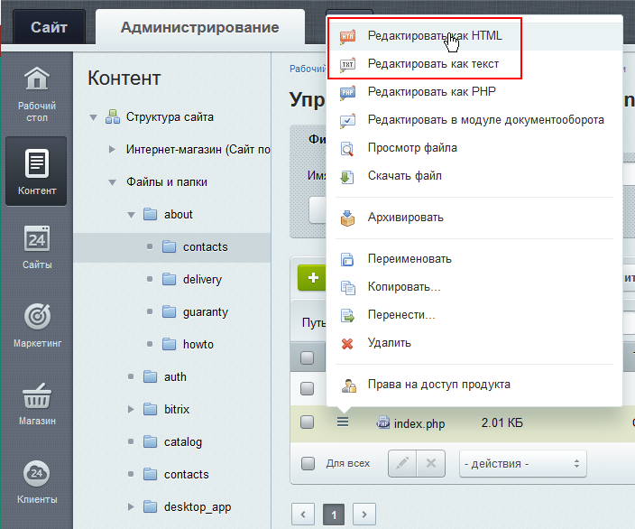
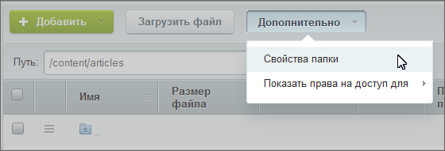
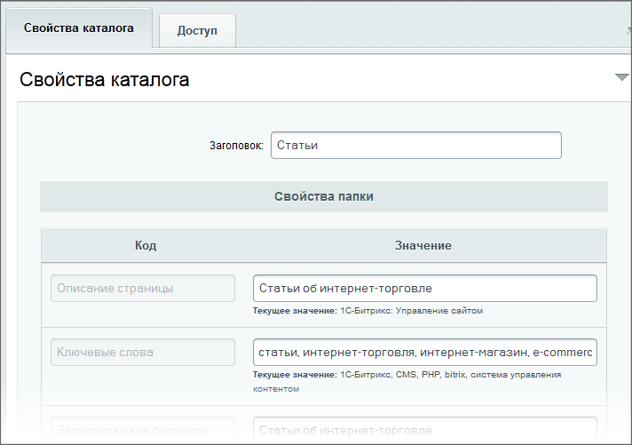
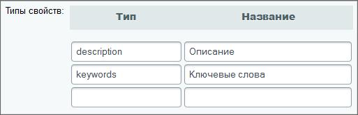
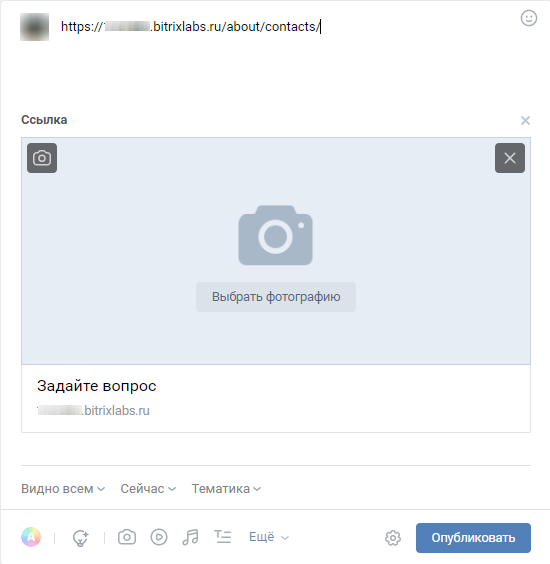
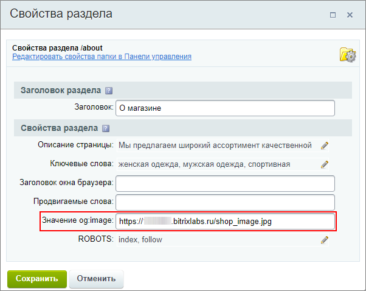

# Управление свойствами страниц и разделов

**Навигация**
- [← Оглавление курса](index.md)
- [← Предыдущий: 2021 — Создание и редактирование новых страниц и разделов](lesson_2021.md)
- [Следующий: 2023 — Управление правами доступа →](lesson_2023.md)

Официальная страница урока: https://dev.1c-bitrix.ru/learning/course/index.php?COURSE_ID=35&LESSON_ID=1929

### Видеоурок

### Задаём заголовок и другие свойства

Управление свойствами страницы в Административном разделе, независимо от выбранного редактора, осуществляется в форме редактирования страницы в

			таблице

                    Эта таблица находится:

- при создании либо редактировании страницы в текстовом режиме в **Свойствах страницы**;

- при создании либо редактировании страницы в режиме HTML-редактора на закладке **Свойства страницы**.



		:


Управление свойствами раздела в Административном разделе производится с помощью пункта **Свойства папки** в контекстном меню папки, либо из контекстной панели, меню

			Дополнительно

                    

		. Откроется окно настроек свойств каталога:

    



### Если нужны новые типы свойств

По умолчанию в системе созданы два базовых типа свойств. Создание новых типов свойств выполняется на странице настроек модуля **Управление структурой** (Настройки &gt; Настройки продукта &gt; Настройки модулей &gt; Управление структурой) в секции **Настройки для сайтов**:



- в поле **Тип** указывается символьный идентификатор создаваемого свойства. Он задаётся латинскими символами и служит для проверки или использования в коде продукта;
- в поле **Название** задайте название свойства. Название отображается пользователям в форме настройки свойств страниц или разделов сайта.

**Примечание**: Типы свойств могут быть заданы отдельно для каждого сайта. Для этого:

- Отметьте опцию
  			Использовать индивидуальные настройки для каждого сайта
                      
  		;
- В списке **Настройки для сайта** выберите желаемый сайт;
- Заполните поля **Типы свойств**.

### Пример создания нового свойства

В качестве примера создания нового свойства рассмотрим добавление мета-тега разметки

			Open Graph

                    **Open Graph** - специальная разметка (протокол), которая позволяет настроить привлекательный вид репостов страниц сайта или ссылок на сайт в соцсетях.

[Официальная документация](https://ogp.me/).

		.

**Задача**: Добавить возможность управления изображениями для превью ссылок на страницы и разделы сайта в соц. сетях. Установить такое изображение для всех ссылок на страницы сайта из раздела О магазине (`/about`).

Страницы раздела О магазине не содержат изображений, что делает превью

			не привлекательным

                    Так отобразится ссылка на страницу Контакты в соц. сети Вконтакте:



		. Поэтому добавим на сайте мета тег **og:image** и возможность управления им через свойства страницы / раздела Контент-менеджером.

**Примечание:** Соцсети проигнорируют картинки на странице, даже если они есть, и подтянут указанное в свойстве изображение. Это работает и для статических, и для динамических страниц.

Приступим к выполнению:

1. Перейдем на страницу настроек модуля **Управление структурой** (Настройки &gt; Настройки продукта &gt; Настройки модулей &gt; Управление структурой). В секции **Настройки для сайтов** укажем сайт 1 и добавим новый тип **og:image** с названием 2 :
  
2. Мета-тег ещё не прописан в шаблоне нашего сайта. Поэтому добавим код для вывода разметки в файл **header.php**
  			шаблона сайта.
  Шаблон дизайна - код разметки, в котором определяется внешний вид сайта: расположение различных элементов на нём, художественный стиль и способ отображения страниц. Включает в себя html-код, графические элементы, таблицы стилей, дополнительные файлы для отображения контента. Может также включать в себя шаблоны компонентов, шаблоны готовых страниц и сниппеты.
  [Подробнее](lesson_1979.md)...
  В нашем примере для сайта установлен шаблон **eshop_bootstrap_v4**. Перейдем к файлам шаблона Контент &gt; Структура сайта &gt; Файлы и папки &gt; bitrix &gt; templates &gt; eshop_bootstrap_v4  и откроем на редактирование в режиме PHP файл **header.php**. Добавим следующую строку к мета-тегам (между тегами `<head> </head>`):
  ```
   // метод ShowProperty подтянет информацию из свойства og:image, что мы создали в первом пункте
  <meta property="og:image" content="<?$APPLICATION->ShowProperty('og:image');?>">
  ```
  
3. Подготовим и загрузим на сайт подходящее изображение. Например, загрузим в корень сайта картинку с названием **shop_image.jpg**;
4. Перейдем в раздел сайта О магазине (`/about`) и откроем форму редактирования свойств. Увидим, что там отобразилось созданное нами свойство. Укажем для него ссылку на изображение:
  
5. Выполним
  			очистку кеша
                      Закладка **Очистка файлов кеша** (Настройки &gt; Настройки продукта &gt; Автокеширование) используется для удаления файлов кеша, содержащих устаревшую или сбойную информацию.
  [Подробнее...](lesson_2164.md)
  		, чтобы увидеть результат настройки сразу.

#### Результат

В результате у Контент-менеджера появилась возможность настройки изображений через свойства для любых страниц и разделов сайта.

При размещении ссылки в соц. сети на страницу раздела О Магазине (например, страницу Контакты) подгрузится изображение:


### Дополнительно

- Документация [Свойства папки](http://dev.1c-bitrix.ru/user_help/content/fileman/fileman/fileman_folder.php);
- [Управление свойствами страницы](https://dev.1c-bitrix.ru/learning/course/index.php?COURSE_ID=34&LESSON_ID=1962) в курсе Контент-менеджер;
- [Управление свойствами раздела](https://dev.1c-bitrix.ru/learning/course/index.php?COURSE_ID=34&LESSON_ID=1959) в курсе Контент-менеджер;
- [Теория. Управление значениями метаданных](https://dev.1c-bitrix.ru/learning/course/index.php?COURSE_ID=43&LESSON_ID=3428) в курсе Разработчик Bitrix Framework.
