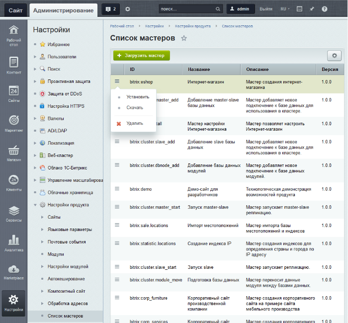
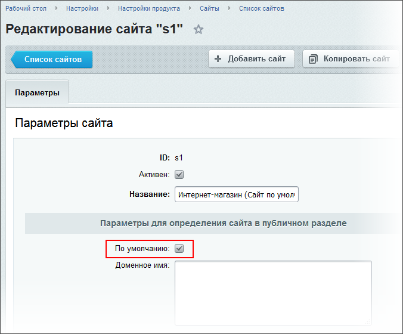

# Установка решения с помощью мастера

**Навигация**
- [← Оглавление курса](index.md)
- [← Предыдущий: 22790 — Алгоритм добавления языка](lesson_22790.md)
- [Следующий: 8607 — Раздел Инструменты →](lesson_8607.md)

Официальная страница урока: https://dev.1c-bitrix.ru/learning/course/index.php?COURSE_ID=35&LESSON_ID=1980

### Мастер вам в помощь

Мастер - диалог, состоящий из

			нескольких шагов

                    Внешний вид и количество шагов может различаться, в зависимости от предназначения мастера.

Мастера установки решений подробно рассмотрены в курсе **Установка и настройка** начиная с главы [Мастер создания сайта для разработчиков](/learning/course/index.php?COURSE_ID=135&CHAPTER_ID=785).

		. Каждый из мастеров имеет свое предназначение. Большая часть из этих мастеров предназначена как раз для смены решения. Список всех мастеров представлен на странице **Список мастеров** (Настройки &gt; Настройки продукта &gt; Список мастеров).

При установлении решения в системе создастся новый сайт, размещённый не в корне, а в собственной папке. И это решение откроется по пути: https://ваш_сайт/папка_решения. Например: https://ваш_сайт/site_de. Чтобы открыть начальный сайт, просто уберите из пути эту папку.

### Как сменить решение

**в публичной части сайта**

- Нажмите кнопку
  			Протестировать новое решение
                      
  		: откроется страница выбора решения для установки.
- Выберите подходящее решение и пройдите все шаги мастера.

**в административной части сайта**

- Перейдите на страницу **Список мастеров** (Настройки &gt; Настройки продукта &gt; Список мастеров).
- Для запуска необходимого мастера выберите пункт **Установить** в меню действий, после чего откроется страница мастера настройки решения.

**Внимание!** Система допускает тестирование нескольких решений. При этом для каждого решения создаются новые сайты. Данные старых решений не удаляются, но если число сайтов превышает число сайтов, разрешенных по умолчанию (например, 2 сайта для лицензии *"Старт"*), то данные более ранних решений становятся неактивными.

Если протестированное решение вас устроило, то чтобы решение отобразилось в публичной части для всех пользователей, сделайте сайт, созданный решением,

			сайтом по умолчанию

                    

		.

#### Как удалить решение

Если решение не понравилось, то для его удаления просто удалите сайт, созданный этим решением. Возможно понадобится удаление созданных для этого сайта

			сущностей

                    Удаление сайта возможно только из Административного раздела со страницы **Список сайтов** (Настройки &gt; Настройки продукта &gt; Сайты &gt; Список сайтов). Перед удалением сайта необходимо удалить сущности, которые имеют отношение к удаляемому сайту (или снять привязку с них).

[Подробнее ...](lesson_3442.md)

		 и сброс кеша.

### Документация по теме

- [Список мастеров](http://dev.1c-bitrix.ru/user_help/settings/settings/wizard_list.php)
- [Импорт мастера](http://dev.1c-bitrix.ru/user_help/settings/settings/wizard_load.php)
