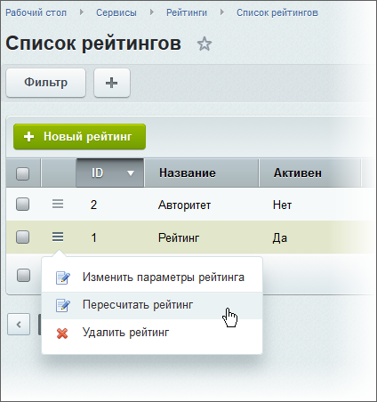

# Расчёт и особенности рейтингов

**Навигация**
- [← Оглавление курса](index.md)
- [← Предыдущий: 8621 — Что такое рейтинги](lesson_8621.md)
- [Следующий: 3582 — Примеры работы →](lesson_3582.md)

Официальная страница урока: https://dev.1c-bitrix.ru/learning/course/index.php?COURSE_ID=35&LESSON_ID=1987

|  | ### Расчет рейтингов |
| --- | --- |

Рейтинги рассчитываются автоматически каждый час с помощью соответствующих

			агентов

                    Агенты - технология, позволяющая запускать произвольные PHP функции (агенты) с заданной периодичностью.

[Подробнее ...](https://dev.1c-bitrix.ru/learning/course/index.php?COURSE_ID=43&CHAPTER_ID=03436)

		, но если необходимо посмотреть изменение рейтинга после каких-либо его изменений, то можно

			пересчитать рейтинг вручную

                    

		.

**Примечание:** Если какой-то критерий на момент запуска пересчета рейтингов не подсчитывался, то данные будут взяты из его последнего расчета.

**Внимание!** После изменения общих настроек рейтингов потребуется пересчет всех рейтингов.

|  | #### Особенности рейтингов |
| --- | --- |

- Для некоторых компонентов необходимо в параметрах включить поддержку рейтингов с помощью соответствующей опции, чтобы в публичной части сайта отображались кнопки оценки контента. Там же можно выбрать их оформление для конкретного компонента. Значение **По умолчанию** берется из настроек рейтингов.
- Рейтинг контента влияет на поиск. Чем больше рейтинг - тем выше в поисковой выдаче будет расположен контент. Такой режим поведения включается на странице настроек модуля **Поиск** с помощью опции **При ранжировании результатов учитывать рейтинг**.

|  | #### Различия системы рейтингов в продуктах «Битрикс24 в коробке» и «1С-Битрикс: Управление сайтом» |
| --- | --- |

- В Битрикс24 в коробке система авторитета строится на основе субординации. Так количество голосов, отдаваемое сотрудником при голосовании за контент, зависит от его положения в иерархии компании. Голос начальника будет состоять из суммы голосов подчиненных и его собственного. Расчет добавочных голосов за авторитет по структуре компании осуществляется с помощью соответствующего правила обработки (Сервисы &gt; Рейтинги &gt; Правила обработки).
  Поддержка субординации (для авторитета включена по умолчанию) настраивается на вкладке **Интранет** формы редактирования рейтинга (Сервисы &gt; Рейтинги &gt; Список рейтингов).
- В подсказке с проголосовавшими сотрудниками за контент (при наведении курсора на символ **★**) в Битрикс24 в коробке список сначала строится по субординации, а если авторитет одинаков (например, равноценные начальники или обычные сотрудники), то уже по принципу "чей контент больше нравится, тот и выше". В 1С-Битрикс: Управление сайтом же список строится только по принципу "чей контент больше нравится, тот и выше".
- В мастере настройки Битрикс24 в коробке, например при установке, можно сразу включить рейтинги и настроить внешний вид публичных элементов оценки контента.
