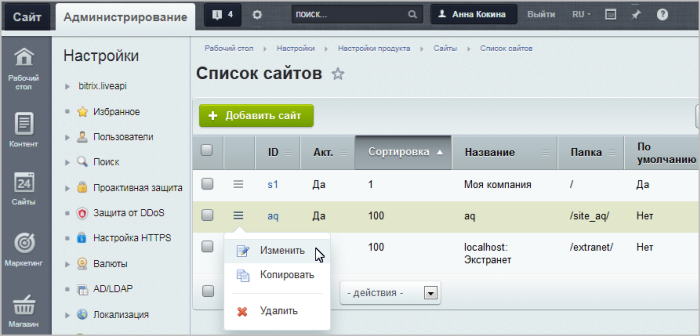
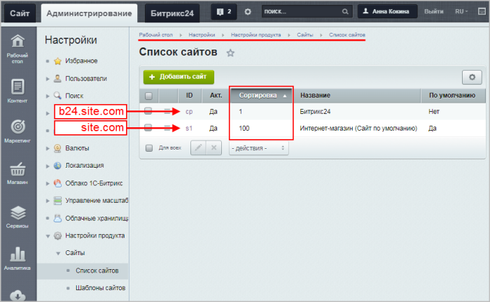
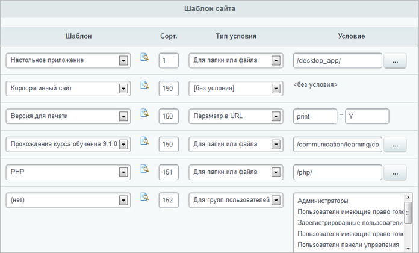
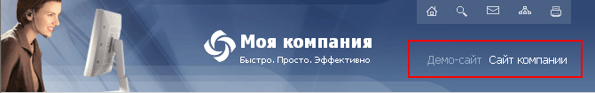
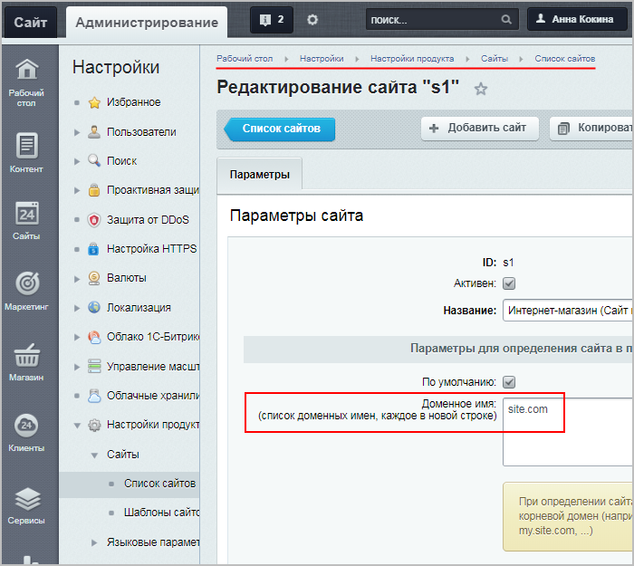

# Управление сайтами и пример создания

**Навигация**
- [← Оглавление курса](index.md)
- [← Предыдущий: 8571 — Многосайтовость](lesson_8571.md)
- [Следующий: 3442 — Удаление сайтов →](lesson_3442.md)

Официальная страница урока: https://dev.1c-bitrix.ru/learning/course/index.php?COURSE_ID=35&LESSON_ID=1991

Тему урока можно изучить в новом формате — [в документации по Bitrix Framework](https://docs.1c-bitrix.ru/pages/cms-basics/sites.html). В ней улучшена структура, описание, примеры.

 

### Управление сайтами

Управление сайтами осуществляется из административного раздела системы на странице **Список сайтов** (Настройки &gt; Настройки продукта &gt; Сайты &gt; Список сайтов):

Каждый сайт, работающий под управлением системы, представляется в виде отдельной записи.

### Как создать новый сайт (видеоурок)

### Как создать новый сайт

- Перейдите в Административный раздел на страницу Настройки &gt; Настройки продукта &gt; Сайты. В Рабочей области откроется Список сайтов.
- Выполните команду **Добавить сайт** на Контекстной панели. В Рабочей области откроется форма **Добавление сайта**.
- Заполните поля:

  - **ID** – поставьте произвольный двузначный код (только латинскими буквами и цифрами);
  - Поставьте флажок **Активен**;
  - Введите название сайта, каким оно будет отображаться в Административной части. Название не обязательно должно быть на латинице, можно дать название и на русском языке;
  - Установите флажок **По умолчанию**. Это делается, если сайт не единственный в списке и нужно, чтобы он открывался по умолчанию;
  - **Доменное имя** - введите доменное имя (имена), которое будет у вашего сайта;
    Заполнять поле рекомендуется только для организации [многосайтовости на одном ядре](https://dev.1c-bitrix.ru/learning/course/index.php?COURSE_ID=103&INDEX=Y).
  - **Папка сайта** - поставьте просто **/**;
  - **Сортировка** - можно ввести любое численное значение;
    **Примечание**: Если новый сайт развёрнут на
    			поддомене домена текущего сайта,
    Пример:
    **site.com** - текущий
    **b24.site.com** - новый (на поддомене домена текущего сайта)
    		 то индекс сортировки сайта на поддомене должен быть
    			меньше,
    
    		 чем индекс сортировки сайта на домене (иначе сайты могут некорректно отображаться).
    Для случаев, когда сайты находятся на
    			разных доменах
    Пример разных доменов:
    **site1.com** - интернет-магазин
    **site2.com** - портал Битрикс24
    		 или
    			разных поддоменах,
    Пример разных поддоменов:
    **bus.site.com** - интернет-магазин
    **b24.site.com** - портал Битрикс24
    		 сортировка может быть любой.
  - В поле **Язык** выбирается язык, используемый для представления информации на страницах сайта.
  - Региональные настройки
                        Региональная настройка - набор параметров, которые имеют разные значения в зависимости от культурных особенностей той или иной местности. Например: формат даты и времени, формат имени, первый день недели и другие.
    [Подробнее ...](lesson_8575.md)
    		 - указание системе как отображать параметры времени, даты и другие в соответствии с культурными особенностями региона, на который рассчитан сайт.
  - Выбирать кодировку нужно внимательно, после анализа
    			многих факторов
                        Перед создателем сайтов всегда встает проблема: в какой кодировке создавать проект. В русскоязычном интернете используются две кодировки: UTF-8 и Windows-1251 (или cp1251).
    [Подробнее ...](http://dev.1c-bitrix.ru/learning/course/index.php?COURSE_ID=43&LESSON_ID=2919)
    		.
    **Примечание**: Иногда для указания кодировки используют упрощенное название **win-1251**. В нашем случае это не допустимо, так как может вызвать ошибку, связанную с некорректным названием кодировки.
  - **Название веб-сайта** - каким оно будет отображаться для пользователей;
  - **URL сервера** введите адрес сайта (**localhost** - для локальной установки);
  - **E-Mail адрес по умолчанию** введите адрес, который будет использоваться в системных сообщениях, например, во всех почтовых шаблонах в качестве адреса отправителя.
- **Почтовые шаблоны** - поле позволяет создать шаблоны, на основе которых будут генерироваться почтовые сообщения.
- **Шаблон** - любой из имеющихся. Это поле обязательно для заполнения, если шаблона нет, его нужно создать.
  ## Для чего нужен шаблон
  Внешний вид страниц сайта формируется на основе шаблона дизайна.
  В шаблоне сайта определяется:
  - дизайн страниц;
  - типы используемых меню и место их подключения;
  - место вывода навигационной цепочки;
  - расположение рекламных областей на страницах сайта;
  - размещение редактируемых и включаемых областей.
  Использование шаблонов открывает широкие возможности для настройки внешнего вида сайта и изменения его дизайна в зависимости от различных условий. Продукт позволяет:
  - гибко настроить дизайн для различных разделов сайта;
  - использовать специальный праздничный дизайн в течение определенного времени;
  - применять отдельные шаблоны дизайна для различных групп посетителей;
  - применять отдельные шаблоны дизайна в зависимости от определенного параметра в адресной строке;
  - и т.п.
  Для каждого сайта может быть назначено неограниченное количество шаблонов.
  **Примечание**: Более подробная информация об управлении шаблонами сайта представлена в главе
  			Базовый шаблон
                       В разделе подробно рассмотрены следующие вопросы:
      управление шаблоном дизайна сайта;
      работа с включаемыми и рекламными областями;
      управление средствами навигации по сайту: меню и цепочкой навигации;
      основные принципы локализации продукта;
      работа с визуальными компонентами;
      оптимизация проекта.
  [Подробнее ...](https://dev.1c-bitrix.ru/learning/course/index.php?COURSE_ID=43&CHAPTER_ID=02880)
  		 учебного курса **Разработчик Bitrix Framework** и в [пользовательской документации](http://dev.1c-bitrix.ru/user_help/settings/settings/sites/index.php) продукта.
  Выбор шаблонов дизайна сайта и настройка условий их применения к страницам выполняется в секции
  			Шаблон
  
  		 формы редактирования сайта:
  **Примечание**: Чтобы шаблон применялся к страницам сайта по умолчанию, поле **Условие** нужно оставить незаполненным.
  #### Переключение между сайтами
  При наличии в системе нескольких сайтов переключение между сайтами в публичном разделе выполняется с использованием специальных ссылок.
  
  Генерация подобных ссылок осуществляется с помощью специального компонента, включенного в шаблон дизайна сайта - **Выбор сайта (bitrix:main.site.selector)**. Данный компонент перечисляет все сайты, созданные на базе данной копии продукта, определяет путь к корневым директориям данных сайтов и выводит ссылки с названиями сайтов в месте, определенном шаблоном дизайна сайта. При этом ссылка с названием текущего (просматриваемого в данный момент) сайта не подсвечивается, т.е. является неактивной.
- Сохраните вновь созданный сайт. Форма создания сайта закроется, откроется список имеющихся сайтов, в котором отобразится созданный сайт.

 

**Примечание**: Подробнее описание значений полей формы смотрите в

			пользовательской документации

						[Описание компонента «Создание и редактирование сайта» в пользовательской документации.](http://dev.1c-bitrix.ru/user_help/detail.php?ID=63439)

		.

### Как поменять домен у сайта

Допустим, что не меняя хостинга, нужно заменить текущий домен сайта **example.com** на новый домен **site.com**. Для этого нужно:

1. Приобрести
  Доменные имена приобретаются у регистраторов доменных имен, а также подобные услуги предоставляют большинство хостинг провайдеров.
  		 доменное имя;
2. Чтобы сайт, размещенный на хостинге, открывался в браузере по приобретенному доменному имени, необходимо привязать это доменное имя к хостингу:
  **Примечание**: Процесс привязки доменного имени к хостингу может занять продолжительное время (вплоть до нескольких дней).

  - если хостинг и доменное имя предоставляет **одна компания**, то зачастую привязка проходит в автоматическом режиме (либо на сайте компании есть соответствующие инструкции);
  - если хостинг и доменное имя предоставляют **разные компании**, то:

    - в аккаунте хостинга в "Настройках домена" (иногда еще может называться "Парковка домена") прописать приобретенное доменное имя (указывается без префиксов типа http, www и т.д.);
    - узнать адреса DNS-серверов у технической поддержки или на сайте хостинговой компании, зайти в свой аккаунт на сайте компании-регистратора (где покупали доменное имя), найти свой домен и указать в его параметрах DNS-сервер хостинг-компании.
3. В завершении осталось указать новое доменное имя в настройках сайта (Настройки &gt; Настройки продукта &gt; Сайты &gt; Список сайтов &gt; [ваш_сайт]):
  

**Примечание**: Если у вас

			в проактивной защите

                    
**Проактивная защита** – это комплекс технических и организационных мер, которые объединены общей концепцией безопасности и позволяют значительно расширить понятие защищенности и реакции веб-приложений на угрозы.

[Подробнее](https://dev.1c-bitrix.ru/learning/course/index.php?COURSE_ID=35&CHAPTER_ID=04547&LESSON_PATH=3918.4633.4829.4547)...

		 на странице

			Хосты/домены

                    
На странице **Хосты/домены** (Настройки &gt; Проактивная защита &gt; Хосты/домены) можно ограничить доступ или перенаправить на заданную страницу те запросы, у которых адрес в HTTP-заголовке `Host` не будет соответствовать разрешенным адресам.

[Подробнее](lesson_5804.md)...

		 (Настройки &gt; Проактивная защита &gt; Хосты/домены) настроено ограничение доступа или перенаправление запросов, то не забудьте на этой странице указать новый домен.
