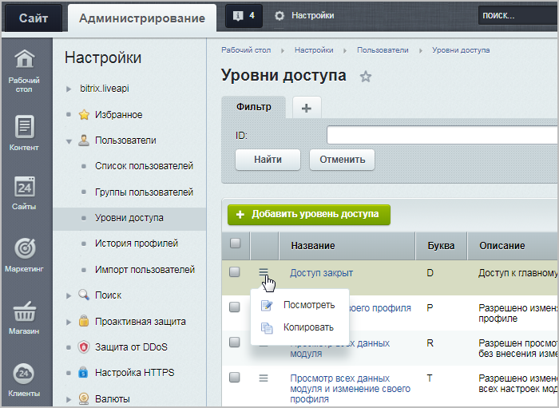

# Уровни доступа

**Навигация**
- [← Оглавление курса](index.md)
- [← Предыдущий: 8573 — Принципы управления доступом](lesson_8573.md)
- [Следующий: 2016 — Доступ к модулям →](lesson_2016.md)

Официальная страница урока: https://dev.1c-bitrix.ru/learning/course/index.php?COURSE_ID=35&LESSON_ID=2015

### Разделять и управлять!

Для разграничения доступа и гибкого управления правами пользователей в системе введено понятие **Уровни доступа**.

> **Уровень доступа** — это набор разрешенных операций (например, загрузка файлов, создание заказов, редактирование страниц и другие), привязанный к модулям и группам пользователей. Созданием и управлением уровней доступа занимается администратор сайта. Уровни доступа применяются в системе управления пользователями и обладают свойством "наследования", то есть если для текущего раздела/страницы явно не задан уровень прав, тогда устанавливается то право, которое задано для вышележащего раздела.

 

Примеры:

- операция **Управление пользователями только разрешенных групп** позволяет управлять пользователями указанных групп (изначально управление пользователями доступно только администраторам)
- операция **Ограниченная модификация файлов с PHP-кодом** позволяет настраивать параметры компонентов и редактировать файлы с PHP в визуальном режиме (изначально модификация файлов с PHP-кодом доступна только администраторам)

### Управление уровнями доступа

Управление уровнями доступа производится в административном разделе на странице **Уровни доступа** (Настройки &gt; Пользователи &gt; Уровни доступа):

 

На странице представлен список всех имеющихся уровней доступа: системных и созданных пользователем.

**Примечание**: Системные уровни доступа доступны только для просмотра, отредактировать их невозможно. А созданные пользователем (т.е. пользовательские) уровни доступа всегда можно отредактировать, либо удалить.

### Создание нового уровня доступа

Для создания собственного уровня доступа есть два способа:

- Нажатием
  			**Копировать**
                      .
  		 в контекстном меню существующего уровня доступа. Создастся копия выбранного уровня и откроется форма редактирования. Обратите внимание, что если был скопирован системный уровень доступа, то вновь созданный уровень будет уже пользовательским.
  C помощью кнопки контекстного меню **Добавить уровень доступа** на странице списка. В этом случае откроется пустая форма создания.

#### Форма создания / редактирования уровня доступа

#### Вкладка Параметры

- **Название** и **Модуль** являются обязательными для заполнения;
- **Системный** - признак системности, проставляется автоматически;
- **Привязка** - из списка выбирается функционал модуля, для которого создаётся новый уровень доступа. Список зависит от выбранного модуля;
- **Буква** - используется для краткого обозначения уровня доступа. Есть у всех системных уровней. Для пользовательских необязательна;
- **Описание** - заполняется произвольным текстом для описания уровня доступа (при необходимости).

#### Вкладка Включаемые операции

После настройки вкладки **Параметры** перейдем к выбору разрешенных операций для создаваемого уровня доступа. Набор опций на вкладке

			Включаемые операции

                     Например для Главного модуля с привязкой Модуль:

		 различается в зависимости от выбранных ранее **модуля** и **привязки**.

 

    

### Модули и привязки

Ниже описаны все доступные варианты модулей и привязок при создании уровня доступа. А также даны ссылки, где можно указать новые уровни доступа.

Общий момент для всех модулей с привязкой **Модуль** (кроме Highload-блоки): помимо настроек модуля, указать новый уровень можно в настройках [группы пользователей](lesson_7175.md) (страница Настройки &gt; Пользователи &gt; Группы пользователей) для соответствующего модуля.

| \| **Модуль** \| **Доступные привязки** \| **Пути к установке новых уровней доступа** \| \| --- \| --- \| --- \| \| Главный модуль \| **Модуль** \| В настройках [Главного модуля](lesson_5010.md) (страница Настройки &gt; Настройки продукта &gt; Настройки модулей &gt; Главный модуль, вкладка Доступ). \| \| **Файл/Папка** \| Раздел Файлы и папки (Контент &gt; Структура сайта &gt; Файлы и папки), действие [Права на доступ продукта](lesson_2019.md) для файла / папки. \|  \| \| Облако 1С-Битрикс \| **Модуль** \| В настройках модуля [Облако 1С-Битрикс](lesson_11669.md) (страница Настройки &gt; Настройки продукта &gt; Настройки модулей &gt; Облако 1С-Битрикс, вкладка Доступ). \| \| Календарь событий \| **Секция календаря** \| Для календарей в [Управлении календарями](https://dev.1c-bitrix.ru/learning/course/index.php?COURSE_ID=34&LESSON_ID=11443). \| \| **Тип календаря** \| Для каждого типа календаря, созданного в настройках модуля [Календарь событий](https://dev.1c-bitrix.ru/learning/course/index.php?COURSE_ID=41&LESSON_ID=5266) (страница Настройки &gt; Настройки продукта &gt; Настройки модулей &gt; Календарь событий, вкладка Типы календарей). \|  \| \| Торговый каталог \| **Модуль** \| В настройках модуля [Торговый каталог](https://dev.1c-bitrix.ru/learning/course/index.php?COURSE_ID=42&LESSON_ID=9131) (страница Настройки &gt; Настройки продукта &gt; Настройки модулей &gt; Торговый каталог, вкладка Доступ). \| \| Облачные хранилища \| **Модуль** \| В настройках модуля [Облачные хранилища](lesson_4826.md) (страница Настройки &gt; Настройки продукта &gt; Настройки модулей &gt; Облачные хранилища, вкладка Доступ). \| \| Управление структурой \| **Модуль** \| В настройках модуля [Управление структурой](lesson_9115.md) (страница Настройки &gt; Настройки продукта &gt; Настройки модулей &gt; Управление структурой, вкладка Доступ). \| \| **Медиабиблиотека** \| Настройка доступа к [коллекциям Медиабиблиотеки](https://dev.1c-bitrix.ru/learning/course/index.php?COURSE_ID=34&LESSON_ID=1855) (Контент &gt; Структура сайта &gt; Медиабиблиотека). \|  \| \| **Стикеры** \| На странице [настроек стикеров](https://dev.1c-bitrix.ru/user_help/service/stickers/index.php) (страница Сервисы &gt; Стикеры, вкладка Доступ). \|  \| |  |  |
| --- | --- | --- |
| Highload-блоки | **Модуль** | В настройках конкретного [Highload-блока](https://dev.1c-bitrix.ru/learning/course/index.php?COURSE_ID=41&LESSON_ID=5799) (страница Настройки &gt; Настройки продукта &gt; Настройки модулей &gt; Highload-блоки, вкладка Права доступа). |
| Информационные блоки | **Инфоблок** | В настройках доступа конкретного [инфоблока](lesson_9411.md) (страница Контент &gt; Инфоблоки &gt; Типы инфоблоков  &gt; название_типа &gt; название_инфоблока, вкладка Доступ, **Расширенный режим** управления правами). |
| Сайты 24 | **Модуль** | В настройках модуля [Сайты 24](https://dev.1c-bitrix.ru/learning/course/index.php?COURSE_ID=41&LESSON_ID=11261) (страница Настройки &gt; Настройки продукта &gt; Настройки модулей &gt; Сайты 24, вкладка Доступ). |
| Обучение | **Урок** | В настройках модуля [Обучение](https://dev.1c-bitrix.ru/learning/course/index.php?COURSE_ID=41&LESSON_ID=9105) (страница Настройки &gt; Настройки продукта &gt; Настройки модулей &gt; Обучение, вкладка Права на доступ) или в форме создания / редактирования [курса](https://dev.1c-bitrix.ru/learning/course/index.php?COURSE_ID=41&LESSON_ID=2873) (страница Сервисы &gt; Обучение &gt; Курсы, вкладка Права доступа). |
| Интернет-магазин | **Статус заказа** | В форме создания / редактирования [статуса заказа](https://dev.1c-bitrix.ru/learning/course/index.php?COURSE_ID=42&LESSON_ID=3077) (страница Магазин &gt; Настройки магазина &gt; Статусы, секция Права на доступ). |
| Проактивная защита | **Модуль** | В настройках модуля [Проактивная защита](lesson_9113.md) (страница Настройки &gt; Настройки продукта &gt; Настройки модулей &gt; Проактивная защита, вкладка Доступ). |
| Поисковая оптимизация | **Модуль** | В настройках модуля [Поисковая оптимизация](https://dev.1c-bitrix.ru/learning/course/index.php?COURSE_ID=41&LESSON_ID=2095) (страница Настройки &gt; Настройки продукта &gt; Настройки модулей &gt; Поисковая оптимизация, вкладка Доступ). |
| Контроллер | **Модуль** | В настройках [Контроллер](https://dev.1c-bitrix.ru/learning/course/index.php?COURSE_ID=41&LESSON_ID=2901) (страница Настройки &gt; Настройки продукта &gt; Настройки модулей &gt; Контроллер, вкладка Доступ). |

### Документация по теме

- [Создание и редактирование уровня доступа](http://dev.1c-bitrix.ru/user_help/settings/users/task_edit.php)
- [Управление доступом к информации](https://dev.1c-bitrix.ru/learning/course/index.php?COURSE_ID=34&LESSON_ID=4492)
