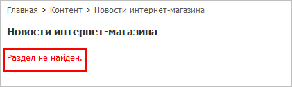
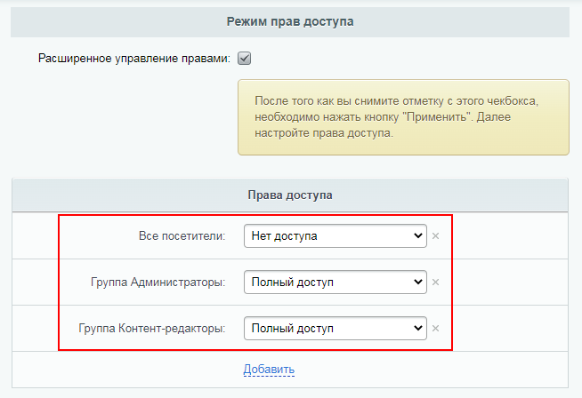
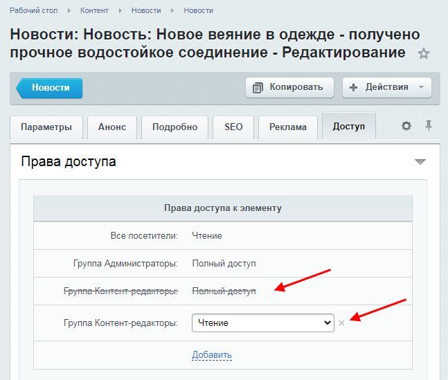
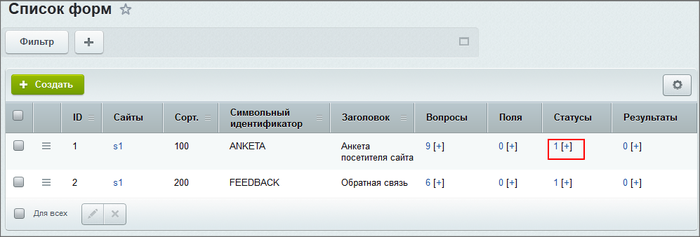
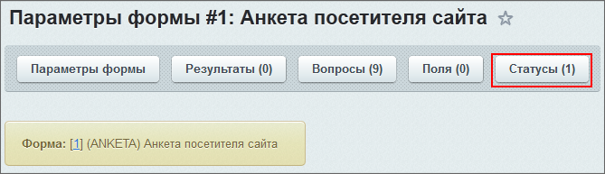
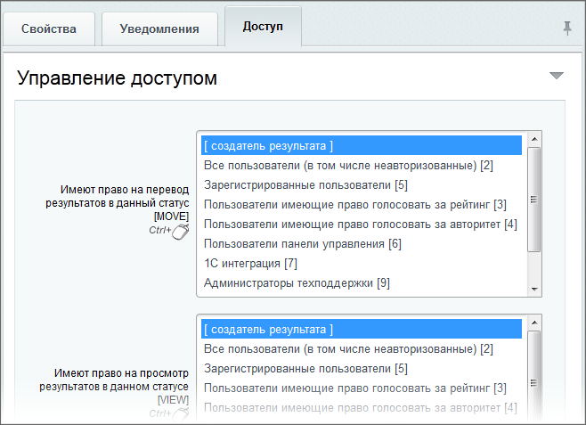

# Доступ к элементам контента

**Навигация**
- [← Оглавление курса](index.md)
- [← Предыдущий: 2016 — Доступ к модулям](lesson_2016.md)
- [Следующий: 2160 — Права на файлы →](lesson_2160.md)

Официальная страница урока: https://dev.1c-bitrix.ru/learning/course/index.php?COURSE_ID=35&LESSON_ID=2017

### Видеоурок

Ранее мы рассмотрели, как настраивать

			доступ к модулям

                    
Настройка прав доступа к модулям определяет действия, которые может позволить себе пользователь выбранной группы.

[Подробнее](lesson_2016.md)...

		. Но некоторые модули предусматривают дополнительную настройку прав доступа к контенту:

- в модуле **Информационные блоки** настраиваются права к каждому инфоблоку или даже к конкретным разделам/элементам;
- в модуле **Веб-формы** в расширенном режиме предусмотрено управление доступом к результатам заполнения веб-формы на уровне **Статусов результатов**.

 

### Модуль Информационные блоки

**Примечание**: Уровень доступа групп пользователей к информационным блокам настраивается отдельно для каждого инфоблока. Более того, в **Расширенном режиме** доступна установка прав для каждого раздела или элемента по отдельности.

 

Настройка прав доступа выполняется в форме редактирования свойств инфоблока на закладке **Доступ** (Контент &gt; Инфоблоки &gt; Типы инфоблоков &gt; [название_типа_инфоблока] &gt; [название_инфоблока]).

#### Простой режим

В простом режиме права доступа настраиваются для всего информационного блока в целом.

 

Например, чтобы пользователи группы **Контент-редакторы** имели право на создание и редактирование новостей инфоблока **Новости компании**, нужно в настройках инфоблока **Новости компании** установить для группы **Контент-редакторы** право доступа **Изменение**.

**Примечание:** При задании доступа по умолчанию **Для всех пользователей** помните, что любые пользователи (даже незарегистрированные) принадлежат к этой группе и пользуются её правами.

Если при попытке изменения доступа появляется сообщение "*Внимание! Заданный уровень доступа переопределяется уровнем доступа по умолчанию*", то это означает, что выставляемое право находится на более низком уровне иерархии, чем право доступа по умолчанию, и система не даст его установить.

В этом случае необходимо пересмотреть систему организации доступа. Например, по умолчанию выставить право **Нет доступа** и для нужных групп указать право **Чтение**.

  

Если доступ к инфоблоку для определенной группы закрыт, то пользователи из этой группы

			не увидят содержимое

                     

		 в публичной части. Кроме того, закрытое содержимое не будет отображаться в поиске для этой группы пользователей.

#### Расширенный режим

После установки флажка в поле

			Расширенное управление правами

                    

		 нажмите кнопку **Применить**, и форма перезагрузится.

Теперь можно задать

			права для инфоблока

                     

		 по умолчанию. Эти права будут применяться до тех пор, пока в форме создания/редактирования конкретного раздела или элемента не будет указан

			другой уровень прав

                     

		.

Для задания прав к конкретному разделу или элементу перейдите в **форму редактирования элемента** на закладку

			Доступ

                     

		.

С помощью ссылки **Добавить** выберите нужную группу или конкретного пользователя, для которых хотите поменять права доступа, и установите нужные права.

### Модуль Веб-формы

 

В модуле

			Веб-формы

                    
Модуль организует работу с произвольными веб-формами, позволяет хранить и фильтровать данные заполненных форм.

**Веб-форма** – специальная область на странице или отдельная страница сайта, в которой посетитель может внести ту или иную информацию. Образно – это аналог бумажной анкеты, бланка и опросного листа. Количество веб-форм и количество вопросов в них ничем не ограничено, вам доступно гибкое управление параметрами ваших форм.

[Подробнее](https://dev.1c-bitrix.ru/learning/course/index.php?COURSE_ID=34&CHAPTER_ID=05749)...

		 предусмотрено управление доступом к результатам заполнения веб-формы на уровне **Статусов результатов**(результатов заполнения веб-формы).

 

**Важно!** Использование статусов **доступно только в расширенном режиме** редактирования веб-форм. Для этого необходимо снять флажок в поле

			Использовать упрощенный режим редактирования форм

                     

		 в настройках модуля **Веб-формы** (Настройки &gt; Настройки продукта &gt; Настройки модулей &gt; Веб-формы).

 

Для настройки прав доступа к статусам выполните следующее:

1. Перейдите на страницу **Список форм** (Сервисы &gt; Веб-формы &gt; Настройка форм);
  
2. Далее откройте список статусов. Это можно сделать двумя способами:

  - либо в списке веб-форм у выбранной веб-формы кликните по ссылке в столбце **Статусы**;
  - либо откройте форму редактирования веб-формы (дважды кликнув по строке с названием формы или выбрав пункт контекстного меню **Изменить**), а затем нажмите кнопку
    			Статусы
    
    		 на контекстной панели.
3. Перейдите к редактированию параметров выбранного статуса, дважды кликнув по строке с его названием или выбрав в пункте контекстного меню **Изменить**, затем выберите вкладку
  			Доступ.
  

### Документация по теме

- [Пример](https://dev.1c-bitrix.ru/learning/course/index.php?COURSE_ID=35&CHAPTER_ID=03797&LESSON_PATH=3906.4503.3797) организации прав доступа;
- [Управление группами пользователей](lesson_7175.md) (курс Администратор. Базовый).
